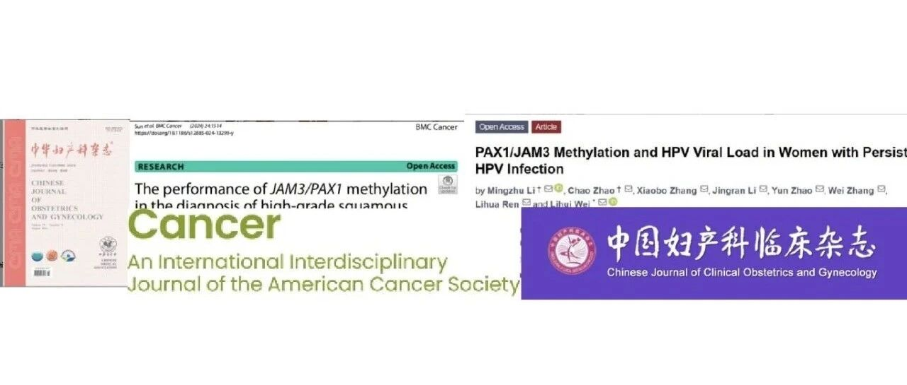

# 盘点回顾2024年聚禾生物在学术方面的成就

_2025年02月06日 18:00_

聚禾生物开发的子宫颈癌和子宫内膜癌甲基化检测技术获得国家药品监督管理局（NMPA）颁发的医疗器械三类证。聚禾生物与全国专家共同进行临床应用数据收集和分析，并在国内期刊与国际 SCI 杂志发表多篇论文，获得了重大肯定，取得了显著成就。国内专家依据循证医学证据，引用相关成果并制定了子宫颈癌和子宫内膜癌筛检和管理指南及专家共识，使这项国内新技术成为临床检测与实践的重要一环。感谢全国妇科医师对聚禾产品的肯定。回顾 2024 年聚禾生物在学术方面的成果，我们更期待在 2025 年，有更多医师与聚禾生物一起在妇科肿瘤领域共同探索，共同发表关于妇科肿瘤筛检的研究成果，为全国女性的健康保驾护航。

聚禾生物筛选的妇瘤甲基化检测基因登上“国际医学顶刊”：获全球大专家认可！

[**JH丨影响因子508.7，聚禾生物甲基化临床研究登上国际“神刊”CA，未来可期！**](https://mp.weixin.qq.com/s?__biz=Mzg5MTUzMjYwNw==&mid=2247489170&idx=1&sn=f3a72d3dbc977d83d3566a8930fe4f6e&scene=21#wechat_redirect)

**01子宫颈癌甲基化相关指南、专家共识及文文献**
1、[ PAX1和JAM3双基因收录在《](https://mp.weixin.qq.com/s?__biz=Mzg5MTUzMjYwNw==&mid=2247490065&idx=1&sn=85ba35651b2ae1d13deb3997e1096cfa&scene=21#wechat_redirect)
[ 中国子宫颈癌筛查指南（二）](https://mp.weixin.qq.com/s?__biz=Mzg5MTUzMjYwNw==&mid=2247490065&idx=1&sn=85ba35651b2ae1d13deb3997e1096cfa&scene=21#wechat_redirect)
》指导子宫颈癌临床应用 [ 2、高危型HPV感染患者JAM3/PAX1高甲基化诊断宫颈高级别病变](https://mp.weixin.qq.com/s?__biz=Mzg5MTUzMjYwNw==&mid=2247489368&idx=1&sn=02863cd21e4126c36d488fbbb2b706a2&scene=21#wechat_redirect)
3、[ 首次揭露PAX1/JAM3甲基化在HPV持续感染中的临床价值](https://mp.weixin.qq.com/s?__biz=Mzg5MTUzMjYwNw==&mid=2247489390&idx=1&sn=81ef9c4600ae4877dfdac5248c358728&scene=21#wechat_redirect)
4、[《肿瘤DNA甲基化标志物检测及临床应用专家共识》制定并推荐子宫颈癌和子宫内膜癌DNA甲基化筛检临床路径](https://mp.weixin.qq.com/s?__biz=Mzg5MTUzMjYwNw==&mid=2247489432&idx=1&sn=7add32b3a4537a72c877f5fc029f51e4&scene=21#wechat_redirect)
5、[ 超3万例，全国首个甲基化前瞻性多中心临床研究，PAX1m/JAM3m双基因检测用于宫颈癌分流具良好性能](https://mp.weixin.qq.com/s?__biz=Mzg5MTUzMjYwNw==&mid=2247489790&idx=1&sn=b2f3e5755c0c83e16ff4e8e0784d83f7&scene=21#wechat_redirect)
6、[ 甲基化检测用于子宫颈癌筛查及预后管理的研究进展](https://mp.weixin.qq.com/s?__biz=Mzg5MTUzMjYwNw==&mid=2247489838&idx=1&sn=0bfc3d7122dfce1c630fd78c7e40689e&scene=21#wechat_redirect)
7、[ PAX1/JAM3甲基化提升ASCUS宫颈癌前病变分流效能，显著降低阴道镜转诊率](https://mp.weixin.qq.com/s?__biz=Mzg5MTUzMjYwNw==&mid=2247489955&idx=1&sn=06494e5c0d37406361da242b6d2d48f3&scene=21#wechat_redirect)
8、[ 评估中国高危 HPV 阳性女性中不同 HPV 基因型和年龄组的 PAX1 和 JAM3 甲基化分诊效果](https://mp.weixin.qq.com/s?__biz=Mzg5MTUzMjYwNw==&mid=2247489968&idx=1&sn=862ce02238d47411a39b9a08f15a4178&scene=21#wechat_redirect)
9、[ JAM3/PAX1甲基化在高风险HPV感染女性高级别鳞状上皮内病变诊断中的表现](https://mp.weixin.qq.com/s?__biz=Mzg5MTUzMjYwNw==&mid=2247489996&idx=1&sn=c50aa2ee70c3f645574e0e7039509994&scene=21#wechat_redirect)
10、[ 评估PAX1/JAM3甲基化在HPV 16/18感染女性中的筛选作用](https://mp.weixin.qq.com/s?__biz=Mzg5MTUzMjYwNw==&mid=2247490019&idx=1&sn=1e376573f0ca322985c6c74c038cc134&scene=21#wechat_redirect)
点击上方蓝色字体跳转原文链接**02子宫内膜癌甲基化相关文章**

1、[《肿瘤DNA甲基化标志物检测及临床应用专家共识》制定并推荐子宫颈癌和子宫内膜癌DNA甲基化筛检临床路径](https://mp.weixin.qq.com/s?__biz=Mzg5MTUzMjYwNw==&mid=2247489432&idx=1&sn=7add32b3a4537a72c877f5fc029f51e4&scene=21#wechat_redirect)

2、DNA甲基化检测在绝经后女性子宫内膜癌筛查中的应用价值

https://www.international-journal-of-gynecological-cancer.com/article/S1048-891X(24)00021-5/abstract

3、DNA甲基化检测在育龄期异常子宫出血女性子宫内膜癌诊断中的应用价值

https://rs.yiigle.com/CN112137202312/1450801.htm

4、细胞学标本中的高甲基化CDO1和CELF4作为子宫内膜恶性病变的分诊策略生物标志物

https://www.frontiersin.org/journals/oncology/articles/10.3389/fonc.2023.1289366/full

5、禾蔻安双基因甲基化检测在子宫内膜癌筛查中的应用价值

https://d.wanfangdata.com.cn/periodical/lanzyxyxb202407004

**03卵巢癌甲基化相关文章**

[ 1、JH|血清中CDO1基因与HOXA9基因启动子甲基化高表达在卵巢癌诊断中的意义](https://mp.weixin.qq.com/s?__biz=Mzg5MTUzMjYwNw==&mid=2247489623&idx=1&sn=e617f2055889e7af18fd19b95db6d1ef&scene=21#wechat_redirect)

**关于聚禾生物**

北京起源聚禾生物科技有限公司是以创新科技为驱动、以关注健康为宗旨的科技企业。聚禾生物是妇科肿瘤早诊领域的开拓者，以独家技术和专利保护的标志物为核心，开发了宫颈癌、子宫内膜癌、卵巢癌等妇科肿瘤早诊产品，填补了该领域的空白。

随着女性对自身健康的关注越来越密切，女性健康市场将大有可为，除妇科肿瘤早筛早诊产品线外，未来聚禾生物还将建立更多女性健康相关的产品管线，打造女性健康市场的技术创新型领先企业。
