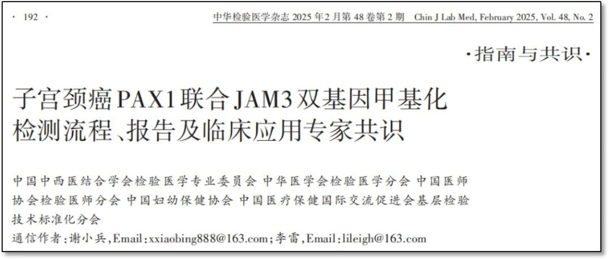
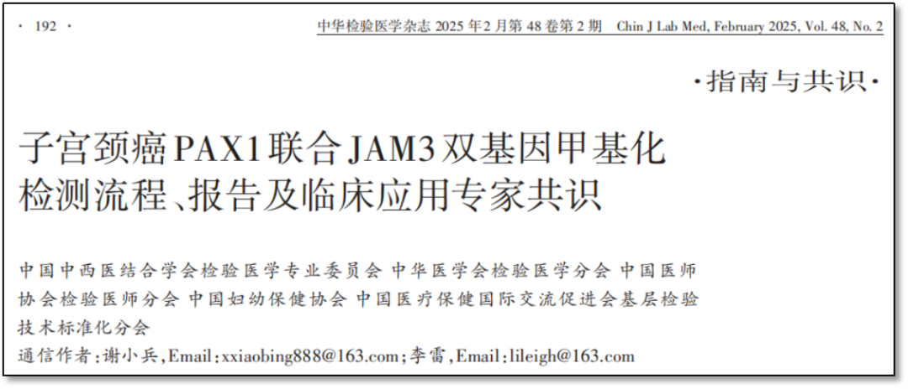
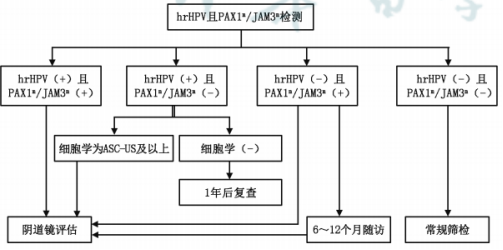
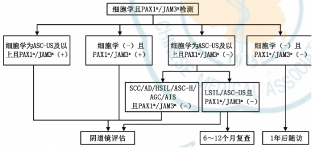

In February 2025, the *Expert Consensus on PAX1 Combined with JAM3 Dual-Gene Methylation Detection for Cervical Cancer*, jointly issued by five authoritative organizations including the Laboratory Medicine Professional Committee of the Chinese Association of Integrated Traditional Chinese and Western Medicine, the Laboratory Medicine Branch of the Chinese Medical Association, the Laboratory Physician Branch of the Chinese Medical Doctor Association, the China Maternal and Child Health Association, and the Primary Laboratory Technology Standardization Branch of the China International Exchange and Promotive Association for Medical and Health Care, was published in the *Chinese Journal of Laboratory Medicine*. Based on the analysis of PAX1/JAM3 dual-gene methylation detection technology, this consensus provides the first DNA methylation technology clinical application standard for cervical cancer early screening, marking a new stage in China's precision cervical cancer prevention and control.

Based on the current state of cervical cancer screening and the development of screening methods and strategies, the Laboratory Medicine Professional Committee of the Chinese Association of Integrated Traditional Chinese and Western Medicine, in collaboration with four other professional associations, organized multidisciplinary experts in laboratory medicine, pathology, and obstetrics/gynecology to jointly develop this consensus on methylation testing and clinical application. The consensus comprehensively reviews the laboratory workflow and quality control standards, sample collection and processing for PAX1/JAM3 dual-gene methylation (PAX1/JAM3) detection, and proposes the significance and function, laboratory testing workflow, quality control, reporting, and clinical application recommendations for PAX1/JAM3 testing. The consensus aims to promote the standardized application of cervical cancer methylation testing in laboratory and clinical settings, ensuring the accuracy and reliability of test results, and providing practical and forward-looking guidance for clinical application scenarios.

**Breaking Through Traditional Screening Challenges: Methylation Technology Advantages Highlighted**

Cervical cancer, as a major threat to women's health globally, has long faced numerous challenges in screening. Traditional screening methods, such as cytology and HPV testing, while playing a role to some extent, still suffer from issues including low coverage and inadequate technical approaches. Against this backdrop, the emergence of DNA methylation markers brings new hope to cervical cancer screening. _PAX1_ and _JAM3_ gene methylation testing, as a novel detection method, has attracted widespread attention for its high sensitivity and specificity.

  * Early warning: Can identify the risk of persistent lesion progression after HPV infection; methylation level changes indicate persistent HPV infection
  * Precision triage: Effectively distinguishes high-risk populations requiring clinical intervention, reducing unnecessary invasive examinations

  * Non-invasive and convenient: Cervical exfoliated cell testing, suitable for primary healthcare promotion

  * Standardized detection: PCR-fluorescent probe method adaptable to healthcare institutions at all levels

**Jointly Recommended by Authoritative Experts: Four Core Application Scenarios**

Abnormal methylation plays an important role in cancer formation and progression, regulating tumor development and progression. Methylation testing is increasingly being used in cancer diagnosis, monitoring, and treatment.

  * Methylation level changes indicate persistent HPV infection

  * Methylation testing applied to auxiliary diagnosis of cervical lesions, preventing missed diagnosis

  * Methylation testing for hrHPV-positive triage

  * Methylation testing for ASC-US cytology management

**Combined with HPV and Cytology to Improve Cervical Cancer and Lesion Screening and Diagnostic Accuracy**

Consensus Statement 7: PAX1/JAM3 testing as auxiliary diagnosis will improve the accuracy of cervical cancer and lesion screening and diagnosis. At the current evidence level, comprehensive judgment combined with HPV or cytology results is still needed to develop follow-up and treatment plans (Level 2, Recommended).

The *Consensus* provides detailed pathway recommendations and descriptions for PAX1/JAM3 dual-gene methylation testing in combination with HPV testing and cytology in clinical settings.

Figure 1: Clinical Management of PAX1/JAM3 Combined with Non-Genotyped High-Risk HPV Test Results

Figure 2: Clinical Management of PAX1/JAM3 Combined with Cytology Test Results

**Emphasis on Standardized Testing and Reporting Workflow**

In terms of technical implementation, the expert consensus emphasizes the importance of standardized operating procedures, including sample collection, preservation and processing, laboratory quality control standards, and standardized reporting requirements, ensuring the accuracy and reliability of test results. The consensus also proposes that in clinical application, PAX1/JAM3 dual-gene methylation testing should be used in combination with other screening results, such as HPV testing and cytology, for more precise clinical decision-making.

**Supporting the National Strategy to Eliminate Cervical Cancer**

The consensus expert group pointed out that the clinical application of PAX1/JAM3 dual-gene methylation testing technology will help achieve the goals of the *Action Plan for Accelerating the Elimination of Cervical Cancer (2023–2030)*. This technology has completed clinical validation in multiple domestic Class III Grade A hospitals, and its standardized testing protocol is suitable for implementation across healthcare institutions at all levels. The publication of this expert consensus fully affirms the application value of this kit in cervical cancer screening. Looking ahead, as more clinical validations are conducted, PAX1/JAM3 dual-gene methylation testing is expected to play a greater role in cervical cancer screening, contributing to China's cervical cancer prevention and control efforts.

**Article Link**

https://rs.yiigle.com/cmaid/1530233

**About CISPOLY**

Beijing Origin CISPOLY Biotechnology Co., Ltd. is a technology-driven enterprise committed to health innovation. As a pioneer in the field of early gynecologic oncology diagnosis, CISPOLY has developed early-detection products for cervical cancer, endometrial cancer, and ovarian cancer using proprietary technologies and patent-protected biomarkers, filling a critical gap in the field.

As women pay increasing attention to their own health, the women's health market holds great potential. Beyond the early screening and diagnosis product pipeline for gynecologic oncology, CISPOLY will continue to build additional women's health product lines, establishing itself as a technology-innovation-leading enterprise in the women's health market.