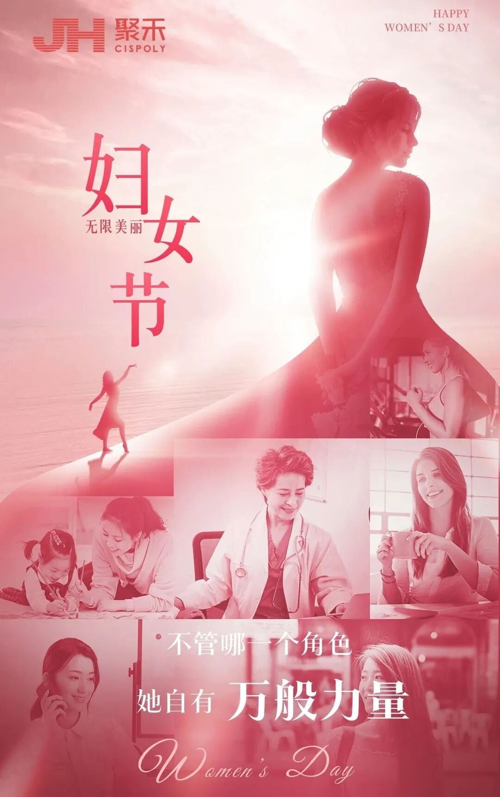
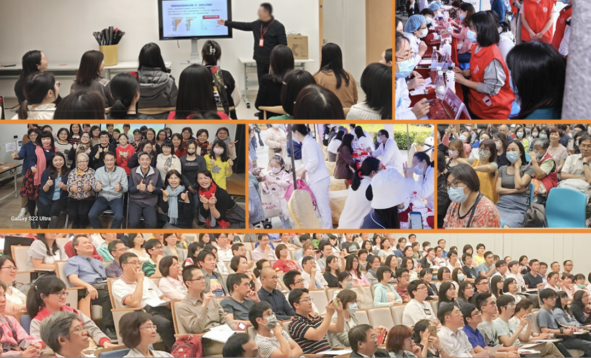

As the 115th International Women's Day approaches — a day when the world focuses on women's rights and health — and especially following the World Health Organization (WHO) global strategy to "eliminate cervical cancer by 2030," preventing and prioritizing women's cancer is recognized as a critical issue affecting global women's health. Many countries and organizations link women's cancer prevention with Women's Day to promote awareness of women's health. Many countries promote free cancer screenings, charitable and public engagement activities, health lectures, "Cervical Cancer Awareness Day," "International HPV Awareness Day," and other globally connected events during Women's Day.

CISPOLY participated in International Women's Day activities themed "New Precision Technology — Creating Healthy Women, Healthy Futures," aimed at raising global awareness of gynecologic tumor prevention — cervical cancer and endometrial cancer — and women's health issues. Leveraging CISPOLY's independently developed CISCER® (cervical cancer) _PAX1_ and _JAM3_ dual-gene methylation detection reagent and CISENDO® (endometrial cancer) _CDO1_ and _CELF4_ dual-gene methylation detection reagent, DNA methylation testing technology was used in partnership with major medical institutions and social organizations to conduct nationwide online and offline activities. Health advocacy and screening services were provided across Beijing, Tianjin, Shandong, Shanghai, Anhui, Hunan, Guangdong, and other provinces and cities through expert free clinics, health education, and other means, promoting early diagnosis and treatment of cervical cancer. Through these activities, women were encouraged to pay more attention to their own health, making precision non-invasive methylation testing the most precious Women's Day gift for women's self-care.

PS: The Origin of Women's Day

International Women's Day originated in the labor and women's rights movements of the early 20th century. In 1908, textile women workers in New York held large-scale demonstrations demanding improved working conditions, shorter hours, higher wages, and voting rights. In 1910, German socialist Clara Zetkin proposed establishing International Women's Day at the International Socialist Women's Conference in Copenhagen to commemorate women's struggle for equal rights. In 1911, Austria, Denmark, Germany, and Switzerland first celebrated International Women's Day. In 1975, the United Nations officially designated March 8 as International Women's Day, aimed at promoting gender equality and women's rights development.

**As the technical supporter of the activities, the gynecologic tumor screening products independently developed by Beijing Origin CISPOLY Biotechnology Co., Ltd. served as the core technology tools for this public welfare initiative:**

1. Supporting National Cervical Cancer Prevention Free Clinic Activities

Participated in cervical cancer prevention free clinic activities held by medical institutions in multiple provinces and cities, providing cervical cancer screening services. These activities aimed to raise women's awareness of cervical cancer and reduce incidence rates through precision early screening and prevention.

2. Public Education on Gynecologic Tumor Methylation Testing

Through educational lectures, brochures, and other formats, the importance of non-invasive gynecologic tumor methylation testing was communicated to the public. Using non-invasive cervical brushing of exfoliated cells or self-collected specimens enables more precise identification of cervical cancer and endometrial cancer, addressing the shortcomings and psychological burden of traditional detection methods.

3. Health Consultation

Multiple activities provided free health consultation services for women, with particular focus on high-risk populations for cervical cancer and endometrial cancer, such as those with persistent HPV infection, obesity, and metabolic diseases. Counseling and discussion were provided on issues troubling women and cancer risk, with methylation testing for further cancer risk assessment.

4. Online and Offline Combined Public Welfare Activities

Some activities used online livestreaming, educational dramas, and other formats to expand outreach and attract broader participation.

This nationwide Women's Day initiative was a two-way journey of love and science. The activities cumulatively reached over 100,000 participants, bringing the professional term "gynecologic tumor methylation" into the public eye. As Nobel laureate Tu Youyou said: "Health is the cornerstone of human dignity." This Women's Day, using gynecologic methylation testing developed for Chinese women's health as a fulcrum, combined with the dance of technology and humanity, leveraged the conceptual and precision revolution of women's proactive health management. Every early screening is a gentle promise to women's lives and harmonious families.

The hospitals and institutions participating in these activities call upon more hospitals nationwide to join the technology-health public welfare initiative, providing age-appropriate women with non-invasive, low-risk, and highly precise early cancer detection services, and promoting the implementation of the "early detection, early intervention" prevention goal. "Accelerating the Elimination of Gynecologic Tumors — China Action" is not merely a Women's Day public welfare activity but a national action for life and health in China. Going forward, we will continue to unite with all sectors of society to deepen the gynecologic tumor prevention and control system, contributing to and establishing China's distinctive health solution for the global elimination of gynecologic tumors.

**About CISPOLY**

Beijing Origin CISPOLY Biotechnology Co., Ltd. is a technology-driven enterprise committed to health innovation. As a pioneer in the field of early gynecologic oncology diagnosis, CISPOLY has developed early-detection products for cervical cancer, endometrial cancer, and ovarian cancer using proprietary technologies and patent-protected biomarkers, filling a critical gap in the field.

As women pay increasing attention to their own health, the women's health market holds great potential. Beyond the early screening and diagnosis product pipeline for gynecologic oncology, CISPOLY will continue to build additional women's health product lines, establishing itself as a technology-innovation-leading enterprise in the women's health market.