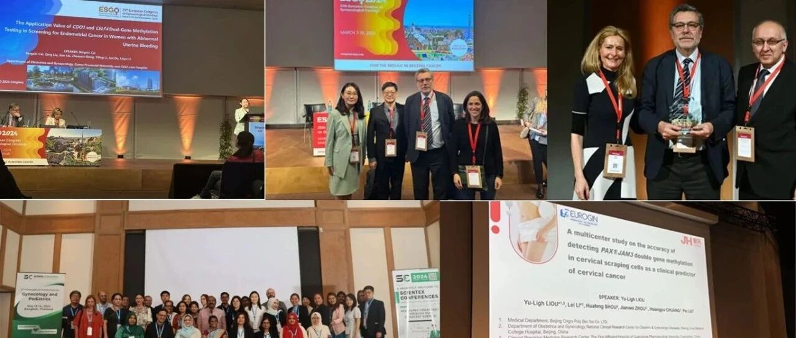
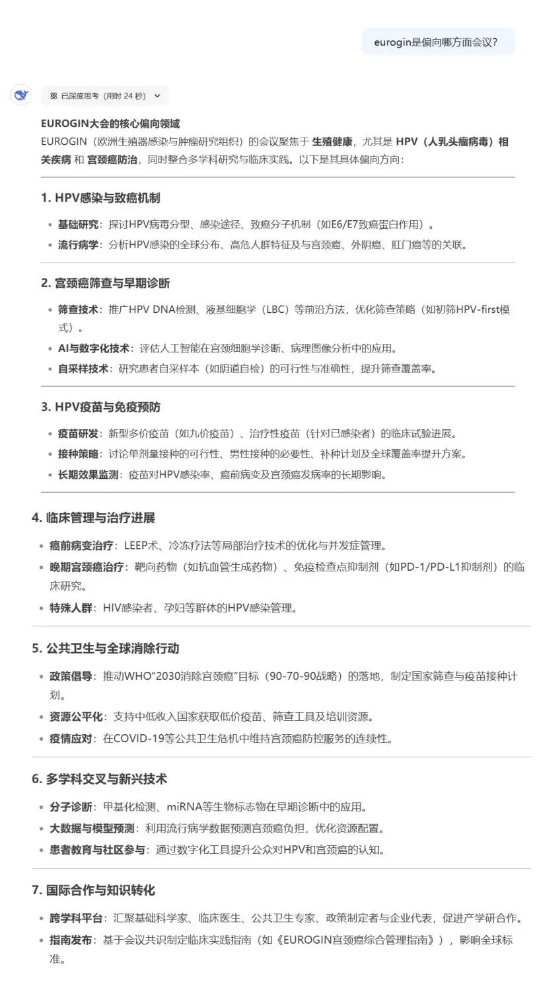
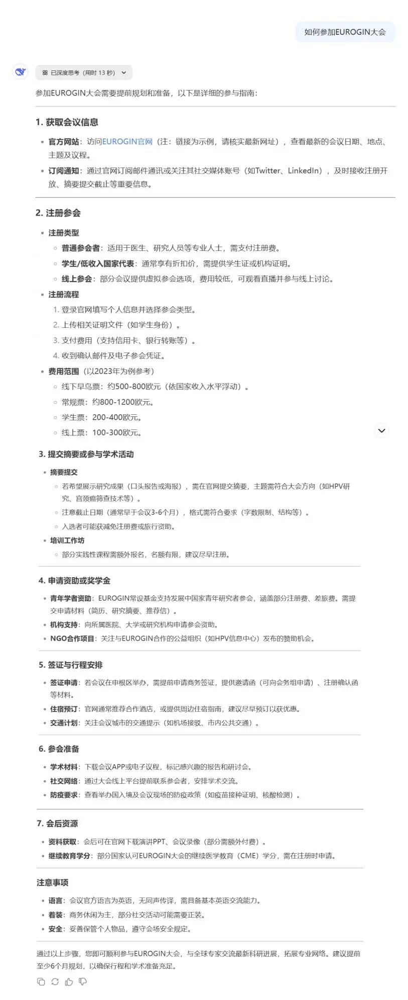
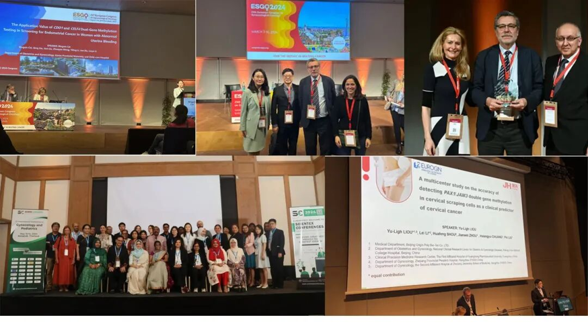

# 中国甲基化技术革新宫颈癌筛查：从实验室到全球临床实践的新范式

_2025年03月13日 10:14_

近些年随着我国国内甲基化技术的普及和发展越来越成熟，想必中国甲基化在国际舞台上也会持续发光。

我们来问一问deepseek对国际会议的了解程度？

（以EUROGIN大会为例）

**EUROGIN大会的独特偏向在于：**

以HPV和宫颈癌为核心，覆盖从基础研究到临床、公共卫生的全链条。

强调技术创新与资源公平，推动筛查技术普及和疫苗可及性。

注重全球协作，尤其关注中低收入国家的需求，助力消除宫颈癌的全球目标。

那么我们如何参加这种国际会议呢？

ESGO会议(European Society of Gynaecological Oncology)，是欧洲领先的妇科癌症研究组织，致力于通过预防、卓越的护理、高质量的研究和教育，提高妇科癌症患者的健康和福祉。

这种国际大会尤其是要以口头报告的的形式宣讲，投稿人需要完善自己的摘要。在官网的早早的确定好投稿以及大会开幕时间，进行投稿。国外会议是全球性的更大舞台，想必未来的几年会有更多的中国甲基化站上像ESGO这种国际大会。

聚禾生物的甲基化技术在过去几年里参加了不少知名国际会议，例如 EUROGIN、ESGO、International Conference on Gynecology and Obstetrics等国际会议。

在2024年第25届欧洲妇科肿瘤协会（ESGO）上，聚禾公司和国内医师临床科研合作首次以内禾蔻安子宫内膜癌(CDO1和CELF4)甲基化无创筛检计划在ESGO口头演讲，并获得内膜癌专场美国凯瑟琳癌症中心Nadeem R. Abu-Rustum主席极度赞扬。

**关于禾蔻安子宫内膜癌甲基化检测试剂盒**

国家药品监督管理局（NMPA）针对子宫内膜癌无创检测首先批准了“人CDO1和CELF4基因甲基化检测试剂盒（PCR-荧光探针法）”（商品名：禾蔻安子宫内膜癌甲基化检测试剂盒）的产品注册申请(国械注准20243402610)，采用子宫颈采集标本结合 _CDO1_ 和 _CELF4_ 基因甲基化检测技术，有效降低了传统宫腔刷取标本的风险与操作难度并展现出优异的检测性能，灵敏度达94.51%，特异度为94.16%，能够避免宫腔取样带来的风险，适用于门诊及基层医疗机构的广泛推广。此外，该技术可在宫腔镜检查前进行无创甲基化评估，显着降低患者的生理损伤风险，为子宫内膜癌的早期筛查提供了更安全、便捷的解决方案。

**关于聚禾生物**

北京起源聚禾生物科技有限公司是以创新科技为驱动、以关注健康为宗旨的科技企业。聚禾生物是妇科肿瘤早诊领域的开拓者，以独家技术和专利保护的标志物为核心，开发了宫颈癌、子宫内膜癌、卵巢癌等妇科肿瘤早诊产品，填补了该领域的空白。

随着女性对自身健康的关注越来越密切，女性健康市场将大有可为，除妇科肿瘤早筛早诊产品线外，未来聚禾生物还将建立更多女性健康相关的产品管线，打造女性健康市场的技术创新型领先企业。
