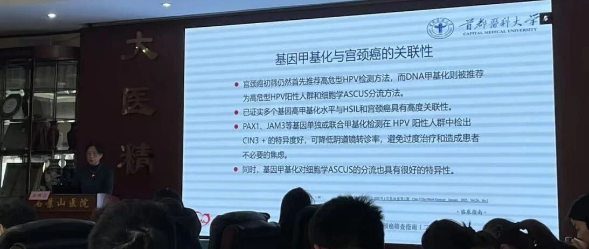
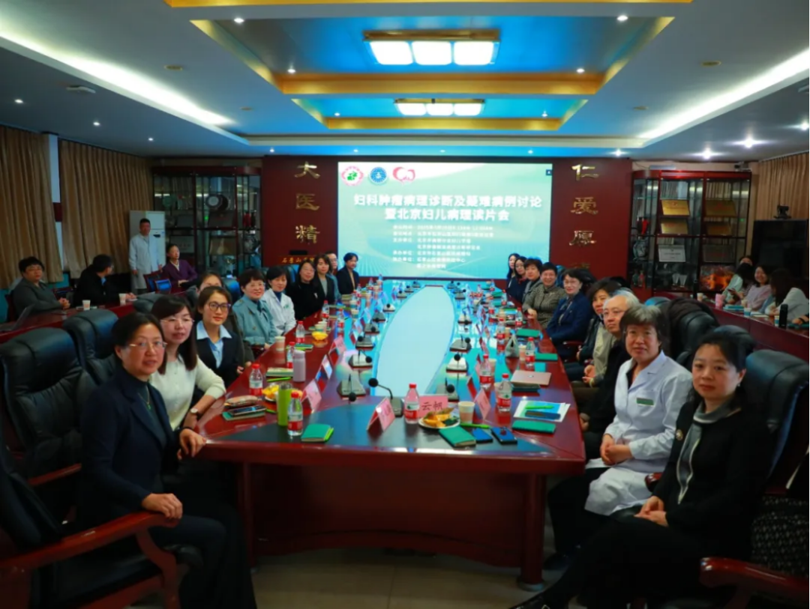
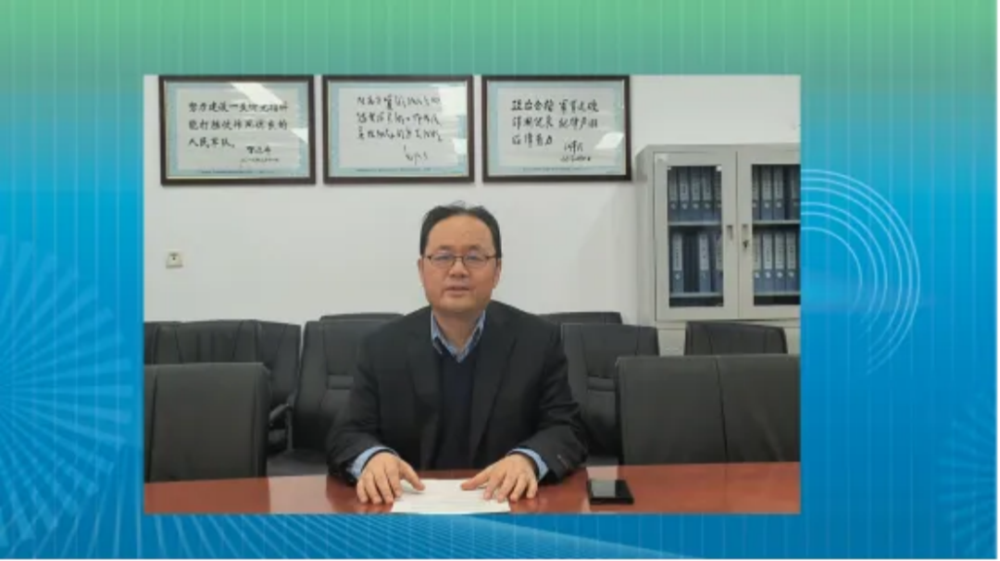
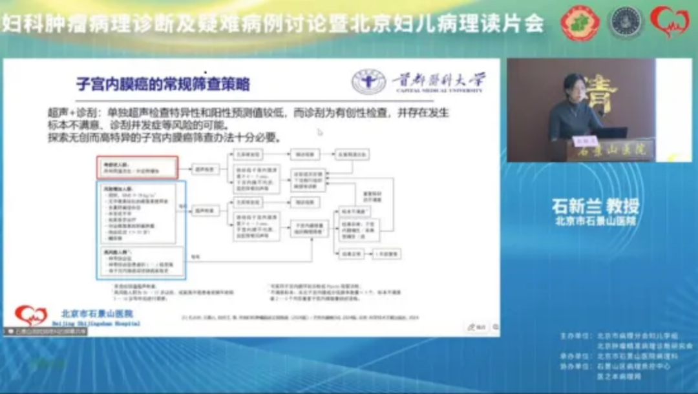
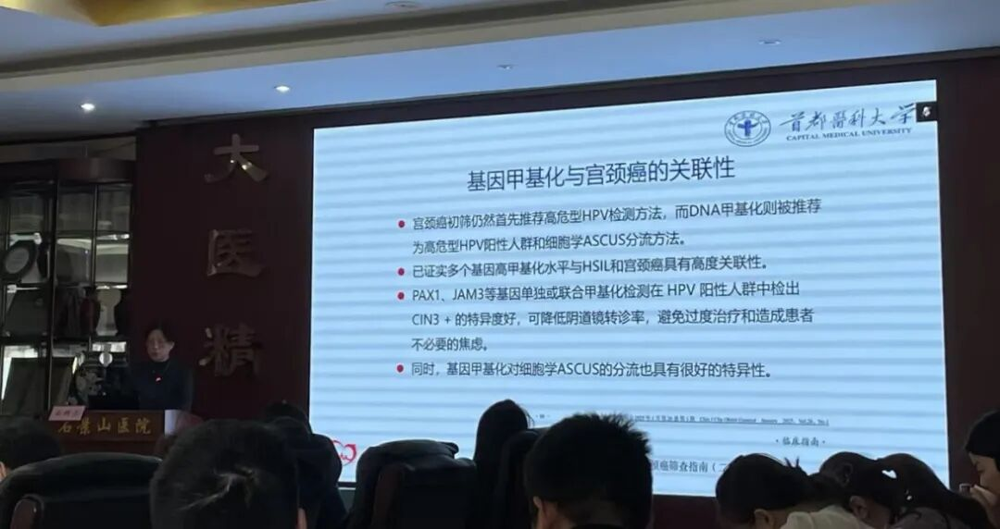
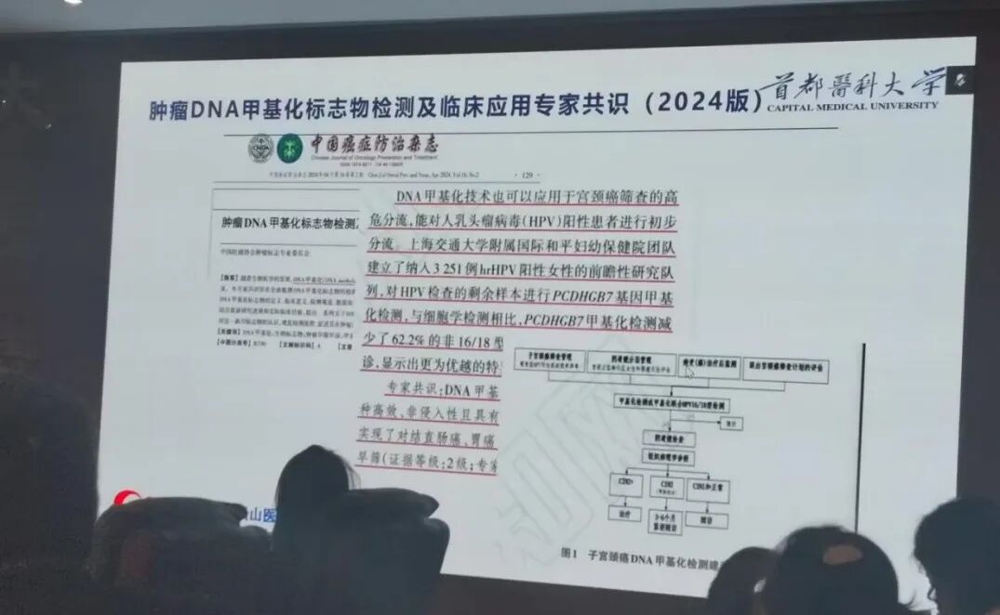

# 妇科肿瘤病理诊断及疑难病例讨论暨北京妇儿读片会圆满落幕，DNA甲基化引起热烈讨论！

_2025年04月03日 10:33_

春意盎然，学术争鸣。3月29日，妇科肿瘤病理诊断及疑难病例讨论暨北京妇儿读片会在石景山医院如期举行。会议由北京市病理学会妇儿学组及北京肿瘤精准病理诊断研究会联合主办，石景山医院病理科承办，石景山区病理质控中心与医之本病理网协办。中国人民解放军总医院第一医学中心石怀银教授、中日友好医院钟定荣教授和中国人民解放军总医院第七医学中心刘爱军教授担任大会主席。来自北京各大医院50余名病理专家学者莅临会议，同时，会议全程网上直播，收看直播的观众达4200余人次，受到了广大病理同仁的关注。

大会主席石怀银教授首先通过视频致辞，石教授代表北京医学会病理学分会对会议召开表示热烈祝贺，对石新兰教授团队对本次会议的积极筹备表示感谢。他表示妇科肿瘤的个性化治疗离不开病理精准诊断与分型，在日常工作中，卵巢交界性肿瘤、种植、微浸润等问题有时很难把握，疑难病例的诊断更需要经验丰富的专家指引方向，同行们之间的交流和碰撞。

大会中，石新兰教授简单介绍了《DNA甲基化在子宫颈癌和子宫内膜癌中的应用研究》，DNA甲基化与肿瘤的发生发展紧密关联，石新兰教授从基因甲基化的概念以及甲基化与肿瘤关联性入手，介绍了基因甲基化在子宫颈癌筛查以及子宫内膜癌筛查中的意义和应用场景。

在讲座中，石新兰教授重点介绍了于2023年3月上市的禾宫康CISCER®双基因甲基化检测试剂盒。该试剂盒由北京协和医院团队牵头进行多中心临床研究，经历了完整的I、II、III期临床试验和万人真实世界验证研究，充分证实双基因甲基化在临床上的应用前景。通过对比甲基化取代细胞学分流以及传统指南分流方法，研究发现甲基化取代细胞学的分流方案将有机会降低28.68%的阴道镜转诊率，减少3.33%的宫颈癌漏诊率。

子宫内膜癌(EC)是全球范围内第二常见的妇科肿瘤, 由于妇女肥胖及糖尿病的患病率增长、绝经期治疗激素的使用减少及生育行为改变等因素, EC的发病率仍处于上升阶段, 并呈现年轻化趋势。子宫内膜癌（EC）在早期检测和非侵入性筛查策略方面提出了重大挑战，聚禾无创CDO1和CELF4双基因甲基化检测试剂禾蔻安已于2024年12月上市,可准确鉴别内膜癌与其他宫腔疾病具有高准确性与内膜癌高鉴别度的结果。

通过此次妇科肿瘤病理诊断及疑难病例讨论暨北京妇儿读片会，石景山医院病理科提高了对妇科肿瘤病理诊断认识，进一步强化了业务素质。将进一步增强与兄弟医院的交流与合作，查缺补漏，开拓视野，为石景山医院的高质量发展提供坚实的技术保障，为妇科肿瘤精准病理诊断贡献智慧与力量！

**关于聚禾生物**

北京起源聚禾生物科技有限公司是以创新科技为驱动、以关注健康为宗旨的科技企业。聚禾生物是妇科肿瘤早诊领域的开拓者，以独家技术和专利保护的标志物为核心，开发了宫颈癌、子宫内膜癌、卵巢癌等妇科肿瘤早诊产品，填补了该领域的空白。

随着女性对自身健康的关注越来越密切，女性健康市场将大有可为，除妇科肿瘤早筛早诊产品线外，未来聚禾生物还将建立更多女性健康相关的产品管线，打造女性健康市场的技术创新型领先企业。
