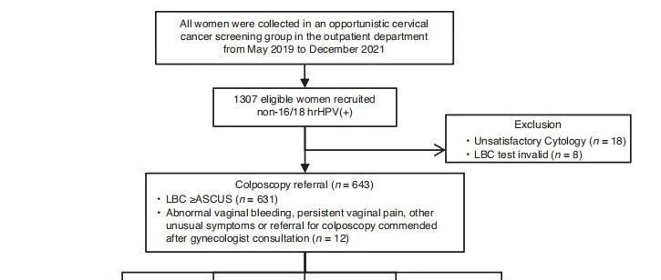
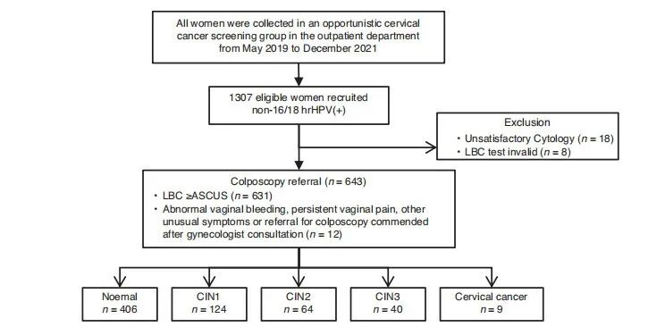
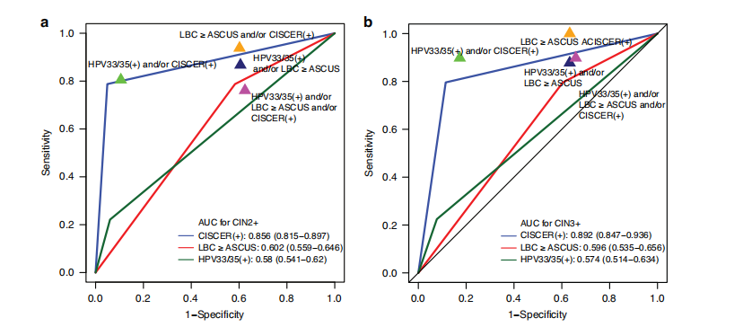

# 突破性禾宫康(CISCER)甲基化检测助力子宫颈癌早筛

_2025年04月11日 09:47_

近日，一项由北京协和医院的子宫颈癌甲基化研究发表在肿瘤知名杂志《British Journal of Cancer》，证实PAX1联合JAM3基因甲基化检测（禾宫康; CISCER）在子宫颈癌早期筛查中表现卓越。特别是在非HPV16/18型高危人群中，CISCER可更准确识别高级别癌前病变，同时大幅减少不必要的阴道镜检查。禾宫康(CISCER) 甲基化试剂盒为宫颈癌作为已获国家药监局批准的国产三类医疗器械产品对子宫颈癌精准防控提供了强有力的无创分子工具。

**研究背景丨子宫颈癌筛查面临哪些挑战？**

子宫颈癌的主要诱因是高危型HPV的持续感染，尤其是HPV16/18型。目前针对非16/18型感染（如HPV31、33、35等）人群的筛查与管理分流管理鲜有学者进行系统性研究。传统液基细胞学（LBC）受主观因素影响大、重复性差，加之阴道镜转诊率居高不下，易引发医疗资源浪费，在资源有限地区尤其难以普及。如何精准分流、避免过筛？分子检测成为新方向。

**研究方法丨禾宫康(CISCER)甲基化试剂盒与传统检测“同台竞技”**

研究基于北京协和医院领衔的METHY3和METHY4两项多中心前瞻性研究，纳入1307名非16/18型高危HPV感染女性。受试者接受HPV基因分型、LBC和禾宫康甲基化检测，最终通过病理诊断确认病变等级。研究系统比较三种方法在CIN2+和CIN3+病变筛查中的表现，评估其敏感性、特异性、阴道镜转诊率及阳性预测价值，并通过多因素回归分析独立预测因素。

**研究结果|禾宫康甲基化检测准又高效**

禾宫康(CISCER)甲基化试剂盒检测在CIN3+风险预测中表现最佳，阳性者风险高达39.3%，阴性者仅0.9%，AUC值达0.892。相比之下，LBC阳性者风险仅9.8%，而其转诊率却高达61.9%。CISCER阳性转诊率仅17.4%，显着降低过度筛查风险。CISCER是唯一对CIN3+具有显着独立预测作用的因素（OR = 68.07）。结合HPV33/35分型后，CIN3+风险提升至50%，筛查效率显着提升，特别适用于细胞学资源不足的基层地区。

**研究结果|禾宫康甲基化检测准又高效**

禾宫康(CISCER)甲基化检测凭借自动化、标准化优势，尤其适合病理资源有限的地区。联合HPV分型检测，CISCER阴性者经过医师综合评估后或可直接回归常规筛查，无需频繁复查或侵入性检查和过度治疗。未来，期待禾宫康(CISCER)甲基化检测被纳入国家筛查流程，成为非16/18型高危HPV感染女性的标准分诊工具，助力实现世界卫生组织“消除子宫颈癌”目标，为女性健康加上“分子级”保护。

**参考文献**

Su, H., Jin, X., Kong, L. et al. The triage role of cytological DNA methylation in women with non-16/18, specifically genotyping high-risk HPV infection. Br J Cancer (2025). https://doi.org/10.1038/s41416-025-03005-5.

**文章链接**

https://www.nature.com/articles/s41416-025-03005-5

**关于聚禾生物**

北京起源聚禾生物科技有限公司是以创新科技为驱动、以关注健康为宗旨的科技企业。聚禾生物是妇科肿瘤早诊领域的开拓者，以独家技术和专利保护的标志物为核心，开发了宫颈癌、子宫内膜癌、卵巢癌等妇科肿瘤早诊产品，填补了该领域的空白。

随着女性对自身健康的关注越来越密切，女性健康市场将大有可为，除妇科肿瘤早筛早诊产品线外，未来聚禾生物还将建立更多女性健康相关的产品管线，打造女性健康市场的技术创新型领先企业。
