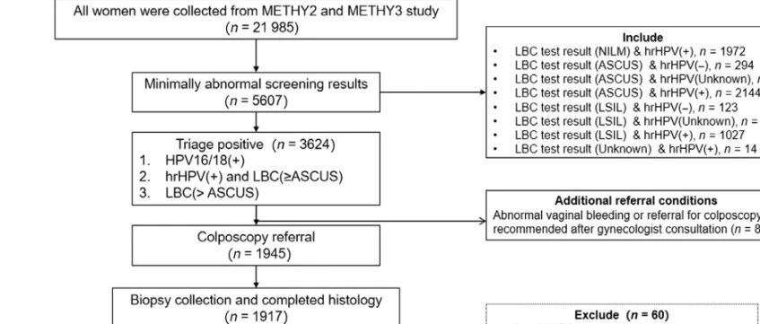
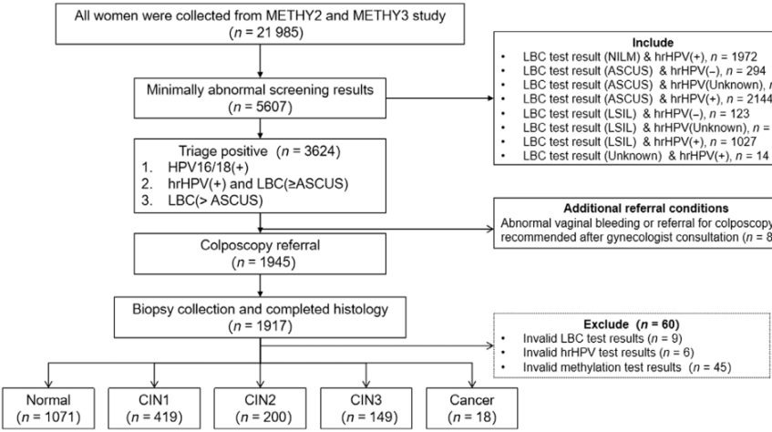
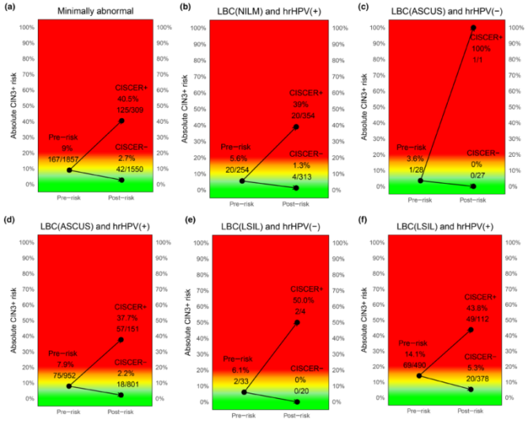

Cytologic DNA methylation for managing minimally abnormal cervical cancer screening results

Recently, a clinical study conducted at Peking Union Medical College Hospital demonstrated that for women with "minimally abnormal" cervical cancer screening results (such as ASCUS, LSIL, or HPV-positive but cytology-negative), detecting PAX1 and JAM3 gene methylation levels (CISCER® testing) can effectively identify patients with high-grade cervical lesions (CIN3+), significantly reducing colposcopy referral rates, and advancing cervical cancer screening toward a more precise and efficient direction.

**Study Background | How to Manage Minimally Abnormal Patients?**

Cervical cancer is the fourth most common cancer among women worldwide, with approximately 110,000 new cases and nearly 60,000 deaths in China in 2020, representing a significant disease burden. Currently, routine screening methods include high-risk human papillomavirus (hrHPV) testing and cervical cytology. Management of "minimally abnormal" results such as ASCUS, LSIL, or HPV-positive but cytology-negative is difficult, easily leading to over-referral or missed lesions. Existing research suggests that gene methylation is closely associated with the early development of cervical cancer, but systematic studies on combined PAX1 and JAM3 gene methylation testing for triage of minimally abnormal screening results have been lacking.

**Study Methods | Real-World Large Cohort Validates Effectiveness**

This study was based on the METHY2 and METHY3 cohort studies conducted at Peking Union Medical College Hospital. It enrolled 1,857 women with "minimally abnormal" cytology diagnoses of ASCUS, LSIL, or hrHPV-positive but normal cytology, after hrHPV genotyping, cytopathology, cervical biopsy, and CISCER® testing (based on PAX1/JAM3 gene methylation detection). The study evaluated the screening performance and suitability of CISCER® technology in different risk populations by comparing histopathology results.

**Key Technologies:**

- Sample processing: Used liquid-based cytology (LBC) and fully automated real-time fluorescence quantitative PCR technology to detect PAX1 and JAM3 gene methylation levels.

- Determination criteria: Positive when PAX1 or JAM3 methylation level was below threshold (ΔCt PAX1 ≤ 6.6 or ΔCt JAM3 ≤ 10.0).

- Data analysis: Evaluated detection performance using ROC curves and calculated CIN3+ risk and colposcopy referral requirements under different screening strategies.

**Study Results | Reducing Referral Rates While Maintaining High Sensitivity**

The CISCER® test demonstrated a sensitivity of 74.9% and specificity of 89.1% for CIN3+. The CIN3+ risk for test-positive individuals was 40.5%, far exceeding the 2.7% for test-negative individuals. With this technology, only 2.5 referrals were needed to detect each CIN3+ case, significantly better than the 11.1 with traditional methods. Among women with NILM cytology combined with hrHPV infection, CISCER® showed the highest AUC (0.867), indicating superior triage performance compared to traditional methods in this population. Additionally, sensitivity was even higher (79.5%) for postmenopausal women aged ≥50.

**Study Significance | Exploring Smarter Cervical Cancer Screening Pathways**

This study confirms that CISCER® methylation testing provides a more precise triage strategy for managing minimally abnormal screening results — efficiently identifying potential high-grade lesions while reducing over-intervention in low-risk populations. It effectively reduces colposcopy referral rates for patients with minimally abnormal screening results, alleviating pressure on medical resources and reducing the burden of overtreatment for low-risk women. Furthermore, CISCER®'s excellent performance in postmenopausal women screening provides new insights for personalized screening applications. In the future, CISCER® testing is expected to serve as a powerful supplement to the routine screening system, optimizing screening workflows and improving efficiency, helping to achieve the public health goal of "early diagnosis and early treatment."

**Conclusion**

This study by the Peking Union Medical College Hospital team provides an innovative solution for cervical cancer screening. By combining DNA methylation testing with existing screening methods, CISCER® technology achieves a breakthrough in risk stratified management and is expected to drive the upgrading of cervical cancer prevention and control strategies globally.

**Article Link**

Full article available at: DOI: 10.1002/ijgo.70167