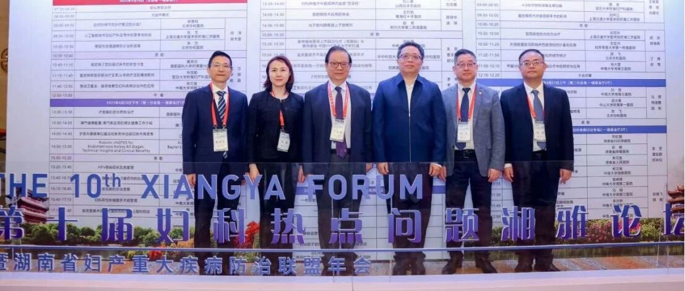
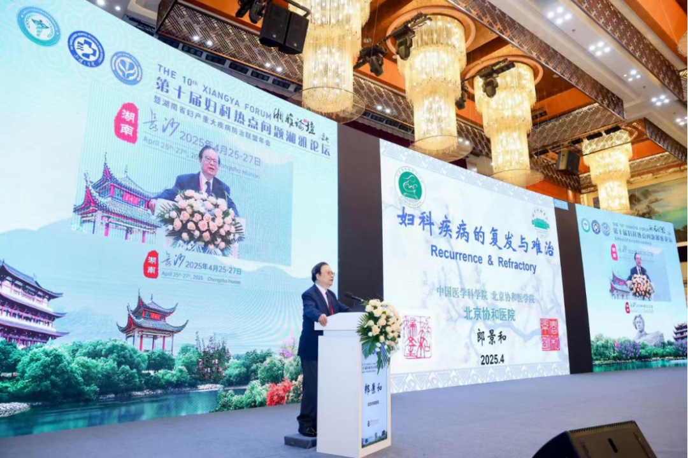
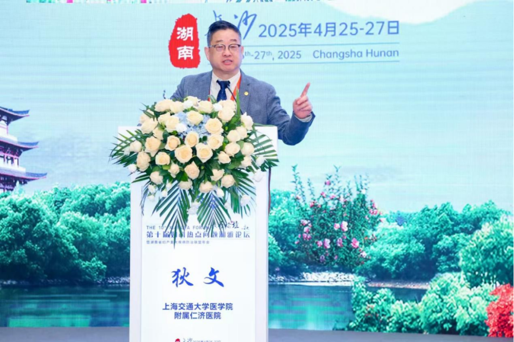
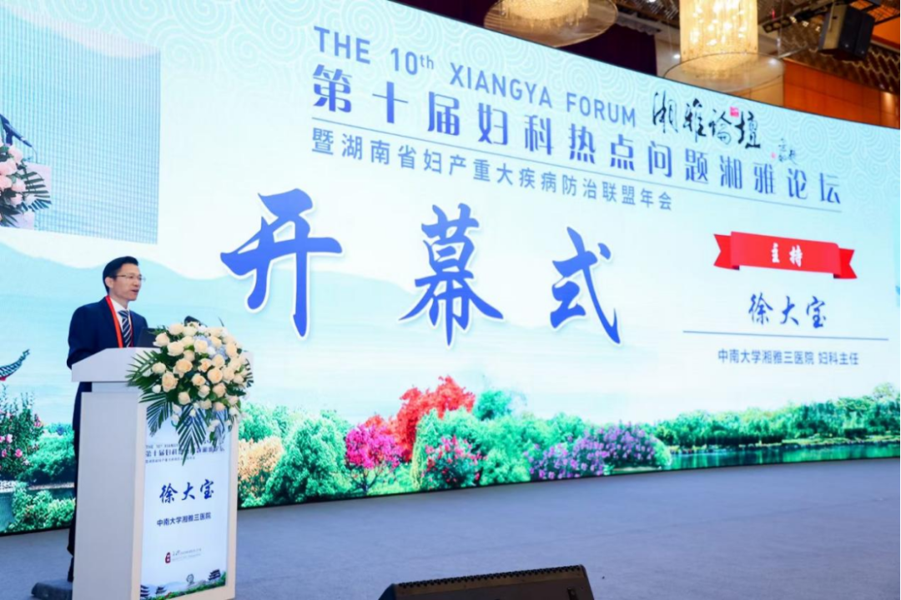
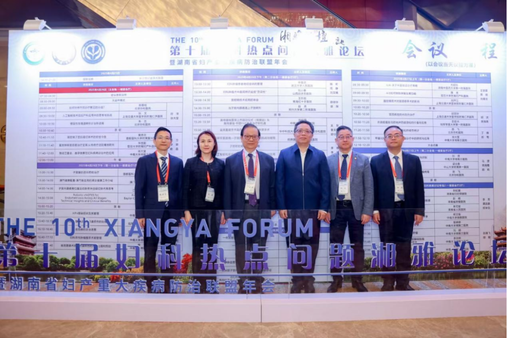
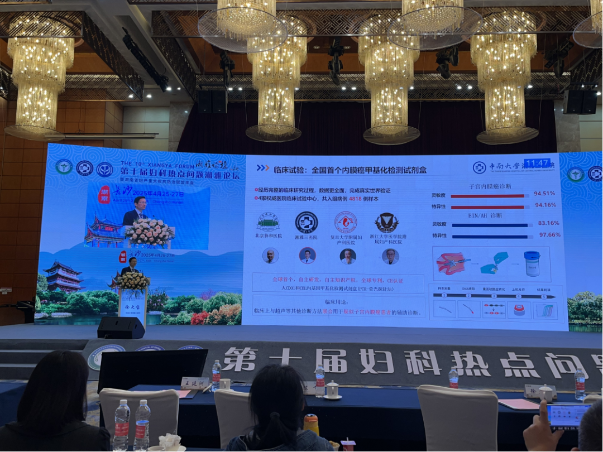

From April 25–27, the 10th Xiangya Forum on Gynecologic Hot Topics and the Hunan Province Major Obstetrics and Gynecology Disease Prevention and Treatment Alliance Annual Meeting, hosted by the Third Xiangya Hospital of Central South University, were held in Changsha. Academician Lang Jinghe from Peking Union Medical College Hospital, Professor Di Wen, President of the Chinese Medical Doctor Association Obstetrics and Gynecology Physician Branch, Professor Zhu Lan, Incoming Chair of the Chinese Medical Association Obstetrics and Gynecology Branch, Professor Chen Xiang, Dean of Xiangya Medical School of Central South University, and Professor Jiang Hong, President of the Third Xiangya Hospital of Central South University attended the opening ceremony and delivered speeches.

The conference was co-chaired by Professor Xue Min, Chief Expert at the Third Xiangya Hospital, and Professor Xu Dabao, Director of the Department of Obstetrics and Gynecology.

The forum invited numerous renowned domestic and international experts in gynecology to discuss hot topics and challenging issues, focusing on female fertility preservation through keynote speeches, surgical video demonstrations, and discussions of difficult and rare diseases. The latest theories, technologies, and products were shared from the perspective of female fertility preservation. The content was rich and diverse, presenting a high-level academic feast.

Professor Xu Dabao from the Third Xiangya Hospital of Central South University presented a specialized academic lecture titled "Research and Application of Methylation Testing Technology in Gynecologic Tumor Diagnosis and Treatment" that attracted widespread attention. He shared the latest global breakthroughs in non-invasive cervical cancer methylation testing technology and announced the world's first domestically developed endometrial cancer CDO1 and CELF4 methylation detection kit using the PCR-fluorescent probe method. This kit achieves non-invasive, accurate auxiliary diagnosis of endometrial cancer, marking a significant step forward for China in the field of early screening and diagnosis of gynecologic tumors.

**Multicenter Clinical Research and Independent R&D Achievements:**

Peking Union Medical College Hospital, in collaboration with the Third Xiangya Hospital, Fudan University Obstetrics and Gynecology Hospital, and other authoritative institutions, conducted multicenter clinical trials and research. Among these, the clinical trial for endometrial cancer CDO1 and CELF4 gene methylation detection enrolled 4,818 samples, showing a sensitivity of 94.51% and specificity of 94.16%. This achievement not only validates the reliability of the technology but also provides a powerful diagnostic tool for clinical practice. Follow-up of approximately 1,000 high-risk asymptomatic individuals or symptomatic patients undergoing hysteroscopy/surgery with non-endometrial cancer pathology over 6 months identified 3 endometrial cancer and 2 EIN patients, highlighting the predictive and precision capabilities of the non-invasive cervical brushing endometrial cancer CDO1 and CELF4 methylation detection kit.

**Advantages of the World's First Endometrial Cancer Methylation Detection Kit:**

This kit is the world's first CE-certified endometrial cancer methylation detection kit, with core advantages including:

High sensitivity and specificity: Clinical trial data shows that combined with imaging, sensitivity can be increased by 50.83%, significantly outperforming traditional detection methods.

Non-invasive and convenient: Testing can be completed using cervical cytology samples, avoiding the pain and complication risks of traditional tissue biopsy.

Early screening capability: In follow-up of populations with no pathological abnormalities or high-risk individuals, the baseline positivity rate was 4.75%, successfully detecting early lesions and giving patients valuable treatment time.

**Clinical Significance and Social Value:**

Current endometrial cancer diagnostic methods such as ultrasound and tumor marker testing suffer from low sensitivity and high false-negative rates, and methylation testing technology fills this gap. The research achievements of the Third Xiangya Hospital and collaborating hospitals nationwide not only improve the early diagnosis rate of endometrial cancer but also provide new solutions for fertility preservation. With the widespread adoption of this kit, it is expected to significantly reduce the missed diagnosis rate and mortality of gynecologic tumors, elevating China's gynecologic oncology diagnosis and treatment to new heights.

**About CISPOLY**

Beijing Origin CISPOLY Biotechnology Co., Ltd. is a technology-driven enterprise committed to health innovation. As a pioneer in the field of early gynecologic oncology diagnosis, CISPOLY has developed early-detection products for cervical cancer, endometrial cancer, and ovarian cancer using proprietary technologies and patent-protected biomarkers, filling a critical gap in the field.

As women pay increasing attention to their own health, the women's health market holds great potential. Beyond the early screening and diagnosis product pipeline for gynecologic oncology, CISPOLY will continue to build additional women's health product lines, establishing itself as a technology-innovation-leading enterprise in the women's health market.