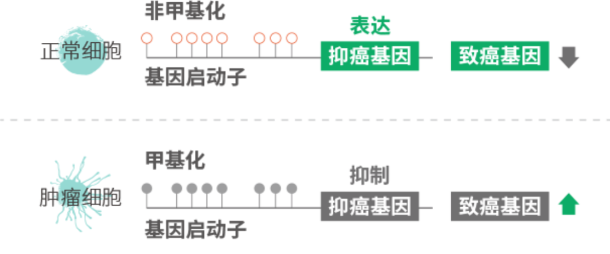
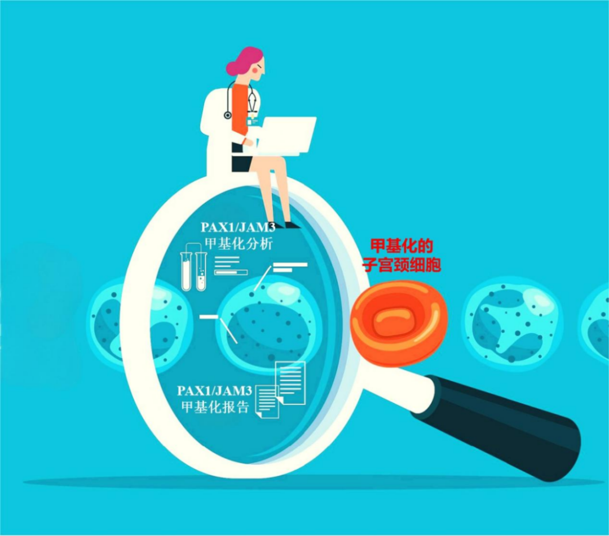

# 禾宫康(PAX1/JAM3)甲基化检测：宫颈癌筛查的“双保险侦察兵”

_2025年06月12日 11:15_

许多女性提起“子宫颈癌”，总觉得离自己很远？工作忙、家务重、有点“不好意思”去检查...很多女性朋友就这样把定期筛查一拖再拖。可等到身体发出警报，往往错过了最佳治疗时机，实在可惜！其实，宫颈癌在早期就像“悄悄潜伏的敌人”，几乎没有任何症状，但定期筛查就是揪出它的“火眼金睛”,也似黎明前的一缕曙光，能在病变尚小、可控时就将其揪出，治愈率可高达90%以上，真正做到“未雨绸缪，胜于临渴掘井”。

**01 传统筛查的“痛点”：像雾里看花**

目前，高危型人乳头状瘤病毒（hr-HPV）检测是宫颈癌筛查的首选方法，宫颈脱落细胞学检查则作为HPV阳性患者的分流方法。

HPV检测，即检查有没有感染高危型人乳头瘤病毒（这是宫颈癌的主要“元凶”）。但它有个问题：对是否存在高危型病毒非常敏感，但它并不能分辨那种一过性、会被免疫系统清除的“短暂访客”，和那种有可能继续发展为病变的“逗留者”，因此假阳性率相对较高，容易让人担心却不一定有实际风险。很多人感染后，身体自己就能把病毒清除掉（90%以上）。所以，HPV检测灵敏度高，却难分“过客”与“留客”。这就容易让人“虚惊一场”，白白担心。

宫颈抹片/细胞学检查 (TCT/LCT)，即医生在显微镜下看宫颈细胞有没有病变。但它高度依赖病理医师的判断能力，很依赖医生的“眼力劲儿”。对基层医院来说，经验和设备有限时，就像“瞎子摸鱼”，30%以上的CIN2+（高级别病变）可能被漏诊或误判，带来过度治疗或焦虑。所以，细胞学检测结果存在“小题大做”做了不必要的检查，或者“漏网之鱼”没查出来的问题。

简单说：现有的两种方法，受其灵敏度和特异性限制，增加了阴道镜转诊率和子宫颈的有创性评估，只是各有千秋，却难以兼顾。故而，高灵敏度配上高特异度，才是王道。

**02 禾宫康甲基化检测（PAX1/JAM3）：宫颈健康的“双保险侦察兵”**

禾宫康甲基化检测（PAX1/JAM3）是专为宫颈癌设计的「双重基因侦察兵」，比一般甲基化检测更精准、更敏感。它像「双镜头相机」，不似传统方法看“表面现象”（病毒或细胞形态），而是深入细胞内部，同时捕捉两个关键基因（PAX1和JAM3）的“开关状态”——这就是“甲基化”。基因“开关”异常（甲基化），往往是细胞开始病变、走向癌变的早期信号。从基因层面捕捉“潜伏信号”，比普通检测多了一层“天眼”。

**为什么说它是“双保险侦察兵”？三大绝招：**

1、“双剑合璧”，看得更全、漏得更少

PAX1专攻鳞状细胞癌（占宫颈癌的70%以上），能捕捉鳞癌早期的基因「开关异常」。JAM3覆盖腺癌和鳞癌，对少见类型（如腺癌）更敏感，覆盖面更广。

举例：

单一基因检测像「单眼望远镜」，可能漏看死角；双基因则像「双眼观察」，PAX1和JAM3双管齐下，视野无死角，大大降低漏诊风险！

2、更高灵敏度，更早预警，提前“战”胜隐形病变

禾宫康比一般甲基化检测灵敏度提升20%，能发现更早期的危险癌前病变（如CIN3），甚至肉眼不可见的微小异常(高度病变或小灶癌)。

研究显示：禾宫康对HSIL（高度病变）的检出率比常规检测高15%，早发现，早干预，治疗效果自然更好！

3、精准定位“病变靶”，减少过度检查

禾宫康阳性结果可精准定位高风险区域，帮助医生决定是否需要活检或手术，避免不必要的过度治疗，既省钱又省心。

**03 早发现才能早治疗，甲基化检测让你“未雨绸缪”**

禾宫康甲基化试剂的成功，标志着中国在宫颈癌分子诊断领域已从“跟跑”转向“领跑”。其技术普惠性、临床精准性与社会价值，不仅为亿万女性筑起健康防线，更成为国产创新医疗器械的标杆。

未来，随着技术迭代与政策支持,禾宫康有望引领全球宫颈癌筛查进入“甲基化时代”，真正实现“早发现、早治疗”的终极目标，守护更多女性的健康与幸福！别再因为“怕麻烦”或“不好意思”而错过筛查，用好现代科技的“利器”，主动为你的健康上好“双保险”吧！

**关于聚禾生物**

北京起源聚禾生物科技有限公司是以创新科技为驱动、以关注健康为宗旨的科技企业。聚禾生物是妇科肿瘤早诊领域的开拓者，以独家技术和专利保护的标志物为核心，开发了宫颈癌、子宫内膜癌、卵巢癌等妇科肿瘤早诊产品，填补了该领域的空白。

随着女性对自身健康的关注越来越密切，女性健康市场将大有可为，除妇科肿瘤早筛早诊产品线外，未来聚禾生物还将建立更多女性健康相关的产品管线，打造女性健康市场的技术创新型领先企业。
