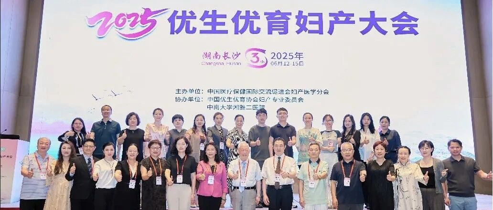
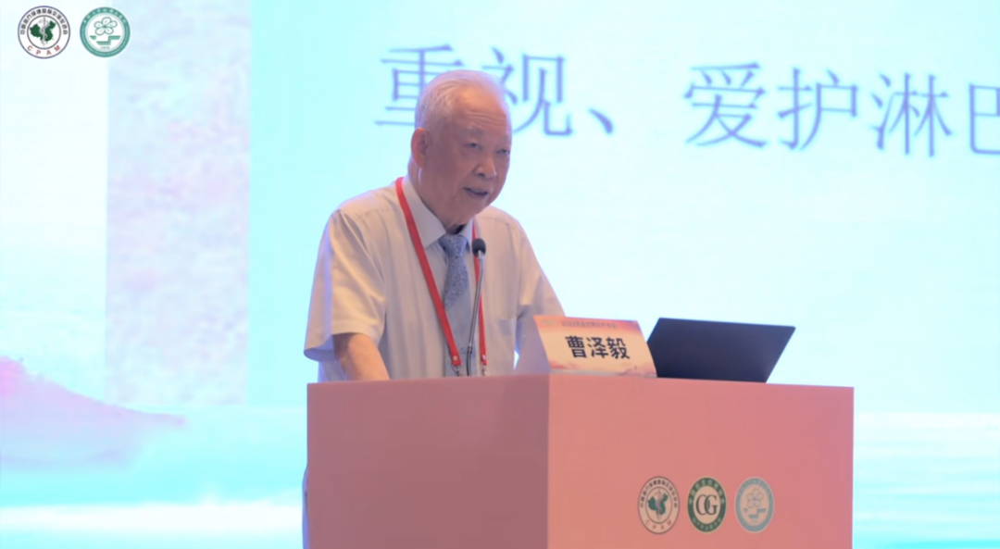
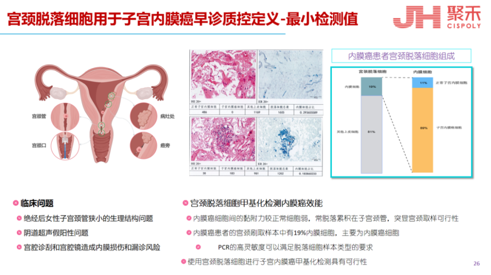
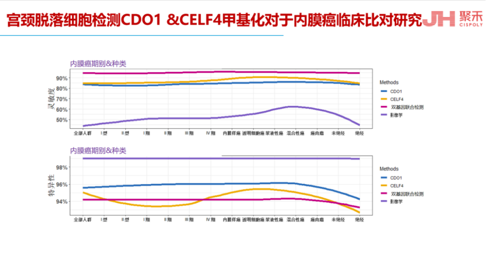
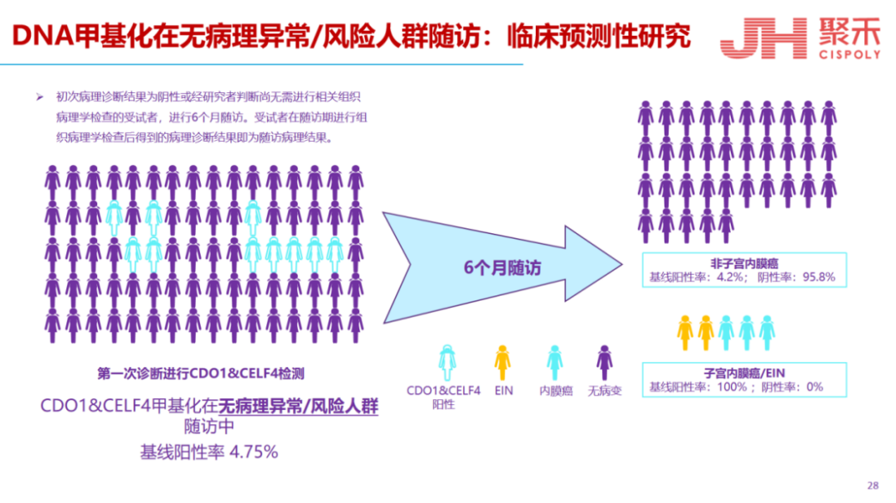
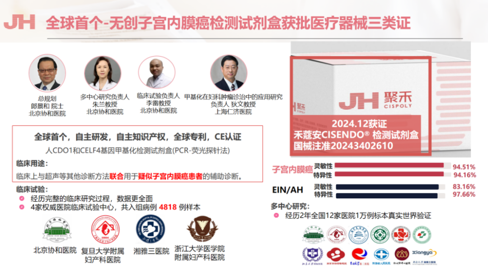

On June 13, 2025, the "2025 Healthy Birth and Obstetrics & Gynecology Conference," hosted by the Obstetrics and Gynecology Medicine Branch of the China International Exchange and Promotive Association for Medical and Health Care, and co-organized by the Obstetrics and Gynecology Professional Committee of the China Healthy Birth Science Association and the Second Xiangya Hospital of Central South University, grandly opened in Changsha, Hunan! This conference gathered obstetrics and gynecology experts and scholars from across the country, aiming to promote the concept of healthy birth, improve the standard of obstetrics and gynecology care, and safeguard women's health. Participating experts exchanged views on hot topics and cutting-edge technologies in obstetrics and gynecology.

The opening ceremony was chaired by Professor Fu Chun from the Second Xiangya Hospital of Central South University, who extended the warmest welcome and sincerest thanks to all guests, scholars, and online attendees! Professor Fu Chun introduced the conference theme of "Life's Starting Point, Healthy Future," bearing the responsibility of advancing obstetrics and gynecology innovation and safeguarding maternal and infant health.

Following this, the conference's Honorary Chair Professor Cao Zeyi delivered remarks, noting that the most important issue currently facing the obstetrics and gynecology community is healthy birth, with China's declining birth rate presenting new challenges for the era. Professor Cao specifically emphasized that this conference should deeply discuss, exchange, and summarize the current status and challenges of healthy birth and women's health in China — this is not only a topic for obstetrics and gynecology but an important component of the national health strategy, bearing great responsibility.

Professor Fu Chun summarized that the conference featured 1 main forum and 9 sub-forums including the Gynecologic Oncology Forum, Reproductive Anti-Aging and Restoration Forum, Integrated Chinese-Western Medicine Obstetrics and Gynecology Forum, HPV Infection and Vaginal Microenvironment Forum, and Intrauterine Disease and Fertility Preservation Forum.

In a gynecologic oncology forum lecture, Professor Liu Yuli from Beijing Tsinghua Changgung Hospital presented on "From Risk Stratification Management of Gynecologic Tumors to Individualized Precision Strategy: Reflections and Research Exploration," cutting in from the current state of female malignancy epidemiology, deeply analyzing the status, pain points, and challenges of female reproductive tract malignancies, and proposing solutions.

**Conference Reflections — Breakthrough New Products for Endometrial Cancer Early Screening**

After attending the conference, reviewing current endometrial cancer detection methodologies reveals that there is no effective precise screening method. Current imaging has low sensitivity; D&C can produce incomplete sampling and inaccurate results due to varying physician techniques; while hysteroscopy addresses the low sensitivity problem of D&C, it may also cause endometrial damage and potential fertility risks for reproductive-age women. The CISENDO® endometrial cancer methylation testing technology was summarized as providing key evidence for risk stratification of high-risk endometrial cancer populations through non-invasive cervical exfoliated cell testing, achieving precise identification of precancerous lesions.

Individualized precision medicine based on genetic testing and DNA methylation is a core future direction, particularly in balancing the needs of endometrial cancer early diagnosis, follow-up, and fertility preservation. CISENDO® new technology will restructure the diagnostic and treatment pathway, improving patient quality of life. This lecture provided the latest endometrial cancer screening and management insights, offering important theoretical foundations and innovative perspectives for future clinical practice and research exploration.

Figure 1

**Core Technology and Findings**

- Detection Principle
    - Endometrial cancer cells have weak adhesion and easily shed into the cervical canal (Figure 1).
    - In endometrial cancer patients' cervical exfoliated cells, endometrial cancer cells account for 89% (Figure 1 bar chart), demonstrating the feasibility of cervical sampling.
    - PCR high sensitivity can meet the needs of minimal cell detection (Figure 1).
- Clinical Problem Resolution
    - Overcomes postmenopausal cervical canal narrowing, transvaginal ultrasound false positives, and D&C missed diagnosis risks (Figure 1).
    - Non-invasive sampling: Replaces traditional hysteroscopy/D&C, reducing damage

Figure 2

**Biomarkers and Performance**

CDO1 & CELF4 combined methylation testing outperforms imaging in cancer type classification and staging (Figure 2).

Figure 3

**Clinical Validation Data**

Baseline CDO1 & CELF4 combined methylation testing positivity rate: 4.75% (in populations with no pathological abnormalities & high-risk women without hysteroscopy indications).

Follow-up findings: Among baseline-positive cases, 3 endometrial cancers and 2 EIN cases were pathologically confirmed within 6 months. CDO1 & CELF4 combined methylation testing positive predictive value: 100%. Baseline-negative cases showed a 95.8% negative follow-up rate.

Figure 4

**Multicenter Validation**

4 hospitals, 4,818 clinical trial samples + 12 hospitals nationwide, 10,000 real-world validation samples (Figure 4).

Dual-gene combined testing (CDO1 & CELF4 methylation): Sensitivity 94.51% (endometrial cancer), specificity 94.16% (Figure 4).

For precancerous lesions (EIN/AH): Sensitivity 83.16%, specificity 97.66% (Figure 4).

CISENDO® Kit: The world's first non-invasive endometrial cancer detection kit (received China Class III medical device certification in December 2024).

Use: Combined with ultrasound for auxiliary diagnosis of suspected patients. Patent-protected, CE certified.

**Key Conclusions and Recommendations**

1. Technical Advantages

✅ Non-invasive, high sensitivity/specificity

✅ Addresses diagnostic challenges in postmenopausal women

✅ Predicts precancerous lesion progression (EIN→cancer)

2. Clinical Significance

Risk stratification: Baseline methylation positivity requires close follow-up (6-month intervals).

Early diagnosis value: Combined with imaging, detection rates can be improved and missed diagnoses reduced.

The CISENDO® endometrial cancer methylation product mentioned above received China's first endometrial cancer methylation detection product registration certificate in 2024. CISPOLY is committed to gynecologic oncology early screening product R&D, having developed detection kits for endometrial cancer, ovarian cancer, cervical cancer, and more. CISPOLY fills gaps in gynecologic oncology screening scenarios with innovative technology, especially using non-invasive technology for endometrial cancer screening, which fills the clinical application void. The methylation kit, jointly developed by CISPOLY and multiple hospitals, achieves a sensitivity of 94.51% and specificity of 94.16% when combined with ultrasound — becoming the world's first non-invasive screening solution based on cervical exfoliated cells, providing an efficient and safe new option for early diagnosis of endometrial cancer.

**About CISPOLY**

Beijing Origin CISPOLY Biotechnology Co., Ltd. is a technology-driven enterprise committed to health innovation. As a pioneer in the field of early gynecologic oncology diagnosis, CISPOLY has developed early-detection products for cervical cancer, endometrial cancer, and ovarian cancer using proprietary technologies and patent-protected biomarkers, filling a critical gap in the field.

As women pay increasing attention to their own health, the women's health market holds great potential. Beyond the early screening and diagnosis product pipeline for gynecologic oncology, CISPOLY will continue to build additional women's health product lines, establishing itself as a technology-innovation-leading enterprise in the women's health market.