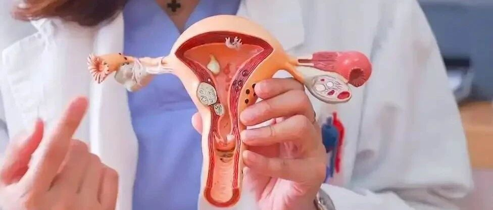
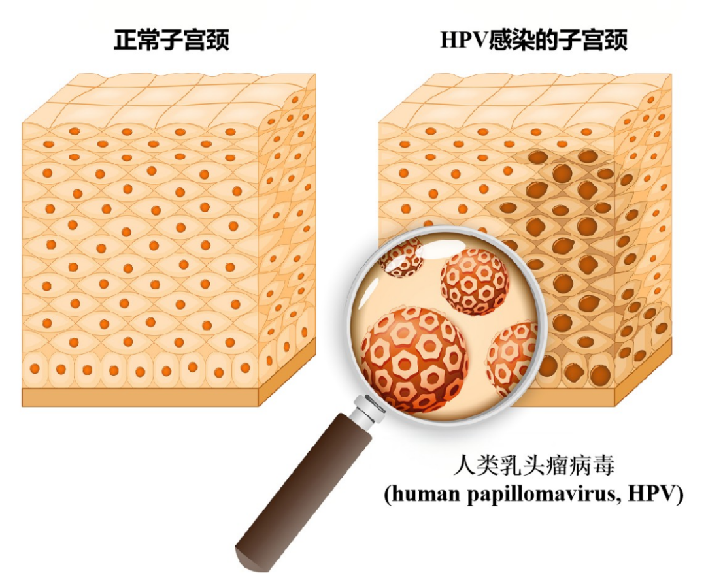
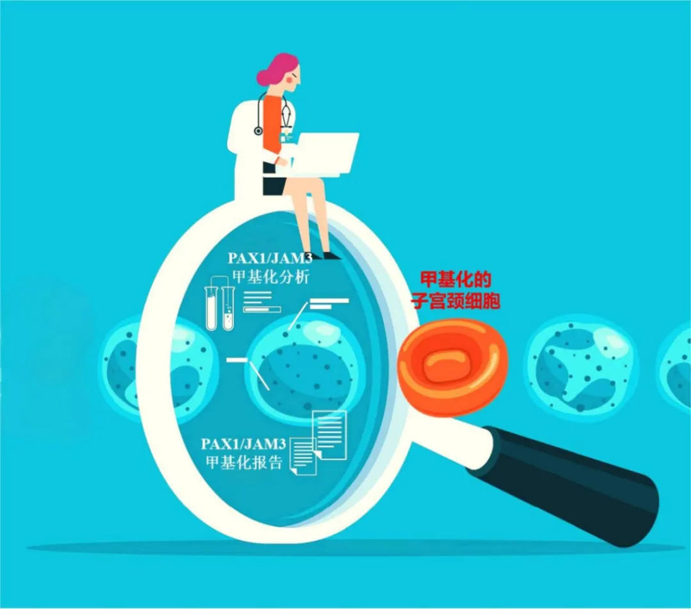

# 守护宫颈健康两道关：HPV查“敌踪”，甲基化查“内变”——禾宫康PAX1/JAM3更早洞察宫颈癌早期风险！

_2025年06月23日 15:44_

宫颈健康筛查需要两道重要关卡：HPV检测负责探查“外敌入侵”，而禾宫康PAX1/JAM3甲基化检测则专注识别宫颈细胞自身的“内部异变”。两者相辅相成，但甲基化检测能更直接地揭示细胞走向病变的“内部恶变信号”，有时甚至能洞察宫颈癌先机！

**第一关：HPV检测——查“敌踪”**

1.查什么？

HPV检测专门查找那些能致癌的“高危型”人乳头瘤病毒（HPV）的踪迹（病毒DNA或RNA）。简单说，就是看有没有坏病毒（特别是最危险的那几种）溜进了你的宫颈。

2.结果说明什么？

（1）阳性（+）：发现高危病毒！这是宫颈癌的主要“祸根”。但切记：绝大多数人（约90%）的免疫“卫士”很给力，1-2年内就能清除病毒。

（2）阴性（-）：好消息！目前大概率没发现高危敌人，风险显著降低。然，智者千虑，必有一失；

任何检测都不是“火眼金睛”，HPV检测也存在“漏网之鱼”（假阴性）！比如：敌人数量太少（病毒载量极低）、活检取样时没“逮着”病变、或者感染了现行检测未覆盖的高危型别(一般HPV有超过200型以上，检测以14型为主)。世上没有100%绝对准确的检测技术。

**第二关：禾宫康PAX1/JAM3甲基化检测——查“内变”**

1.查什么？

不看病毒，而是直接探查我们宫颈细胞内部！禾宫康PAX1/JAM3甲基化检测,专门检查细胞里关键的“安全卫士”基因（PAX1, JAM3）是不是被“封印”（高度甲基化）了。这些基因本负责管住细胞不乱长，一旦被“封印”（高度甲基化），细胞就可能“失控”，走上快速高度病变之路。

2.为何重要？

禾宫康甲基化检测具备了PAX1和JAM3双安全信号，相当于直接监听细胞内部发出的“危险信号”！它能更早、更直接地提示细胞是否发生了实质性的、与癌前病变（特别是高级别CIN2/3）进展密切相关的分子变化。明察秋毫，见微知著！

3.结果说明什么？

- 阳性（+）：这提示细胞内部很可能发生了严重的“叛变”或失控倾向（高度甲基化），与高级别癌前病变（CIN2/3）甚至癌变进展风险高度相关。这是一个反映疾病实际进展状态的强烈信号！
- 阴性（-）：目前细胞内部比较“安稳”，关键“安全卫士”基因还在工作，短期内快速恶化的风险很低，是颗重要的“定心丸”。

两道关卡，结果组合不同，应对策略大不同！

1.情况一：HPV阳性 (+) + 甲基化阴性 (-)

下一步：遵医嘱。若为高危HPV16/18型，仍需阴道镜；其他高危型且宫颈细胞学检查(TCT)正常，可半年后复查HPV+甲基化检测。

2.情况二：HPV阴性 (-) + 甲基化阳性 (+)

高危HPV持续感染通常是导致细胞“内变”（甲基化阳性）的“元凶”。所以，HPV阴性却甲基化阳性，这种组合虽少见，却犹如“警报灯狂闪”，更需警惕！

可能原因：
- 1.病毒藏得太深：
病变细胞躲在宫颈管或仅刷取到少量HPV感染（低病毒载量），狡猾地躲过了HPV检测（假阴性），但感染的病毒已足以“煽风点火”，引发细胞内部的恶性转化！下一步怎么办？
- 2.进阴道镜前确认已经无创检查了禾宫康甲基化，其结果阳性时，让阴道镜检查时特别提示须注意病变躲藏在深处，抓出躲藏的病变。
- 3.刻不容缓！必须立即进行阴道镜检查 + 必要时活检（组织病理学检查）！这是诊断的“金标准”。放大观察宫颈表面＋取活体组织，才能准确诊断并排除隐患
- 4.时间越拖，风险越高。无论你是否打过HPV疫苗、无论你有没有不舒服、无论你之前的TCT结果正不正常，都必须尽快做！

为何如此紧急？
- HPV阴性看似“天下太平”，但甲基化阳性却犹如发现“内院已然起火”！
- 甲基化检测就像指路灯，指示阴道镜+活检那“照妖镜”往正确方向照，必须把可能隐藏的严重问题揪出来，防微杜渐，刻不容缓！

总结箴言：禾宫康甲基化，洞察“内变”更关键！

1. HPV阳性 ≠ 得癌！绝大多数感染可自愈，但需遵医嘱定期复查。
2. HPV阴性 ≠ 绝对安全！小概率“漏网之鱼”不可不防。
3. 禾宫康PAX1/JAM3甲基化阳性—— 拉响“内变”警报！
它直接揭示细胞内部的危险动向，是评估病变进展风险的“关键信号灯”！尤其当与HPV结果矛盾（HPV-/Methy+）时，犹如“山雨欲来风满楼”，必须高度重视，立即进行阴道镜检查 + 必要时活检或是密集随访！
4. 甲基化阴性——重要的“安心符”，但别掉以轻心：
    1. HPV 16/18 阳性者仍需阴道镜；
    2. 其他高危型则按医嘱定期复。
    3. 医师综合结合其他结果，能更有效地评估短期风险。

最重要：相信专业，双关共守！HPV检测查“敌踪”，禾宫康PAX1/JAM3等甲基化检测查“内变”，双剑合璧，方能明察秋毫！医生会综合所有信息（HPV分型、甲基化结果、年龄、症状、TCT等），制定最佳检测方案。

牢记一句古语：“防未然，始为上策”。听从医生指导，综合评估，才能让健康大门抵御病毒侵袭。

定期进行科学的宫颈筛查，包括HPV和禾宫康PAX1/JAM3等甲基化检测，如同为宫颈健康筑起“双保险”，知己知彼，百战不殆，方能将风险扼杀在萌芽！

**关于聚禾生物**

北京起源聚禾生物科技有限公司是以创新科技为驱动、以关注健康为宗旨的科技企业。聚禾生物是妇科肿瘤早诊领域的开拓者，以独家技术和专利保护的标志物为核心，开发了宫颈癌、子宫内膜癌、卵巢癌等妇科肿瘤早诊产品，填补了该领域的空白。

随着女性对自身健康的关注越来越密切，女性健康市场将大有可为，除妇科肿瘤早筛早诊产品线外，未来聚禾生物还将建立更多女性健康相关的产品管线，打造女性健康市场的技术创新型领先企业。
