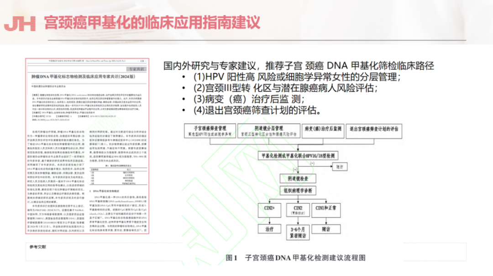

Opening Ceremony and Keynote Speeches: A Global Vision for Obstetrics and Gynecology Development

On June 21, 2025, the 8th Red House Forum and the 6th Shanghai Public Hospital High-Quality Development Forum grandly opened in Shanghai. This year's forum, themed "Open Cooperation · Technology Empowerment · Smart Healthcare," gathered over 70 top experts from both domestic and international institutions, conducting in-depth discussions on gynecologic oncology, perinatal medicine, reproductive endocrinology, artificial intelligence (AI) applications, and other topics, promoting the translation of research outcomes and advancing global women's health.

**Conference Insights: Technology Innovation Leads Cervical Cancer Screening with Precision Stratified Management**

At the 8th Red House Forum, "precision medicine" and "international collaboration" became core themes. Participating experts repeatedly emphasized that traditional diagnostic technologies (such as hysteroscopy, imaging) suffer from high invasiveness and missed diagnosis risks, and how new technologies address clinical challenges.

In cervical cancer screening, new technologies optimize the clinical precision management of high-risk HPV-infected patients, reduce colposcopy referral rates, expand genotyping, and simultaneously satisfy both screening and risk stratification needs. The *Chinese Cervical Cancer Screening Guidelines (Part II)* highlights new triage technologies for abnormal cervical cancer screening results, including p16/Ki-67 dual staining, host gene and/or HPV gene methylation testing, HPV extended genotyping, and HPV gene integration testing, all of which have demonstrated promising clinical application prospects, offering precision management pathways suited to different regional populations for early stratified management of cervical cancer.

**Reflections on the Significance of CISPOLY's CISCER® (PAX1/JAM3 Methylation) Testing in Cervical Cancer Screening**

CISPOLY's DNA methylation testing technology, through its non-invasive, high-sensitivity characteristics, provides a breakthrough solution for early screening and risk stratification of gynecologic tumors such as cervical cancer.

**Potential and Application Scenarios of Methylation Testing Technology**

As a frontier technology in epigenetics, the application prospects of methylation testing in cervical cancer detection provoke deep reflection. The following application directions are proposed in conjunction with forum topics and industry trends:

1. Innovation in Cervical Cancer Early Screening

Current status and challenges: Traditional HPV testing has overdiagnosis issues, while methylation testing (such as PAX1/JAM3) can identify epigenetic changes in cervical epithelial cells, with sensitivity as high as 89.6%, specificity exceeding 96.5%, and the ability to detect early lesions.

Clinical value: Red House Hospital cases show that patients with strongly positive methylation have a significantly higher proportion of subsequently pathology-confirmed invasive adenocarcinoma, suggesting its utility as a supplementary "liquid biopsy" tool.

2. Cervical Cancer: From "Morphology-Dependent" to "Molecular Stratification"

PAX1/JAM3 dual-gene methylation model:

In the diagnosis of cervical adenocarcinoma (such as gastric-type adenocarcinoma, GAS), traditional methods easily confuse it with benign lesions (such as lobular endocervical glandular hyperplasia, LEGH). CISPOLY's PAX1/JAM3 testing shows a methylation positivity rate of 94.05% in cancerous tissue with specificity of 96.30%, successfully distinguishing GAS from LEGH and reducing diagnostic error risk by 34%.

3. HPV-Positive Triage Strategy

For HPV 16/18-positive women, combined methylation testing can increase specificity for CIN3+ to 96.1%, reducing excessive colposcopy examinations. Case data show that those with persistent HPV infection but negative methylation have a 3-year cumulative cancer risk of only 2.9%, validating its risk prediction value.

4. Prediction of Cervical Lesion Progression During Pregnancy

Combining methylation markers with AI models can address the issue of cervical lesion progression during pregnancy, reducing anxiety in pregnant women with cervical lesions.

**Conclusion**

Studying the exciting content of the 8th Red House Forum provided understanding of the transformation of gynecologic oncology medical models driven by new technologies. As the "window" of epigenetics, methylation testing can be deeply integrated with AI in the future, playing a core role throughout the entire chain of early screening, diagnosis, and treatment monitoring. Through international collaboration and clinical translation, we look forward to these innovative technologies truly benefiting women worldwide and realizing the "Healthy China" vision.

**About CISPOLY**

Beijing Origin CISPOLY Biotechnology Co., Ltd. is a technology-driven enterprise committed to health innovation. As a pioneer in the field of early gynecologic oncology diagnosis, CISPOLY has developed early-detection products for cervical cancer, endometrial cancer, and ovarian cancer using proprietary technologies and patent-protected biomarkers, filling a critical gap in the field.

As women pay increasing attention to their own health, the women's health market holds great potential. Beyond the early screening and diagnosis product pipeline for gynecologic oncology, CISPOLY will continue to build additional women's health product lines, establishing itself as a technology-innovation-leading enterprise in the women's health market.