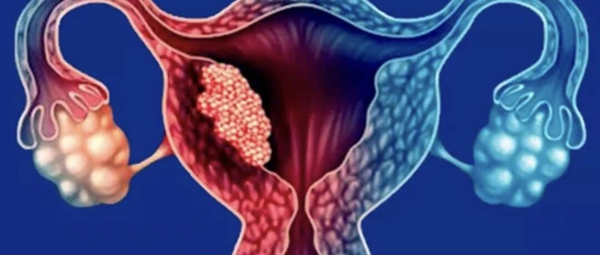
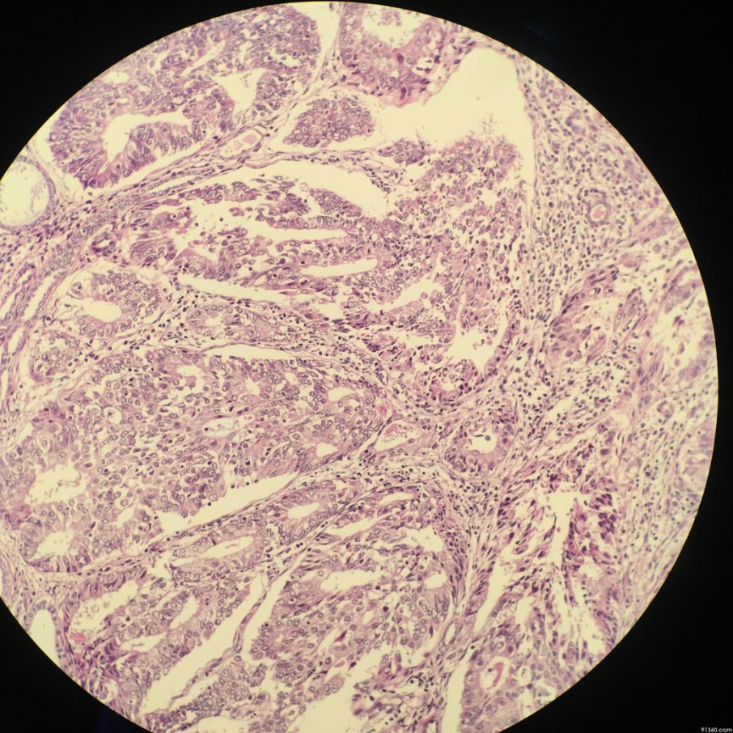
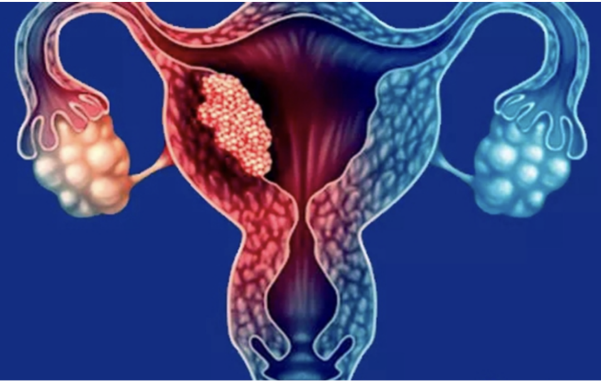

Endometrial cancer screening — say goodbye to "unclear visualization" (imaging limitations) and "uncomfortable testing" (invasive pain)! CISENDO® CDO1/CELF4 methylation testing brings a revolutionary new option of "non-invasive precision diagnostics"! With just a gentle brush, it can "scrutinize" at the gene level, precisely capturing traces of cancerous change, sparing you the suffering of traditional invasive examinations — truly achieving early detection and early peace of mind!

**I. Traditional Examinations: Each Has Strengths but Also Weaknesses**

1. Imaging Studies: Like "Observing from Afar"

1) Ultrasound (B-mode): Most commonly used, like measuring the uterus's dimensions — assessing endometrial thickness and morphology. But its drawbacks are:

Early lesions easily escape detection:

When the endometrium is thin or there is early-stage cancer, ultrasound may "not see clearly" (sensitivity approximately 75%–90.9%), and cannot distinguish benign (polyps, hyperplasia, lesions) from endometrial cancer (specificity approximately 79.1%). Repeated examinations all show "imaging abnormalities." Only by "seeing the subtle" can one "understand the significant" — ultrasound struggles to capture early endometrial cancer changes.

2) MRI (Magnetic Resonance Imaging): Provides more detailed visualization, can determine whether cancer has invaded the myometrium or metastasized. But:

High cost and limited accessibility: Expensive examination fees, limited equipment availability, and high dependence on physician experience. Too "exclusive" to become a screening mainstay.

3) CT: Primarily used to check whether cancer cells have metastasized distantly; of little help for early detection. "Looking far while ignoring the near" — not an early detection scout.

2. Invasive Examinations: Like "Breaking Down the Door"

1) Hysteroscopy: Inserting a thin scope into the uterine cavity for "direct visualization." However, the drawbacks are significant:

Requires anesthesia/causes pain: May cause pain, bleeding, and even endometrial damage. Patients often refuse due to fear. "When the city gate catches fire, the pond fish suffer" — the examination itself carries risks.

2) Diagnostic Dilation and Curettage (D&C): D&C is the most commonly used endometrial biopsy method in clinical practice, and was once the "gold standard" for endometrial cancer pathological diagnosis — scraping endometrial tissue for laboratory examination. But:

- Significant trauma: It is a surgical procedure that may cause infection, bleeding, or perforation. "Defeating 1,000 enemies while sustaining 800 losses" — the cost is steep.
- Potential for missed diagnosis: If the lesion is small or in an inaccessible location, it may not be scraped. "Catching one while missing ten thousand" — small lesions easily escape.

The *Chinese Guidelines for Gynecologic Oncology Clinical Practice (2024 Edition)* states that because fractional D&C involves blind endometrial sampling, it has problems including missed diagnoses, specimen contamination, and false positive results when used alone. Therefore, fractional D&C is no longer recommended as an essential requirement in the diagnosis of endometrial cancer.

3) Cytology (Endometrial Brushing and Cervical Brushing):

Endometrial cells are not as easily distinguishable as cervical cells and require experienced pathologists. "Climbing a tree to catch fish" — the wrong direction makes success difficult.

**II. CISENDO® CDO1/CELF4 Methylation Testing: Detecting "Gene-Level Changes" — Seeing the Subtle to Know the Significant!**

Traditional methods either "can't see clearly" (imaging) or "cause pain" (invasive). CISENDO® CDO1/CELF4 dual-gene methylation testing takes a different approach, directly targeting the core of cancer development — abnormal gene changes!

Cells contain two important "safety guardian" genes (CDO1 and CELF4). When they become abnormally "sealed" (technically termed "promoter hypermethylation"), they lose their protective function, and cells may embark on the "path to cancer." This "gene sealing" is an early signal of cancer development!

**III. Advantages of CISENDO® CDO1/CELF4 Methylation Testing:**

1. "Preventive" initial screening: Can capture the "gene sealing" signal before cellular morphology has significantly changed! Preferred for high-risk populations (such as Lynch syndrome families, BMI ≥ 30 obese individuals, postmenopausal women). Positive cases then proceed to precise invasive confirmation, avoiding "aimless" D&C.

2. "Targeted" high accuracy: Research shows its sensitivity for identifying endometrial cancer reaches 94.51%, with specificity of 94.16%, significantly outperforming routine ultrasound!
Especially for early (Stage I) cancer, sensitivity reaches 90.8%! And it is effective for all types of endometrial cancer. When combined with ultrasound, detection sensitivity can be increased to 95.8% (though specificity may decrease slightly) — a more powerful combination! Positive results notify hysteroscopists to examine lesional (cancer) risk areas more carefully, avoiding repeated curettage.

3. "Patient-centered" comfort: Sampling is as simple as "lightly brushing away dust" — just a specialized small brush (similar to cervical cancer screening brushes) gently collects exfoliated cells from the cervical canal or uterine cavity! No cervical dilation, no deep uterine access — painless, non-invasive, no anesthesia! The procedure takes only minutes. Especially suitable for elderly women, those with frail health (e.g., cardiovascular/cerebrovascular disease) who cannot tolerate invasive examinations, and patients with fear of invasive procedures. This significantly increases willingness to participate in screening and compliance.

4. Affordable and widely applicable: Costs far less than MRI, making it suitable for outpatient and community promotion, as well as large-scale population screening and regular monitoring of high-risk groups (such as obese individuals, those with genetic risk, postmenopausal women).

**IV. CISENDO® CDO1/CELF4 Methylation Testing: Multi-Scenario Compatibility, Full-Cycle Management**

CDO1/CELF4 testing is applicable not only for initial screening but throughout the entire "screening-diagnosis-follow-up" continuum of endometrial cancer.

-"Distinguishing right from wrong" to assist diagnosis: For the most common alarm signal — abnormal uterine bleeding (AUB) — traditional ultrasound may miss 15%–20% of cancers!
- CDO1/CELF4 testing sensitivity for AUB patients exceeds 95%, providing rapid risk indication and guiding subsequent precise examinations for early warning.
-"Tracking traces" to prevent recurrence: After treatment (surgery/chemoradiation), regular testing (via secretions or even blood) can detect early signs of minimal recurrent lesions earlier and more sensitively than imaging (methylation levels will elevate). "Nipping it in the bud" — safeguarding the road to recovery.

**Conclusion: From "Passive Defense" to "Proactive Prevention"**

CISENDO® CDO1/CELF4 dual-gene methylation testing, with its four core advantages of "high precision, early detection, non-invasive, and wide applicability," successfully addresses the shortcomings of traditional examination methods:

① Imaging can't see clearly? CISENDO® — detecting "gene-level changes," gaining foresight!

② Invasive exams too painful? CISENDO® — "leaving no trace," non-invasive comfort!

③ Difficulty covering initial screening, diagnosis, and follow-up? CISENDO® — throughout the entire process, safeguarding health!

Non-invasive CISENDO® CDO1/CELF4 dual-gene methylation testing marks a shift in endometrial cancer prevention and control — from the traditional "passive treatment" model (waiting until lesions are obvious and symptoms are severe) to a more advanced "proactive prevention, precision intervention" paradigm! "The best physician treats disease before it appears" — prevention is better than cure. Choosing more advanced, more comfortable, and more precise detection technology builds a more reliable "firewall" for your uterine health!

**About CISPOLY**

Beijing Origin CISPOLY Biotechnology Co., Ltd. is a technology-driven enterprise committed to health innovation. As a pioneer in the field of early gynecologic oncology diagnosis, CISPOLY has developed early-detection products for cervical cancer, endometrial cancer, and ovarian cancer using proprietary technologies and patent-protected biomarkers, filling a critical gap in the field.

As women pay increasing attention to their own health, the women's health market holds great potential. Beyond the early screening and diagnosis product pipeline for gynecologic oncology, CISPOLY will continue to build additional women's health product lines, establishing itself as a technology-innovation-leading enterprise in the women's health market.