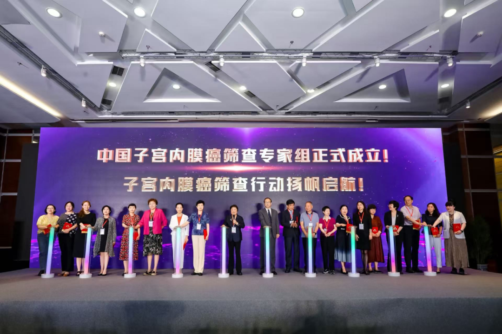
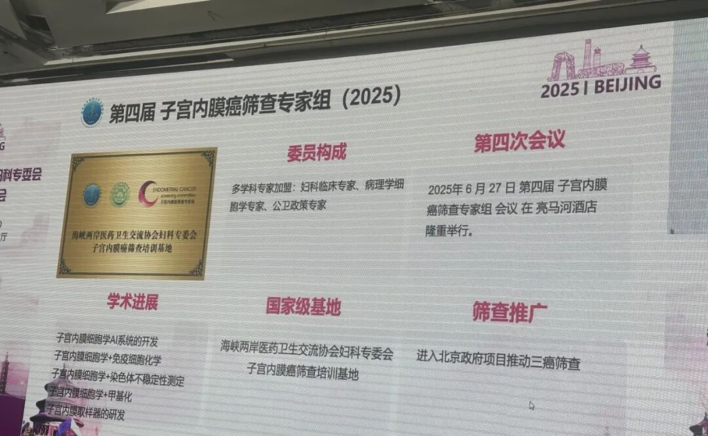

On June 28, 2025, the 12th Endometrial Cancer Screening and Early Diagnosis — Endometrial Cytology Technology Training Course officially established the Endometrial Cancer Screening Expert Group and set up the first national-level endometrial cancer screening training base at Beijing Tsinghua Changgung Hospital! With the establishment of the expert group, the focus is on screening system development, academic breakthroughs, and public health practice implementation.

The "National-Level Base" initiative will strengthen standardized training and quality control, while the measure to "incorporate endometrial cancer screening into the Beijing Government's three-cancer screening program" marks the formal inclusion of endometrial cancer screening in a major national regional public health service system, accelerating the health goal of "early detection, early intervention." This initiative marks China's crucial first step globally for endometrial cancer screening.

**Major Public Welfare Benefit**

Beijing Tsinghua Changgung Hospital officially launched the national-level endometrial cancer screening training base, simultaneously opening a dedicated screening green channel for all city residents! This means that women in Beijing can access internationally leading early cancer screening services close to home, with high-risk groups completing testing on the same day at the fastest! Expert Group Chair Professor Liao Qinping from Tsinghua Changgung Hospital, who has worked for twenty years from "breaking the ice" to "lighting the fire," called out: "Starting today, let the light of screening benefit every Chinese woman! The cause of endometrial cancer screening sets sail!" Going forward, national colleagues must work together to forge the "Chinese approach" into an international gold standard!

**Screening Revolution: No Hospitalization, No Painful D&C**

Traditional screening requires hospitalization for D&C surgery. Now, through new screening technology:

✔ Completely painless: Only requires sampling similar to an outpatient gynecologic examination ✔ Rapid results ✔ Precision breakthrough!

**Why Does Endometrial Cancer Receive So Much Attention?**

Because endometrial cancer is the leading female reproductive malignancy in highly developed cities. Early symptoms (such as abnormal bleeding) in premenopausal women are similar to many uterine cavity conditions and easily overlooked. Without timely screening, it may progress to advanced stages, threatening life. Moreover, incidence rates have been rising in recent years due to factors such as obesity and hormonal changes. Attention to screening and prevention can effectively improve early diagnosis rates and reduce harm.

**Endometrial Cancer Has Become the Top Gynecologic Tumor Among Women in China's Developed Regions, with a Trend Toward Younger Patients:**

1. Soaring incidence: Up 132% over the past 30 years, with incidence rates in cities like Beijing and Shanghai approaching European and American levels;
2. Highly insidious: Vaginal bleeding and other symptoms may be attributable to other intrauterine conditions. Endometrial cancer often co-occurs with other intrauterine diseases and is easily overlooked;
3. Preventable and treatable: Early detection yields a cure rate exceeding 90%, while advanced disease entails high treatment costs and poor outcomes.

Attending this conference provided a view of the future: Under a non-invasive/minimally invasive foundation, the integration of AI systems for endometrial cytology and cervical cytology, endometrial cytology combined with immunocytochemistry, chromosomal instability, and gene methylation will create screening approaches more suited to women's needs in the advancement of endometrial cancer screening.

Beijing residents can access endometrial cancer screening guidance through the WeChat Jingtong Mini-Program by filling in basic data, completing a self-assessment with results that guide Beijing women directly to designated hospitals for screening.

【Special Reminder】 If you meet any of the following conditions, please make an appointment immediately:

☑ Women aged 45 and above ☑ Obesity (BMI ≥ 28) ☑ Diabetes history exceeding 5 years ☑ Abnormal vaginal bleeding ☑ Family history of tumors

**Green Channel — Exclusive Benefit for Beijing Residents**

Beijing Tsinghua Changgung Hospital has opened the "Endometrial Cancer Screening Green Channel":

1. Fast scheduling: High-risk groups (e.g., postmenopausal bleeding, obesity, diabetes) receive priority;
2. Same-day examination: Ultrasound and blood test results available within half a day; eligible patients complete sampling on the same day;
3. Professional guidance: Screening reports are reviewed by core expert group members; suspicious cases are directly referred for expert consultation.

**How to Participate:**

① Search "Jingtong Mini-Program" on WeChat → Click "Endometrial Cancer Risk Factor Survey"; ② Call Beijing Tsinghua Changgung Hospital Obstetrics and Gynecology Center hotline 010-56119018 to schedule; ③ Community hospital referrals receive expedited processing.

Through this conference, we learned about the clinical and pathological considerations for endometrial cancer screening in China. We look forward to the establishment of a complete system that will become a new international model for three-cancer screening to protect women's health.

Given the continuously rising global incidence of endometrial cancer, non-invasive cervical cell-based CISENDO® methylation testing will become an important new screening modality for endometrial cancer.

**"CISENDO®" Is the Most Effective Product for Current-Stage Endometrial Cancer Screening:**

CISENDO® (Human CDO1/CELF4 Gene Methylation Detection Kit), as China's first approved Class III medical device for endometrial cancer methylation detection, is based on the dual-gene methylation signatures of CDO1 and CELF4. By detecting DNA methylation levels in cervical exfoliated cells or intrauterine secretions, it enables non-invasive early screening.

Its sensitivity reaches 94.51%–95%, with specificity of 92%–94%, significantly outperforming traditional ultrasound (sensitivity approximately 52.6%) and D&C. Particularly for early lesions (such as precancerous lesion EIN), the detection rate exceeds 83%, with a false negative rate below 5%.

**Clinical Innovation: Non-invasive Sampling Restructures the Screening Paradigm**

Traditional screening relies on invasive D&C, which is painful for patients and has low adoption in primary care. CISENDO® pioneered the "cervical secretion non-invasive sampling" technology, requiring only a disposable cervical cell collector to complete sampling — entirely painless, simple to operate, with patient compliance improved by over 60%. The testing turnaround time is reduced to 3 hours, with costs 50%–60% lower than pathology examinations, making it suitable for primary healthcare and remote area screening needs.

Multicenter clinical trials (covering 4,818 samples) showed that for postmenopausal asymptomatic populations, sensitivity reached 92.67%; for premenopausal women with abnormal bleeding, over 90%. The positive predictive value was 100%, and the negative predictive value was 95.8%.

CISENDO® reshapes the endometrial cancer screening standard with "high precision, low trauma, and high accessibility." It not only fills a domestic technology gap but also sets a new benchmark for global women's health management through clinical data validation and ecosystem synergy.

**About CISPOLY**

Beijing Origin CISPOLY Biotechnology Co., Ltd. is a technology-driven enterprise committed to health innovation. As a pioneer in the field of early gynecologic oncology diagnosis, CISPOLY has developed early-detection products for cervical cancer, endometrial cancer, and ovarian cancer using proprietary technologies and patent-protected biomarkers, filling a critical gap in the field.

As women pay increasing attention to their own health, the women's health market holds great potential. Beyond the early screening and diagnosis product pipeline for gynecologic oncology, CISPOLY will continue to build additional women's health product lines, establishing itself as a technology-innovation-leading enterprise in the women's health market.