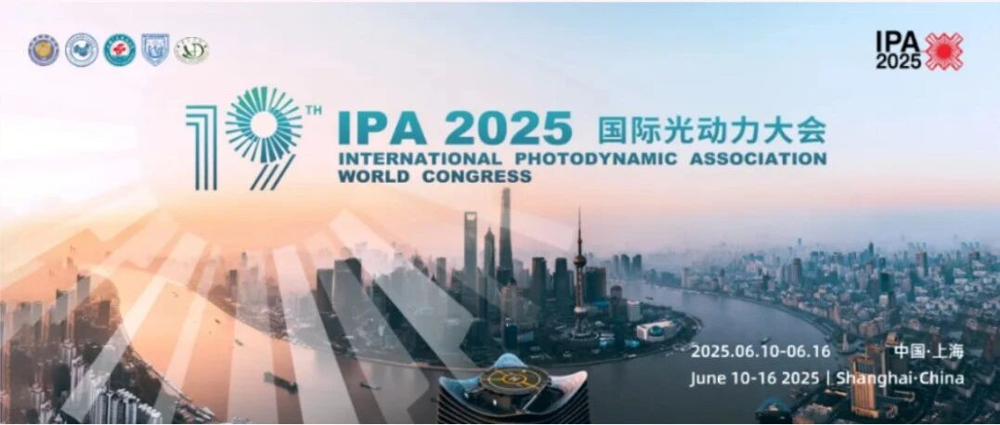

# 2025国际光动力大会（IPA 2025）心得：光动力技术革新与甲基化检测的协同突破

_2025年07月03日 09:51_ 广东

2025年6月10日，第19届国际光动力大会（IPA 2025）在上海国际会议中心隆重开幕。本届大会以「光动力基础与临床融合，造福人类健康」为核心主题，汇聚全球30余国800余位专家，涵盖肿瘤、皮肤疾病、妇科、口腔等多领域，展示光动力技术从基础研究到临床转化的完整生态链。光动力医学正从「单一治疗手段」迈向「多学科整合方案」，而中国学者通过自主研发新型光敏剂和智能光源系统，已在全球指南中占据关键地位。

大会期间，国内外妇科光动力治疗领域的顶级学者齐聚一堂，举行了一场别开生面的专题研讨会。中国学者通过自主研发新型光敏剂（如氨基酮戊酸光动力疗法ALA-PDT）和智能光源系统，已在全球指南中占据关键地位。

**一、参会心得：技术协同的未来路径**

1.学科数据整合：
光动力疗效与甲基化标志物的关联需依赖大数据平台。建议参考IPA大会的「光动力全球临床数据库」，纳入表观遗传组学数据，构建多维风险预测模型。
2.临床转化路径优化：
目前癌症甲基化检测多限于科研阶段，在妇科肿瘤方面已4项子宫颈癌甲基化检测试剂盒和2项子宫内膜癌甲基化检测试剂盒获得NMPA医疗器械三类证，对于妇科肿瘤具有重要指标意义，未来与光动力设备厂商合作开发「检测-治疗一体化」，将会开创新的个体化医疗里程碑。
3.全球标准制定：
光动力疗法与甲基化检测的协同应用缺乏国际统一标准，需借鉴IPA大会的「技术指南制定委员会」模式，建立跨国协作机制。2025国际光动力大会不仅展示了光动力技术的临床威力，在学习过程中也思考了表观遗传学与光动力协同创新的巨大潜力。甲基化检测作为肿瘤「液体活检」的核心工具，未来可深度融入光动力医学的全周期管理——从早期筛查、治疗靶点筛选到复发监测，最终实现「精准无创、全局覆盖」的医疗愿景。期待中国学者继续引领技术标准制定，让光动力与甲基化检测的协同创新惠及全球患者。

**二、光动力医学：基本原理与妇科应用**

光动力医学是一种基于光-光敏剂-氧三要素的精准治疗技术。其核心是利用特定波长的光激活光敏剂（如卟啉类、酞菁类化合物），产生活性氧（ROS，如单线态氧）及其他活性物质，诱导病变细胞凋亡、坏死或抑制血管生成，从而达到治疗目的。

**三、光动力在妇科领域的应用**

1. 宫颈病变：针对高危型HPV持续感染引起的宫颈上皮内瘤变（CIN），光动力疗法可选择性清除病变组织，保留宫颈结构和功能，降低术后对生育的影响。
2. 尖锐湿疣：外阴/阴道尖锐湿疣由HPV低危型感染引起，光动力治疗通过破坏疣体组织并抑制病毒复制，复发率低于传统物理治疗（如激光、冷冻）。
ALA-PDT治疗宫颈HSIL的完全缓解率达92.5%，且HPV清除率从6个月的64.6%提升至1年的81.3%。

**四、妇科甲基化：表观遗传调控与疾病关联**

DNA甲基化是表观遗传学的重要修饰方式，主要表现为CpG二核苷酸的胞嘧啶（C）5位碳原子甲基化。正常情况下，基因启动子区的高甲基化会抑制基因转录；而全基因组低甲基化则可能导致基因组不稳定。在妇科疾病中，异常甲基化与多种病理过程密切相关。

在甲基化检测与光动力疗效研究中发现，甲基化检测阳性(高甲基化)较阴性(低甲基化)结果患者其光动力治疗宫颈HSIL病变，需更多治疗次数，提示甲基化检测可作为疗效预测指标。

**五、禾宫康(PAX1/JAM3)在宫颈病变(癌) 治疗后监测与复发预警**

1. 局部病变复发评估：宫颈病变(癌)术后患者定期进行 PAX1/JAM3甲基化检测,结合光动力随访治疗，可降低复发率。
2. 个体化治疗策略优化：宫颈病变 PAX1/JAM3甲基化检测患者可预测更少次数的光动力治疗，降低患者对于病变恐慌并及早得知早日恢复。

**六、结语**

参会中学习到光动力愿景，也思考甲基化在宫颈病变(癌)治疗中作为随访生物标志物，可协助评估治疗效益，并降低患者在治疗期间恐慌。

**关于聚禾生物**

北京起源聚禾生物科技有限公司是以创新科技为驱动、以关注健康为宗旨的科技企业。聚禾生物是妇科肿瘤早诊领域的开拓者，以独家技术和专利保护的标志物为核心，开发了宫颈癌、子宫内膜癌、卵巢癌等妇科肿瘤早诊产品，填补了该领域的空白。

随着女性对自身健康的关注越来越密切，女性健康市场将大有可为，除妇科肿瘤早筛早诊产品线外，未来聚禾生物还将建立更多女性健康相关的产品管线，打造女性健康市场的技术创新型领先企业。
