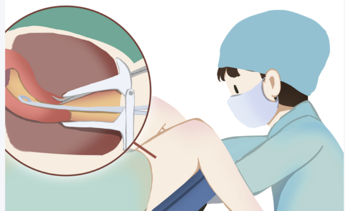

# 绝经后又来"月经"？这种常见症状别忽视！新检测技术让内膜癌无处藏

_2025年07月09日 10:24_

最近，62岁的XX女士有点慌——绝经5年了，上周突然发现内裤上有血丝。她赶紧去医院，医生建议做"刮宫检查"。但她回忆这种检查又疼又可能漏诊的经验，犹豫着要不要做，心想可能之前宫腔问题老毛病又犯了，一直随访也没事，虽然绝经后就慢慢症状消除，但可能最近太累了，休息休息就好。其实，和XX女士有类似困扰的女性不少，经历过刮宫检查后，都犹豫了，想着之前结果又不是内膜癌，现在怎会事呢? 就是老毛病又来了，没事。

子宫内膜癌作为我国女性生殖系统三大癌症之一，发病率每年都在涨，而且越来越"青睐"年轻女性。数据显示，我国每年新发病例超20万，70%以上是早期患者——如果能早点发现，治好了基本不影响生活。但问题就出在：医师总是说宫腔疾病超声总是看出问题的，但怎分别是子宫内膜癌或是一般宫腔良性疾病呢? 从网络与专业医师建议，现在最常用的是"刮宫检查"。终于踏出第一步去刮宫后，“痛!痛!痛!”。什么漏诊率还高达20%-30%！这是什么状况??? 继续随访、随访，超声有问题再来刮宫。

**为什么"刮宫"也会漏诊？老方法有三个"硬伤"**

研刮宫检查，说白了就是用器械伸入阴道、再进入宫颈口-宫颈管，直达子宫，刮取子宫内膜，医师又不能看里面有甚么，就依照经验上下左右刮刮刮。拿去化验看有没有癌细胞。它”曾经”一直被当作"金标准"，虽然现在有宫腔镜检查，但仍在医院中不普及也是需要麻醉与住院，最常用的刮宫实际操作中问题不少：

第一，病灶太"狡猾"。子宫内膜癌的病灶往往很小，可能只占内膜表面的5%甚至更少。医生刮的时候全凭经验，就像在大海里捞针，很容易漏掉微小病灶。

第二，内膜"薄"的麻烦。绝经后女性内膜本来就薄（正常只有1-4mm），刮的时候可能根本刮不到足够的组织，结果就会"假阴性"——明明有癌，却没查出来。

第三，患者"怕疼"不敢查。刮宫毕竟是有创操作，扩张宫颈、刮内膜的过程会让很多人疼得直冒汗，有些女性甚至因为怕疼拒绝重复检查，耽误诊断。

更揪心的是，现在很多年轻女性希望保留完整子宫内膜（比如想生二胎），想到网络搜寻刮宫可能引起的后遗症包括感染、子宫损伤、宫腔粘连、月经异常、不孕等‌，但如果刮宫结果不准，可能要损伤内膜，不就白搭了! 犹豫间，要么漏掉癌症最佳治疗期。

**新技术来了！无创操作，先检测基因，让"刮宫"不再犹豫了，精准打击，查癌更准更轻松**

近期,一个叫"禾蔻安"的新甲基化检测技术火了 ——它不用刮内膜，只需要取点宫颈分泌物就能查内膜癌风险！这到底是怎么做到的？

原来，癌细胞有个"小尾巴"：DNA甲基化。简单说，我们的细胞里有一套"基因开关"，正常细胞的开关是"开着"的，能让抑癌基因正常工作；但癌细胞会偷偷把这些"开关"用"小锁"锁死（甲基化异常），让抑癌基因罢工，癌细胞就开始疯狂生长。

禾蔻安检测就是专门找子宫内膜癌的"重要锁"的。它通过分析宫颈脱落细胞里的2个关键锁 (关键基因 -CDO1和CELF4）的甲基化水平，就能判断子宫内膜有没有癌变风险。这方法就像每次总要去看看保险箱是否有被动过，珠宝有没有不见，看保险箱锁有没有跟上次一样锁好锁紧，一样道理。女性子宫健康就像珠宝一样，超声总会看出问题，但大部分有问题超声都是不致命危险，有子宫内膜癌临床症状(异常出血)或是之前超声有问题的女性，查查子宫内膜癌关键锁是否锁紧，简单方便又心安。

**和传统刮宫比，它的优势太明显了：**

近完全不疼！不用扩张宫颈，只需要用棉签在宫颈口取点分泌物，像做普通妇科检查一样，几乎没感觉。

漏诊更少！临床研究发现，它能查出89.7%的早期内膜癌（刮宫只能查65%-75%）；哪怕内膜薄得只有2mm，漏诊率也降到5%以下。

结果更准！它用数值说话，不像刮宫靠医生肉眼判断，假阳性率（没病说有病）只有2%，比刮宫低很多。

还能提前预警！不仅能查已经癌变的细胞，连"癌前病变"（高级别内膜增生）也能提前发现，相当于给癌症按了"暂停键"。

推荐作为刮宫的 "黄金搭档",特别适合这些情况：

- 绝经后突然出血、阴道排液；

- 月经长期不干净、量特别多；

- 彩超提示内膜增厚或长东西；

- 刮宫结果不清楚，需要再确认；

查出癌前病变，定期复查。

早发现能救命！这些信号要注意

子宫内膜癌早期症状其实挺明显：绝经后出血（哪怕只有一滴）、月经老不干净（超过7天）、阴道排液（像淘米水）、下腹隐痛……出现这些情况，别拖！现在有了禾蔻安这种无创检测，可以先做个初步筛查，再决定要不要做刮宫。

"以前总怕漏诊不敢查，现在有了新武器，患者更愿意配合，我们也能更早抓住癌症。"北京协和医院医生感慨，"医学进步的意义，就是让更多女性不用再为'漏诊'提心吊胆，又能保护子宫不要损伤，能更早拥抱健康。"

从"盲刮"到"分子检测"，从"忍疼检查"到"轻松筛查"——禾蔻安的上市，不仅是技术的突破，更是无数女性的健康福音。记住：癌症不可怕，早发现早治疗才是关键！

爱自己与爱家人的女性，体检时，做了宫颈癌抹片检查、HPV检查时，记得跟医师说同时“禾蔻安检测“，爱自己多一点就是爱家人多一点!

**关于聚禾生物**

北京起源聚禾生物科技有限公司是以创新科技为驱动、以关注健康为宗旨的科技企业。聚禾生物是妇科肿瘤早诊领域的开拓者，以独家技术和专利保护的标志物为核心，开发了宫颈癌、子宫内膜癌、卵巢癌等妇科肿瘤早诊产品，填补了该领域的空白。

随着女性对自身健康的关注越来越密切，女性健康市场将大有可为，除妇科肿瘤早筛早诊产品线外，未来聚禾生物还将建立更多女性健康相关的产品管线，打造女性健康市场的技术创新型领先企业。
