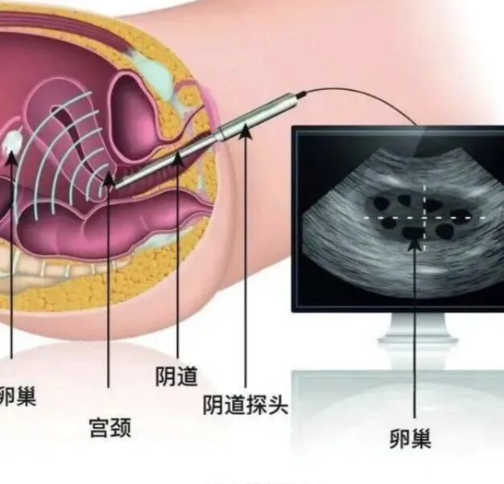

The uterus is a woman's "cradle of life," but in recent years, this cradle has been facing a silent threat — endometrial cancer (also called "endometrial carcinoma"). Along with cervical cancer and ovarian cancer, it is one of the three major malignant tumors of the female reproductive system, and it is "aggressively on the rise": National Cancer Center 2023 data shows that China sees over 200,000 new endometrial cancer cases annually, with an increasing predilection for younger women. What makes this even more challenging is that many patients' early symptoms (such as irregular periods or postmenopausal bleeding) are easily dismissed as "minor issues" or delayed by fear of "painful examinations," leading to a dramatic decline in survival rates at the time of endometrial cancer diagnosis.

**Why Is Early Endometrial Cancer Always "Missed"? Current Screening Methods Have Shortcomings:**

Currently, the most commonly used initial screening method by physicians is transvaginal ultrasound (TVS). Simply put, a high-frequency probe is placed close to the vagina to "take a picture of the uterus," examining endometrial thickness, texture, and blood flow. While recommended as a first-line examination in guidelines, in practice it's like "looking through a veil."

Only the "thick" are easily detected: Ultrasound has a "hidden rule" — endometrial thickness exceeding 4–5 mm in postmenopausal women is considered "abnormal." But in reality, 10%–20% of early endometrial cancer patients have particularly "thin" endometrium, making it impossible for ultrasound to clearly identify problems, resulting in a high missed diagnosis rate. Difficulty distinguishing benign from malignant: Early endometrial cancer may present as only localized thickening or heterogeneous echogenicity, closely resembling benign conditions like endometrial polyps or hyperplasia — like "twins." Different ultrasound physicians' experience levels can yield very different interpretations.

Can only "see" but not "definitively diagnose": Ultrasound can only tell us "the endometrium seems to have an issue" but cannot directly state "this is cancer or a benign lesion" — the appearance may be similar, and it's unclear whether the change is benign, malignant, or a hidden malignant lesion. Suspicious findings require hysteroscopy and D&C, which are not only cumbersome but may also increase risk.

Susceptible to physical condition interference: If a woman is overweight, has excessive bowel gas, or has a retroverted uterus, ultrasound images become "blurred" and results become less accurate.

**New Technology Is Here! From "Seeing Shadows" to "Testing Genes" — Early Lesions Have Nowhere to Hide:**

Is there a way to overcome these ultrasound shortcomings? In recent years, a new technology called "endometrial cancer methylation testing" has entered the clinical arena. It's like adding a "microscope" to screening, specifically targeting the most hidden "tell-tale trail" of cancer cells.

Its principle is actually easy to understand: Our cells contain a set of "gene switches" (DNA methylation). Under normal conditions, the switches on tumor suppressor genes are "off" (hypomethylated), allowing them to suppress cancer cell growth. But cancer cells secretly turn these switches "on" (hypermethylated), causing tumor suppressor genes to "stop working." These gene-level changes appear earlier than endometrial thickening or morphological changes — meaning that even if the endometrium is only 1 mm thick, as long as there is a cancerous tendency, methylation testing can "catch" it.

**Compared to Ultrasound, It Has Three Major Advantages:**

- Earlier detection: Even at 1 mm, as long as cancer cells are present, it can detect them

Studies show that for postmenopausal women with endometrial thickness less than 5 mm, methylation testing can "uncover" 87.5% of early cancers, with accuracy (specificity) reaching 90.8%. Many "thin endometrial cancers" missed by ultrasound can be precisely identified.

- More consistent: Not affected by physician experience

Ultrasound results depend heavily on the physician's skill level, but methylation testing uses fluorescence-based quantitative PCR technology to "count" gene switches — the results are as objective as "exam scores," with minimal variation across different hospitals and physicians, significantly reducing error.

- Gentler: No "cutting" required

What reassures patients most is that it only requires a cervical brush to collect some cells (similar to cervical cancer screening), with no need for D&C or hysteroscopy. It is especially friendly for women who "want to know the results" but fear pain and trauma (such as postmenopausal women with cervical atrophy, or young women wishing to preserve fertility).

**Combined Screening: "Ultrasound + Methylation" — Dual Protection with Lower Missed Diagnosis Rates**

Of course, methylation testing is not an "all-rounder." Its greatest strength is "qualitative assessment" — determining whether the endometrium has cancerous tendencies — while ultrasound's advantage is "localization" — assessing endometrial thickness and detecting masses. Together, they are "1+1>2": enabling hysteroscopists to both locate and characterize lesions, precisely uncovering endometrial cancer.

If ultrasound reveals endometrial thickening or abnormalities, followed by methylation testing, the early cancer detection rate can be increased from 82% to 95.8%. This allows physicians performing hysteroscopy to know "the problem is here," enabling careful examination of hidden areas and accurate sampling.

For women with postmenopausal bleeding who do not wish to undergo invasive procedures, if ultrasound shows borderline endometrial thickness (e.g., 6 mm) and methylation testing is positive, physicians can more confidently recommend hysteroscopy for careful examination and targeted biopsy of suspicious areas, avoiding missed diagnoses.

**If You Fall into Any of These Categories, Consider the New Method!**

If you belong to any of the following groups, consider discussing endometrial cancer methylation testing with your physician during checkups or gynecologic visits:

1. Postmenopausal bleeding: Even if ultrasound shows a thin endometrium (e.g., <5 mm), don't dismiss it — methylation testing can help rule out hidden risks.
2. Overweight women (BMI ≥ 25): Body fat can interfere with ultrasound images, but endometrial cells shed onto the cervix are unaffected — methylation testing is equally accurate.
3. Women on tamoxifen therapy: Regular "ultrasound + methylation" dual protection provides peace of mind during treatment.
4. Young women preserving fertility: When endometrial issues are suspected, methylation testing provides multi-layer protection — it can assist in confirming diagnosis through biopsy pathology while reducing the risk of endometrial damage from repeated curettage, preserving endometrial integrity.

**A Final Honest Word**

Endometrial cancer is formidable, but early detection offers a high cure rate (5-year survival rates for early-stage patients can exceed 90%). In the past, we relied on ultrasound to "see"; now, with methylation testing to "test," the two together provide "dual insurance" for the uterus. If you are in a high-risk group, or encounter confusion during screening, don't hesitate to communicate more with your physician and choose the most suitable plan — after all, early detection and early treatment mean your health is the greatest guarantee of family happiness. Regular endometrial cancer methylation testing is like purchasing "health + happiness" dual insurance — the ultimate "trump card" against endometrial cancer!

**About CISPOLY**

Beijing Origin CISPOLY Biotechnology Co., Ltd. is a technology-driven enterprise committed to health innovation. As a pioneer in the field of early gynecologic oncology diagnosis, CISPOLY has developed early-detection products for cervical cancer, endometrial cancer, and ovarian cancer using proprietary technologies and patent-protected biomarkers, filling a critical gap in the field.

As women pay increasing attention to their own health, the women's health market holds great potential. Beyond the early screening and diagnosis product pipeline for gynecologic oncology, CISPOLY will continue to build additional women's health product lines, establishing itself as a technology-innovation-leading enterprise in the women's health market.