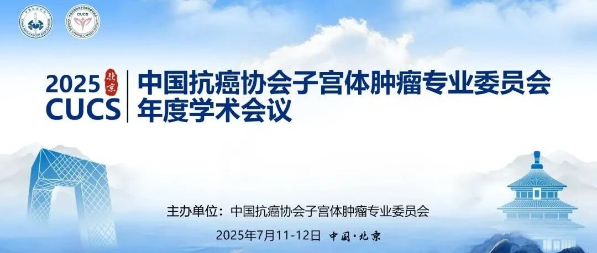
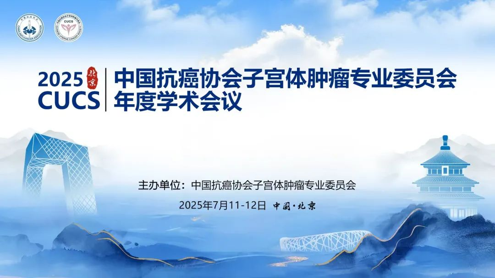
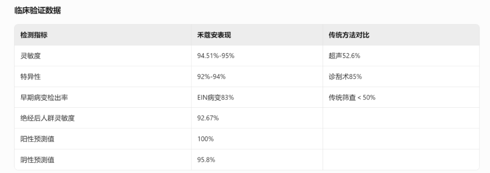

[Summer Symposium · Exploring a New Era in Uterine Tumor Prevention and Treatment]

On July 11–12, 2025, the annual academic symposium hosted by the Uterine Tumors Professional Committee of the Chinese Anti-Cancer Association was grandly convened in Beijing. Top scholars in the field of gynecologic oncology from across the country gathered to conduct in-depth discussions on core topics including endometrial cancer, uterine sarcoma, gestational trophoblastic neoplasia, and fertility preservation. Through keynote presentations, case discussions, and multidisciplinary consultations, participants jointly mapped a new blueprint for gynecologic oncology diagnosis and treatment.

**I. Academic Frontiers: Innovative Breakthroughs in Endometrial Cancer Diagnosis and Treatment**

In the endometrial cancer special forum, experts focused on four core directions:

- Precision staging system reconstruction: New staging systems based on molecular classification improve prognostic assessment accuracy
- Minimally invasive surgery revolution: Progress in single-port laparoscopic/robot-assisted surgery applications
- Molecular diagnosis milestones: Diagnosis combined with molecular classification for further stratification, enabling early precision treatment
- Novel treatment paradigms: Exploration and practice of immunotherapy combination regimens

**II. Genetic Testing Technology Transforming Endometrial Cancer Treatment Protocols:**

Grade 3 endometrioid carcinoma requires further stratification based on molecular classification (such as POLEmut, p53abn). LVSI is an independent prognostic factor; patients with extensive LVSI require postoperative adjuvant therapy. Stage I/II POLEmut patients may be observed after surgery without lymph node dissection, while p53abn patients require lymphadenectomy and adjuvant therapy. Traditional clinicopathological features for determining surgical approach have limitations; molecular classification (such as CTNNB1wt low-copy-number type, TP53mt high-copy-number type) correlates with minimally invasive/open surgery prognosis, requiring comprehensive decision-making incorporating anatomical features. Future prospective studies are needed to validate the value of molecular classification, and AI integration of multi-omics data should be used to optimize surgical models.

**III. New Genetic Testing Technology Leading Non-invasive Endometrial Cancer Screening:**

Although this conference did not highlight endometrial cancer methylation testing as a centerpiece, in recent years the NMPA has approved two Class III medical device registrations for endometrial cancer methylation detection — a global first. Among these, CISENDO® (Human CDO1/CELF4 Gene Methylation Detection Kit) offers the following advantages through non-invasive sampling and high-sensitivity detection: Dual-gene combined detection: CDO1 + CELF4 methylation combined testing achieves sensitivity of 94.51%–95%; Non-invasive sampling: Cervical secretion collection replaces traditional D&C, improving patient compliance by 60%; Rapid diagnosis: Results available in 3 hours, an 80% reduction in turnaround time; Cost advantage: Testing costs only 40%–50% of pathological biopsy.

**IV. Clinical Validation Data for Non-invasive Endometrial Cancer (CDO1/CELF4) Methylation Testing:**

As endometrial cancer management transitions from treatment to molecular classification-based stratified management, and with the advent of non-invasive screening technology, we believe that following the cervical cancer screening development model, China will leverage its mission to safeguard women's health — transitioning from cervical cancer screening toward "a new era of endometrial cancer screening," filling the international void in non-invasive endometrial cancer screening technology and building a universally accessible screening system suitable for primary healthcare.

This conference was highly successful. We look forward to more domestically-led international innovations in testing, diagnosis, and management that will further promote the Chinese medical development model globally.

**About CISPOLY**

Beijing Origin CISPOLY Biotechnology Co., Ltd. is a technology-driven enterprise committed to health innovation. As a pioneer in the field of early gynecologic oncology diagnosis, CISPOLY has developed early-detection products for cervical cancer, endometrial cancer, and ovarian cancer using proprietary technologies and patent-protected biomarkers, filling a critical gap in the field.

As women pay increasing attention to their own health, the women's health market holds great potential. Beyond the early screening and diagnosis product pipeline for gynecologic oncology, CISPOLY will continue to build additional women's health product lines, establishing itself as a technology-innovation-leading enterprise in the women's health market.