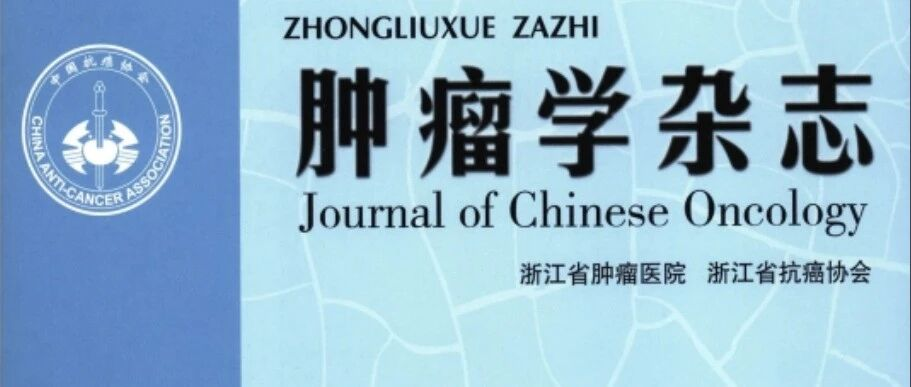

The Chinese Anti-Cancer Association's Integrated Chinese and Western Medicine Ovarian Cancer Professional Committee, through its Expert Panel for Developing the Chinese Expert Consensus on Standardized Selection of Cervical Cancer Genetic Testing Based on Clinical Needs, notes that cervical cancer incidence and mortality rank 4th among female malignancies, with China's incidence growing at an average annual rate of 1.63%. With the advancement of hereditary cancer concepts, the role of genetic testing in cervical cancer prevention, screening, diagnosis, and treatment is becoming increasingly well-defined. Currently, there is a lack of standards and specifications for cervical cancer genetic testing selection. Accordingly, this consensus has been developed to provide reference for genetic testing in high-risk population screening and cervical cancer treatment.

This consensus is primarily intended for reference by gynecologists, related specialists, and other healthcare providers at hospitals of various levels. The target population is cervical cancer patients and individuals at high risk for cervical cancer, with the aim of improving diagnostic accuracy and the safety and efficacy of treatment.

**1. Application of Genetic Testing in Screening and Triage**

(1) HPV DNA testing is the preferred screening method for the general population. Those positive for HPV 16/18 are directly referred for colposcopy; those positive for non-16/18 types require cytology for stratified management.

(2) HPV E6/E7 mRNA testing is applicable for triage of ASC-US populations, reducing unnecessary colposcopy referrals.

(3) DNA methylation markers (such as PAX1, JAM3, FAM19A4, etc.) can identify cervical cancer or precancerous lesion risk, and are particularly suitable for triage of HPV-positive patients or those with abnormal cytology.

(4) Immunotherapy-related testing: PD-L1, MMR/MSI (mismatch repair/microsatellite instability), and TMB (tumor mutational burden) testing are recommended. Patients with MSI-H or TMB-H may benefit from PD-1/PD-L1 inhibitors (such as pembrolizumab).

(5) Targeted therapy-related testing: HER2, RET, and NTRK gene testing are recommended. HER2-positive patients may be considered for trastuzumab deruxtecan; RET fusion-positive patients are recommended for selpercatinib; NTRK fusion-positive patients are recommended for larotrectinib, entrectinib, or repotrectinib.

**2. Focus on PAX1 and JAM3 Methylation Markers:**

PAX1/JAM3 methylation testing is significantly superior to cytology for detecting CIN III+. When liquid-based cytology results are ASC-US or above, PAX1/JAM3 methylation positivity significantly reduces colposcopy referral rates (74.66% vs 17.45%).

PAX1 and JAM3 are the key DNA methylation markers mentioned in this document, primarily used for cervical cancer screening triage, especially in risk stratification of HPV-positive patients.

**3. Potential and Application Scenarios of Methylation Testing Technology**

As a frontier technology in epigenetics, the application prospects of methylation testing in cervical cancer detection provoke deep reflection. The following application directions are proposed in conjunction with forum topics and industry trends:

(1) Innovation in cervical cancer early screening: Current status and challenges: Traditional HPV testing has overdiagnosis issues, while methylation testing (such as PAX1/JAM3) can identify epigenetic changes in cervical epithelial cells, with sensitivity as high as 89.6%, specificity exceeding 96.5%, and the ability to detect early lesions.

(2) From "morphology-dependent" to "molecular stratification": In the diagnosis of cervical adenocarcinoma (such as gastric-type adenocarcinoma, GAS), traditional methods easily confuse it with benign lesions (such as lobular endocervical glandular hyperplasia, LEGH). PAX1/JAM3 testing shows a methylation positivity rate of 94.05% in cancerous tissue with specificity of 96.30%, successfully distinguishing GAS from LEGH and reducing diagnostic error risk by 34%.

(3) HPV 16/18-positive management strategy: For HPV 16/18-positive women, combined methylation testing can increase the specificity for CIN 3+ to 96.1%, reducing excessive colposcopy examinations.

(4) Prediction of cervical lesion progression during pregnancy: Combining methylation markers with AI models can address the issue of cervical lesion progression during pregnancy, reducing anxiety in pregnant women with cervical lesions.

Looking ahead, as more clinical validations are conducted, the combined PAX1 and JAM3 dual-gene methylation test is increasingly featured in various cervical cancer expert consensus statements and guidelines, gaining citation and recognition from cervical cancer experts and becoming an important part of consensus. It is expected to play a greater role in cervical cancer screening, contributing to China's cervical cancer prevention and control efforts.

**Article Source**

Chinese Expert Consensus on Standardized Selection of Cervical Cancer Genetic Testing Based on Clinical Needs (2025 Edition) [J]. Journal of Oncology, 2025, 31(7): 557-566.

**About CISPOLY**

Beijing Origin CISPOLY Biotechnology Co., Ltd. is a technology-driven enterprise committed to health innovation. As a pioneer in the field of early gynecologic oncology diagnosis, CISPOLY has developed early-detection products for cervical cancer, endometrial cancer, and ovarian cancer using proprietary technologies and patent-protected biomarkers, filling a critical gap in the field.

As women pay increasing attention to their own health, the women's health market holds great potential. Beyond the early screening and diagnosis product pipeline for gynecologic oncology, CISPOLY will continue to build additional women's health product lines, establishing itself as a technology-innovation-leading enterprise in the women's health market.