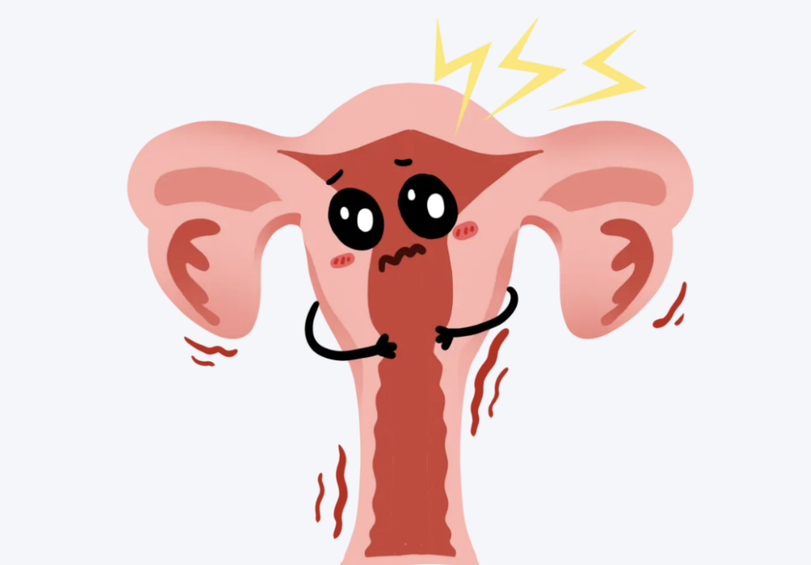
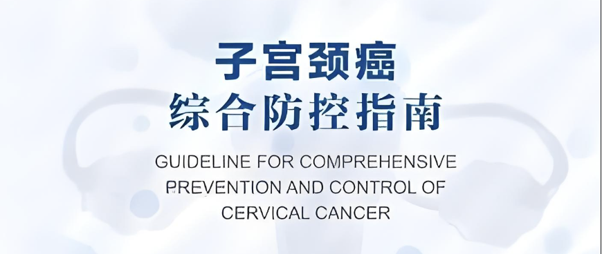
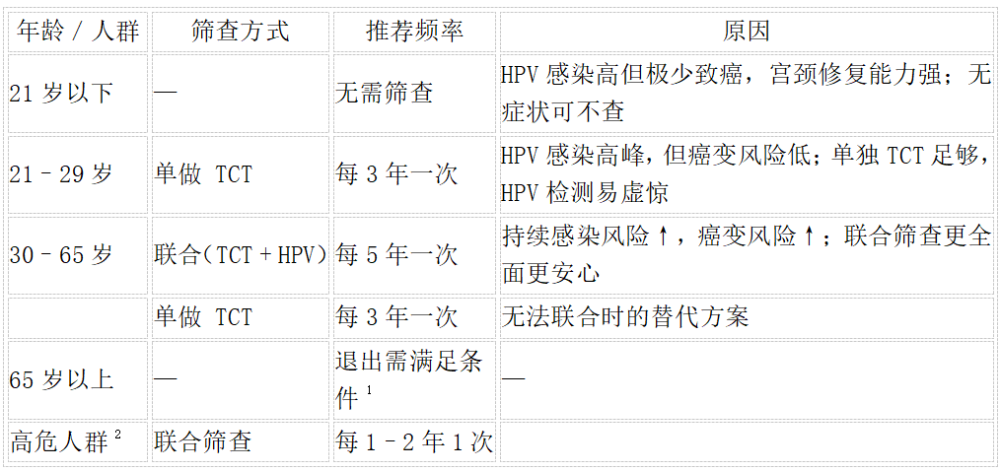

Cervical cancer is the fourth most common cancer among women worldwide, but it is also the only cancer that can be "detected for prevention and caught early enough to eliminate"! The key lies in regular screening — catching cancer in its earliest stages!

**I. Different Screening Methods: Choosing the Right Tool Is Key**

The CISCER® PAX1/JAM3 methylation test is like performing a "deep cancer CT" on cells — it doesn't just examine surface morphology but delves into the internal "switches" of genes. Once PAX1 or JAM3 shows abnormal methylation, it signals the very first sign of cancerous change — leaving nowhere to hide!

**II. Screening Frequency Guide: Determined by Age & Risk!**

Based on international guidelines (ASCCP 2020, China's *Comprehensive Cervical Cancer Prevention and Control Guidelines*), the following scientific screening protocols are recommended:

(1) Exit from screening requires meeting any one of the following:
- Two consecutive negative co-tests within the last 10 years (with the most recent ≤5 years ago)
- Three consecutive negative TCT results within the last 10 years (with the most recent ≤3 years ago)

❗ Individuals with a history of cervical cancer/precancerous lesions or immunodeficiency require lifelong screening.

(2) Risk factors include: multiple sexual partners, early sexual debut (<16 years), prior HPV/genital warts, immunocompromise (HIV/transplant), smoking, long-term contraception/hormone therapy, family history.

**III. Pre-Screening Precautions: Accurate Results Depend on Details!**

- Timing: Best done 3–7 days after your period ends (avoid menstruation).
- Preparation: Avoid sexual intercourse, vaginal douching, or medication 24 hours before the test.
- Inflammation: If you have acute vaginitis/cervicitis, treat it first before screening.

**IV. Clearing Misconceptions: Don't Fall into Screening Traps!**

❌ Myth 1: Got the HPV vaccine = no need for screening?

Wrong! The vaccine does not cover all high-risk HPV types and is ineffective against existing infections. Even after vaccination, you still need to screen on schedule!

❌ Myth 2: Normal TCT = absolutely safe?

Wrong! TCT may miss cases of persistent HPV infection without cytological changes. Co-testing is strongly recommended for women 30+!

❌ Myth 3: More frequent screening is always better?

Wrong! Over-screening may lead to unnecessary colposcopies and biopsies, adding burden and anxiety. Following guideline-recommended frequencies is the most scientific approach!

**V. Advantages of CISCER® PAX1/JAM3 Methylation Testing**

(1) "Dual-gene surveillance": Simultaneously monitors methylation of PAX1 and JAM3 genes, detecting deep cellular cancerous tendencies at an early stage. (2) High sensitivity, low false-positive rate: Sensitivity ≥98%, with specificity higher than standard methylation tests. (3) Complements traditional screening: Works synergistically with TCT/HPV testing to improve overall detection rates.

**VI. Conclusion: Early Screening, Early Intervention — Leaving Risk Nowhere to Hide!**

Remember: Cancer is not a sudden ambush — it is a lesion that went undetected. With early screening and early intervention, cervical cancer simply has no opportunity to "grow"!

**About CISPOLY**

Beijing Origin CISPOLY Biotechnology Co., Ltd. is a technology-driven enterprise committed to health innovation. As a pioneer in the field of early gynecologic oncology diagnosis, CISPOLY has developed early-detection products for cervical cancer, endometrial cancer, and ovarian cancer using proprietary technologies and patent-protected biomarkers, filling a critical gap in the field.

As women pay increasing attention to their own health, the women's health market holds great potential. Beyond the early screening and diagnosis product pipeline for gynecologic oncology, CISPOLY will continue to build additional women's health product lines, establishing itself as a technology-innovation-leading enterprise in the women's health market.