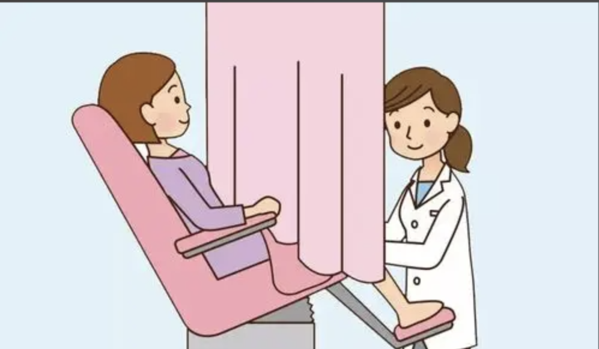

Aunt Zhang had been experiencing irregular periods — bleeding that should have stopped kept dragging on for half a month, occasionally mixed with dark red clots. The gynecologist recommended an outpatient "diagnostic dilation and curettage" (D&C) to scrape the endometrium for pathological examination to determine the cause of bleeding. After the procedure, the report showed "no significant abnormalities." Aunt Zhang wondered: "If there's no problem, why am I still bleeding?" She then went to another hospital, where the doctor used a small instrument with a "camera" (hysteroscope) to directly visualize the uterine cavity — and discovered a polyp the size of a mung bean hidden in the uterine cornu, which traditional curettage had completely missed!

This is not an isolated case. Although traditional D&C diagnosis has been used for decades, it has an inherent flaw: it is a "blind procedure" dependent on the physician's scraping technique, like feeling around in a dark room — making it easy to miss critical lesions.

**How Does Curettage Perform "Blind Sampling"?**

Simply put, the traditional D&C procedure works as follows: the physician inserts a long, thin curette through the vagina and cervix into the uterine cavity, then rotates the curette to scrape endometrial tissue. Throughout the entire process, the physician cannot see the inside of the uterus — relying entirely on tactile sensation and experience to judge "whether anything was obtained."

This "blind" operation is like reaching into a closed box and stirring — if a small piece of paper is hidden in a corner, you might not touch it. Similarly, if a lesion on the endometrium (such as a small polyp, localized hyperplasia, or early cancer) happens to be in a position the curette "cannot reach," it will be missed.

**What Exactly Can Blind Sampling Miss?**

Focal lesions: Endometrial lesions often "play hide and seek." For example, endometrial polyps may be only the size of a grain of rice but tend to grow in "hidden corners" such as the uterine cornu or fundus. The coverage of a traditional curette is limited, making it easy to "miss" them. Research has found that approximately 15% of endometrial polyps escape detection by traditional D&C.

Non-uniform sampling: Endometrial thickness and condition vary with the menstrual cycle, and different regions may have differing tissue characteristics (e.g., the endometrium near the fundus is thicker). If the curette only scrapes one area, it may miss critical lesions in other regions.

High dependence on experience: Novice physicians may not be able to comprehensively scrape due to lack of proficiency. Even experienced physicians face accuracy limitations in blind curettage due to uterine anatomy (e.g., an excessively anteverted or retroverted uterus) — like "navigating a curved tunnel in the dark."

**How Serious Are the Consequences of Missed Diagnosis?**

The most direct consequence is "normal test results but persistent symptoms." In Aunt Zhang's case, if the small polyp in the uterine cornu had been missed, it would continue to stimulate the endometrium, causing recurrent bleeding. Even more dangerously, if the lesion were early-stage endometrial cancer, the missed diagnosis could delay treatment — after all, early cancer may present as just a small protrusion on the endometrium that a traditional curette "cannot feel," resulting in a false impression of "no abnormalities."

**Is There a "Brighter" Method?**

Absolutely! The new CISENDO® (CDO1/CELF4) methylation testing technology is like casting "a beam of light" into the darkness of traditional curettage. Just like cervical cancer screening, it requires only a painless collection of cervical secretions to assess endometrial cancer risk! How does it work?

As it turns out, cancer cells leave a "tell-tale trail": DNA methylation. Simply put, our cells have a set of "gene switches." In normal cells, these switches are "on," allowing tumor suppressor genes to function properly. But cancer cells secretly "lock" these switches (abnormal methylation), causing tumor suppressor genes to stop working, and cancer cells begin to grow uncontrollably.

The CISENDO® test is specifically designed to detect the "critical locks" of endometrial cancer. By analyzing the methylation levels of two key locks (key genes — CDO1 and CELF4) in cervical exfoliated cells, it can determine whether the endometrium has cancer risk. This method is like routinely checking whether the safe has been tampered with, whether the jewelry is still there, and whether the safe lock is still secured as before. A woman's uterine health is like jewelry — ultrasound will often reveal issues, but most ultrasound-detected problems are not life-threatening.

**Recommended as the "Golden Partner" for Curettage, Especially for These Situations:**

- Sudden postmenopausal bleeding or vaginal discharge;

- Prolonged or excessively heavy menstrual periods;

- Ultrasound suggesting endometrial thickening or a mass;

- Inconclusive curettage results requiring confirmation;

- Detection of precancerous lesions requiring regular follow-up.

**Conclusion**

Traditional D&C is a classic gynecological examination that has helped many patients in the absence of visualization tools. However, its "blind sampling" limitations may lead to missed critical lesions. With advances in medical technology, DNA methylation testing can now more precisely "uncover" hidden lesions. If symptoms persist after examination, or if your physician recommends further workup, there is no need to resist — a clearer "view" is the more responsible approach to your health.

**About CISPOLY**

Beijing Origin CISPOLY Biotechnology Co., Ltd. is a technology-driven enterprise committed to health innovation. As a pioneer in the field of early gynecologic oncology diagnosis, CISPOLY has developed early-detection products for cervical cancer, endometrial cancer, and ovarian cancer using proprietary technologies and patent-protected biomarkers, filling a critical gap in the field.

As women pay increasing attention to their own health, the women's health market holds great potential. Beyond the early screening and diagnosis product pipeline for gynecologic oncology, CISPOLY will continue to build additional women's health product lines, establishing itself as a technology-innovation-leading enterprise in the women's health market.