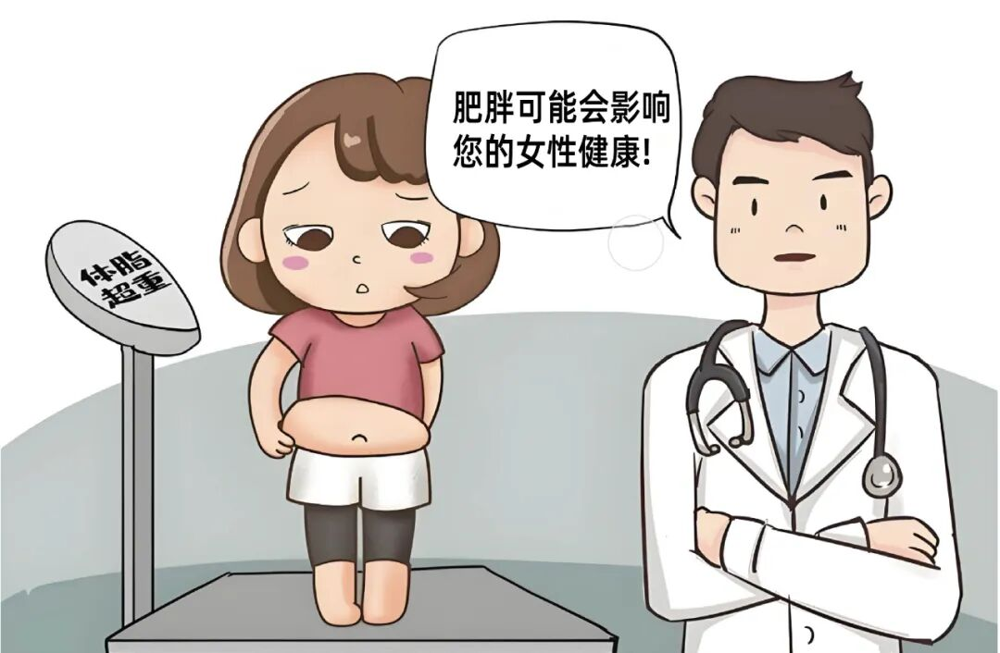

Recently, a 45-year-old woman named Ms. Li visited our clinic. She was overweight, her menstrual cycle had been irregular for over six months, and this time she experienced non-menstrual bleeding. Upon examination, she was diagnosed with early-stage endometrial cancer. With teary eyes, she asked, "Doctor, I've never had any major health problems — how did I get cancer?"

In fact, situations like Ms. Li's are not uncommon. In recent years, the incidence of endometrial cancer has been rising year by year, and obesity is a "hidden culprit" that doctors repeatedly emphasize. Today, let's discuss: what exactly is the relationship between being overweight and endometrial cancer?

Endometrial cancer most commonly affects women over 50 who are postmenopausal, but in recent years more young patients are being diagnosed (even in their 30s), and obesity is one of the key triggers.

**Why Does Obesity "Feed" Endometrial Cancer? The Key Lies in Hormones**

The health of a woman's endometrium depends on a balance between two hormones: estrogen (which stimulates endometrial growth) and progesterone (which causes the endometrium to shed, forming menstruation). When estrogen chronically "dominates," the endometrium is like a plant being continuously fertilized — it proliferates excessively, increasing cancer risk.

Obesity, in particular, causes estrogen to "exceed normal levels." Our adipose tissue contains an enzyme called "aromatase" that converts androgens (which women also have in small amounts) into estrogen. People with more body fat naturally produce more estrogen.

What makes matters worse is that obese women often experience ovulatory dysfunction (such as polycystic ovary syndrome). When follicles fail to develop and ovulation does not occur, progesterone secretion becomes insufficient. Without progesterone acting as a "brake," estrogen continues to stimulate the endometrium unopposed, and over time, the endometrium is more likely to "turn malignant."

Research has found that women with a body mass index (BMI) ≥ 30 have a 2–3 times higher risk of endometrial cancer compared to women of normal weight. If BMI exceeds 40 (severe obesity), the risk can soar to more than 5 times!

**Beyond Hormones, Obesity Has These "Accomplices"**

- Obesity not only directly elevates estrogen levels but also triggers systemic "chronic inflammation" and "metabolic disorders":

- Accumulated fat releases large amounts of inflammatory cytokines that chronically stimulate endometrial cells, accelerating their abnormal proliferation;

- Obesity is often accompanied by insulin resistance (impaired blood sugar regulation), and elevated insulin levels further promote endometrial hyperplasia;

- Hypertension, hyperlipidemia, and other components of "metabolic syndrome" work together with obesity to further compound the risk of endometrial cancer.

**Overweight Women: You Must Do These 4 Things!**

At this point, some may panic: "I'm overweight — does that mean I'll definitely get cancer?" Don't worry! Obesity is a risk factor, not an inevitable outcome. With proactive intervention, you can significantly reduce your risk.

1. Weight Management: Lose 5%–10% for Significant Risk Reduction

There's no need to pursue extreme thinness. Aim to bring your BMI into the 18.5–24 range (calculated as: weight in kg ÷ height in m²). Even losing just 5%–10% of body weight (e.g., 5–10 jin out of 100 jin) can significantly reduce estrogen levels and inflammatory responses.

2. Dietary Adjustments: Less Sugar, Less Oil, More Fiber

Reduce refined sugar (milk tea, cakes) and fried foods; eat more vegetables, whole grains (oats, brown rice), and quality protein (fish, legumes). These foods help stabilize blood sugar, reduce insulin fluctuations, and indirectly protect the endometrium.

3. Regular Exercise: At Least 150 Minutes of Moderate-Intensity Exercise Per Week

Brisk walking, swimming, or aerobics — the key is to get moving. Exercise not only burns calories but also regulates hormonal balance and reduces chronic inflammation.

4. Monitor Body Signals and Screen Regularly

If you experience non-menstrual bleeding, postmenopausal bleeding, or prolonged menstrual periods, seek medical attention promptly! Especially for overweight women, those with polycystic ovary syndrome, or those with a family history (high-risk groups), an annual gynecologic ultrasound plus endometrial cancer DNA methylation testing is recommended.

The CISENDO® test is specifically designed to detect the "critical locks" of endometrial cancer. By analyzing the methylation levels of two key locks (key genes — CDO1 and CELF4) in cervical exfoliated cells, it can determine whether the endometrium has cancer risk. This approach is like routinely checking whether the safe has been tampered with, whether the jewelry is still there, and whether the safe lock is still secured as before. A woman's uterine health is like jewelry — ultrasound will often reveal issues, but most ultrasound-detected problems are not life-threatening. For women with clinical symptoms of endometrial cancer (abnormal bleeding) or those with prior ultrasound abnormalities, checking whether the critical locks of endometrial cancer are secure is simple, convenient, and reassuring.

**A Final Honest Word**

Endometrial cancer does not "suddenly appear." It is often the "cumulative result" of long-term high-estrogen stimulation. Obesity is a key factor that "adds fuel to the fire" of this stimulation. Weight management is not about "looking beautiful" — it's about "relieving the burden" on your body: restoring hormonal balance, stabilizing metabolism, and keeping the endometrium away from the risk of "going out of control." Starting today, watching your diet and getting active is the best "cancer prevention insurance" you can give your future self.

**About CISPOLY**

Beijing Origin CISPOLY Biotechnology Co., Ltd. is a technology-driven enterprise committed to health innovation. As a pioneer in the field of early gynecologic oncology diagnosis, CISPOLY has developed early-detection products for cervical cancer, endometrial cancer, and ovarian cancer using proprietary technologies and patent-protected biomarkers, filling a critical gap in the field.

As women pay increasing attention to their own health, the women's health market holds great potential. Beyond the early screening and diagnosis product pipeline for gynecologic oncology, CISPOLY will continue to build additional women's health product lines, establishing itself as a technology-innovation-leading enterprise in the women's health market.