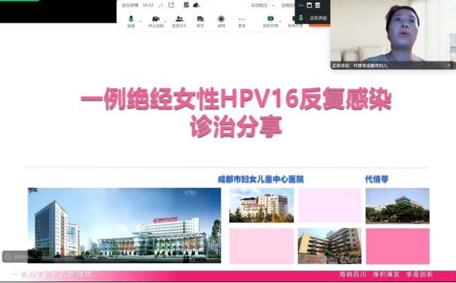
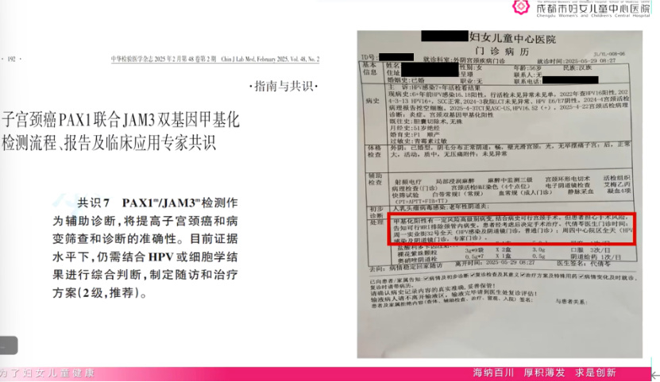

On August 25, 2025, a cervical cancer methylation academic exchange conference was held online, co-chaired by Director Zhao Qingping from Sichuan Provincial Maternity and Child Health Hospital and Director Dong Yuyan from Shandong Provincial Maternity and Child Health Hospital. The conference was based on the contents of the *Chinese Cervical Cancer Screening Guidelines (Part II)*, focusing on "Case Analysis and Clinical Application of Cervical Cancer Methylation Testing." Key discussions centered on the important role of methylation testing in cervical cancer screening, triage, and treatment decision-making, as well as future directions for clinical application. This exchange activity provides forward-looking exploration for future clinical research and the development of related guidelines and expert consensus.

## **I. Case Presentation**

Director Dai Qianling from Chengdu Women's and Children's Central Hospital shared a case of a 56-year-old female patient. The patient had been persistently infected with high-risk HPV for 6 years, with most cytology and colposcopy biopsy results showing inflammation or normal findings.

1. Basic Information: Gender: Female; Age: 56; Ethnicity: Han; Marital status: Married; 2. Chief Complaint: HPV infection for 7 years with recent biopsy results. 3. Present Illness: (1) Medical History Summary:

* 6 years ago: HPV 16/18 positive, biopsy showed no abnormalities; subsequent follow-up showed persistent HPV 16 infection.
* 2022: HPV 16 positive, SCC normal, LBC no abnormalities, HPV E6/E7 negative.
* 2025: HPV 16/52 positive, LBC no abnormalities, biopsy pathology showed inflammation, cervical dual-gene methylation positive.

(2) Menstrual, marital and reproductive history: Postmenopausal; P1 spontaneous delivery. 4. Diagnosis: Diagnostic conization: Cervical high-grade squamous intraepithelial lesion (CIN2). 5. Doctor-Patient Communication and Decision-Making Process: (1) Patient concerns: Worry about surgical risks (e.g., post-conization complications such as bleeding, infection, cervical insufficiency). (2) Communication content:

* Informed the patient of the potential risks of persistent HPV 16 infection and possible high-grade lesions (elevated risk of progression to invasive cancer), and recommended further workup to exclude endocervical lesions (e.g., pelvic MRI).
* Explained the necessity of surgery (diagnostic cervical conization): to clarify the extent of lesions, exclude the risk of invasive cancer, and simultaneously achieve therapeutic effect (removal of lesional tissue).
* After thorough physician explanation and shared decision-making with the patient.

## **II. Case Summary**

The patient is a postmenopausal woman with persistent HPV 16 infection for many years, but colposcopy biopsy failed to detect any lesions, and auxiliary examinations showed no abnormalities. Due to a positive methylation test result, after thorough doctor-patient communication regarding risks and benefits, diagnostic conization pathology revealed a high-grade cervical lesion, invasive cancer was ruled out, and an individualized treatment plan was established with emphasis on the importance of long-term postoperative follow-up.

In postmenopausal women, cervical atrophy often leads to concealment of the squamocolumnar junction, frequently resulting in limited cytology sampling and incomplete colposcopic visualization of the lesional area, leading to suboptimal results.

Facing the clinical dilemma of "persistent HPV 16 positivity for several years with cytology and histology inconsistent with clinical symptoms and disease progression," affected women endure prolonged psychological stress and fear.

In response to this growing population facing such disease challenges, the medical team actively explored more precise detection methods to provide more effective approaches for patients with persistent HPV infection, thereby avoiding missed diagnoses and the immense psychological burden caused by cancer-related fear. After comprehensive multidimensional evaluation, the PAX1/JAM3 dual-gene methylation testing technology was introduced. After collecting cervical exfoliated cell specimens in the outpatient setting, the patient's PAX1/JAM3 dual-gene methylation result was positive, suggesting the possible presence of occult high-grade lesions within the endocervical canal.

Based on comprehensive analysis of clinical symptoms and various test results, after discussion with the patient, Director Dai recommended diagnostic conization to confirm the pathology. She also noted that for patients unwilling to undergo conization, methylation results can serve as reference evidence for weighing follow-up versus surgery.

Director Dai also shared clinical practice observations: in multicenter validation, this methylation test demonstrated a high negative predictive value (approaching 90%), offering significant reference value in triage and follow-up management, though it needs to be interpreted in conjunction with clinical, imaging, and colposcopy findings.

## **III. Two Primary Clinical Scenarios for Methylation Testing**

Director Dai summarized that her department primarily uses methylation testing in two scenarios:

(1) Triage for non-16/18 high-risk HPV-positive patients or those with low-risk cytology but high-risk factors; (2) For cases with discordant biopsy and cytology results, unsatisfactory sampling, or suspected occult endocervical lesions, to determine whether high-grade lesions have been missed.

## **IV. Case Discussion**

Director Zhao Qingping from Sichuan Provincial Maternity and Child Health Hospital and Director Chen Xin from Mianyang People's Hospital respectively summarized and discussed case management approaches and screening process optimization. Experts unanimously agreed that methylation testing can serve as a supplementary tool to reduce missed diagnoses, optimize triage, and assist in treatment decision-making.

1. Discussion and Summary by Director Zhao Qingping (Sichuan Provincial Maternity and Child Health Hospital)

Director Zhao Qingping affirmed the representativeness and practical significance of the case shared by Director Dai, pointing out that in postmenopausal women, cervical atrophy and Type 3 transformation zones that are difficult to expose increase the risk of missed diagnosis by colposcopy and biopsy.

PAX1+JAM3 dual-gene methylation testing provides clinicians with a "timely and supplementary" risk assessment tool. For patients with persistent high-risk HPV infection but inconsistent traditional test and histology results, methylation testing can help clinicians make more individualized decisions between "cautious follow-up" and "early diagnostic surgery."

As testing costs decrease, this technology is expected to be rationally incorporated into more tertiary hospitals and screening workflows, improving screening precision and triage efficiency.

2. Discussion and Summary by Director Chen Xin (Mianyang People's Hospital)

Director Chen Xin approached the discussion from a screening science and public health perspective, emphasizing that the goal of cervical cancer screening is "early identification and precise management" of cervical epithelial lesions. She noted that traditional TCT relies on pathology experience, and HPV testing has high sensitivity but insufficient specificity, easily leading to over-referral and overtreatment. Combined PAX1 and JAM3 methylation testing can improve triage precision, especially for patients with persistent infection, difficult sampling, or discordant cytology/biopsy results. In clinical practice, methylation testing is more commonly used for follow-up and triage decisions in patients with high-risk factors, thereby reducing unnecessary colposcopy referrals while minimizing the risk of missing high-grade lesions. Clinical Application Highlights:

* Supplementary triage tool: For non-16/18 high-risk HPV-positive patients or those with low-risk cytology but high-risk factors, used to reduce unnecessary colposcopy referrals.
* Preventing missed diagnosis: In postmenopausal or occult endocervical lesion scenarios, a positive methylation result suggests the need for enhanced follow-up or consideration of diagnostic conization.
* Postoperative/post-biopsy decision support: When histology is inconsistent with clinical imaging/colposcopy, methylation results can serve as a reference for preoperative risk assessment.
* Higher negative predictive value: The conference noted that the product's clinical validation showed a negative predictive value approaching 90%, which helps reassure low-risk patients during follow-up, though clinical comprehensive judgment is still needed to guard against false positives.

## **V. Conclusion**

This academic exchange conference highlighted the practical value of combined PAX1 and JAM3 dual-gene methylation testing in cervical cancer screening and clinical management through representative cases and expert discussions. Experts unanimously agreed that PAX1 combined with JAM3 dual-gene methylation serves as an important supplementary tool, capable of improving diagnostic sensitivity in complex or high-risk cases, optimizing triage pathways, and providing strong reference for individualized treatment decisions. As more multicenter validation data becomes available and testing costs further improve, combined PAX1+JAM3 methylation testing will play an increasingly important role in the clinical screening system.

**About CISPOLY**

Beijing Origin CISPOLY Biotechnology Co., Ltd. is a technology-driven enterprise committed to health innovation. As a pioneer in the field of early gynecologic oncology diagnosis, CISPOLY has developed early-detection products for cervical cancer, endometrial cancer, and ovarian cancer using proprietary technologies and patent-protected biomarkers, filling a critical gap in the field.

As women pay increasing attention to their own health, the women's health market holds great potential. Beyond the early screening and diagnosis product pipeline for gynecologic oncology, CISPOLY will continue to build additional women's health product lines, establishing itself as a technology-innovation-leading enterprise in the women's health market.