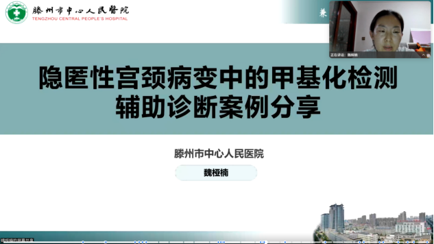
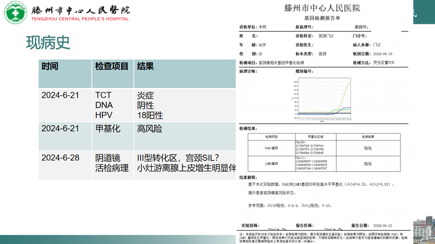
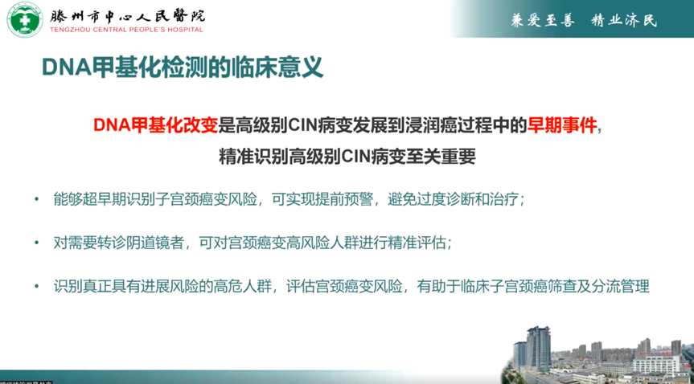
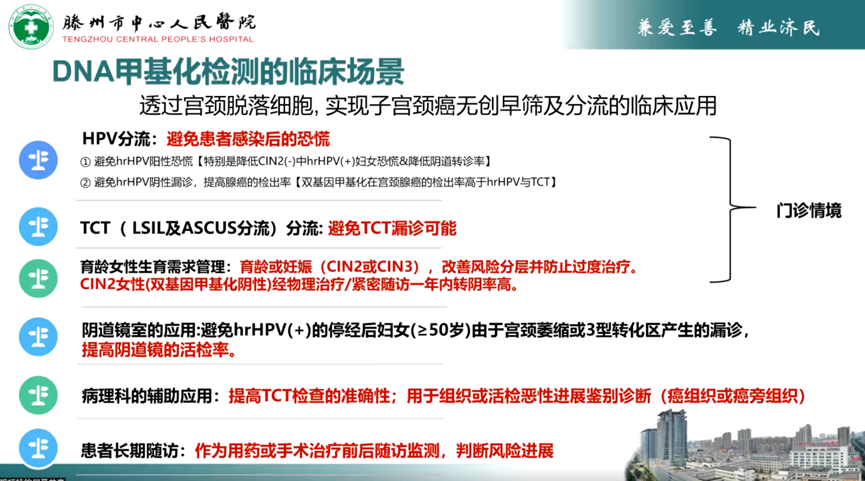
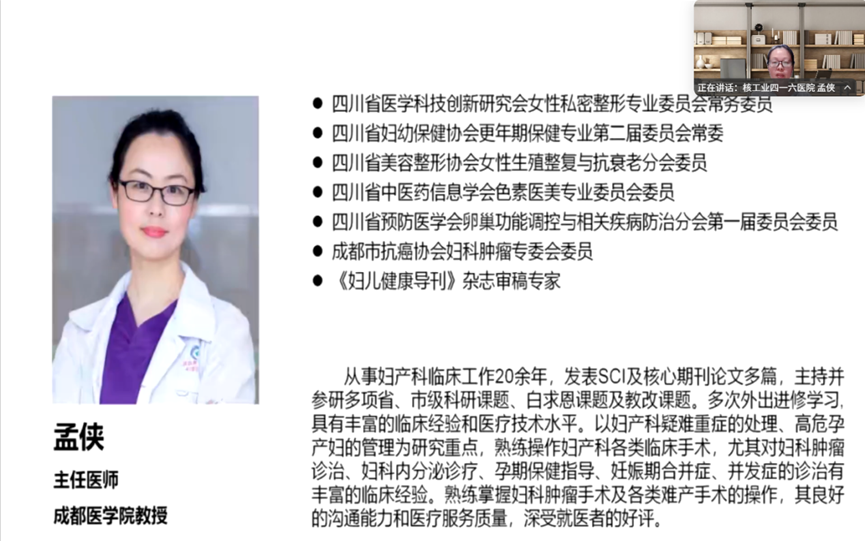
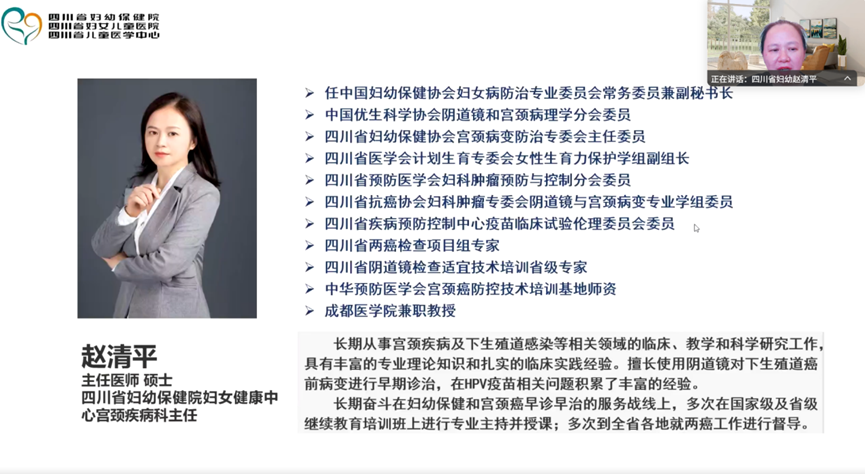

# 宫颈癌甲基化学术交流会—病例讨论聚焦子宫颈癌甲基化检测临床应用 —— 在隐匿性宫颈腺癌漏诊病例探讨

_2025年09月08日 15:47_

2025年8月25日，由四川省妇幼保健院赵清平主任与山东省妇幼保健院董玉燕主任联合主持的宫颈癌甲基化学术交流会在线上举行。会议点讨论甲基化检测在子宫颈癌筛查、分流及治疗决策中的临床病例分享，探讨其在临床应用可行性。这一交流活动将为未来的临床研究以及相关指南和专家共识的制定提供前沿探索。

##**一、病例分享**

滕州市中心人民医院的魏亚楠主任分享了一例HPV18持续感染4年的病例,甲基化检测阳性后进一步诊断出宫颈腺癌,强调了甲基化在腺癌筛查中的价值。

1. 基本信息姓名：满某，女，48岁主诉：HPV18持续感染4年月经史：月经规律（5/30），量中，无痛经
2. 既往史：高血压；家族史：无特殊遗传病史
3. 既往史：
- 2020-10-11：TCT提示炎症，HPV18阳性；阴道镜活检/宫颈管诊刮提示慢性炎症，活检组织p16阴性，Ki-67基底细胞阳性→建议1年复查（患者未按时复诊）。
- 2023-06：复查仍HPV18阳性，TCT提示炎症；阴道镜活检提示宫颈管慢性炎症，少量游离鳞状上皮增生，免疫组化KI-67（副基底细胞+），p16斑驳阳性→药物治疗并建议复查。
- 2024-06：HPV18持续阳性，TCT仍提示炎症，常规检查未发现明确上皮内瘤变，但免疫组化提示腺体区p16阳性。
4. 现病史
- 2024-06-21：进行PAX1/JAM3双基因DNA甲基化检测（提示高风险，阳性）；随后复查阴道镜显示III型转化区，局部可见小灶腺上皮异常伴p16阳性，活检多点仍多提示慢性炎症或局灶增生，病理并未明确大片CIN2+/HSIL。
- 病理与影像、HPV与细胞学结果不一致，疑有隐匿病变；甲基化检测结果提示高度风险，促使临床团队采取进一步诊断性干预。4.治疗经过
- 2024-07-05：在全麻下行诊断性宫颈锥切术；术中见宫颈表面局灶不着色区约0.2cm。术后病理：发现宫颈腺癌（原位/小范围腺癌）。
- 术后行MRI评估，随后于2024-07-15实施腹腔镜下全子宫+双侧附件切除术（患者已无生育需求）。
- 术后病理：锥切术后改变，宫颈有小区域CINI及腺体上皮局灶增生，子宫肌瘤、子宫内膜增生，双侧附件未见异常。随访随临床路径进行。

##**二、漏诊原因的分析**

魏主任对漏诊原因的分析

1. HPV检测提示度不足：无论HPV DNA或E6/E7
mRNA，均不能完全指示是否存在隐匿性上皮病变或其进展速度；持续阳性提示风险但不能定位病灶。
2. TCT / 病理取材与人工阅片局限：取材不充分、制片或阅片主观性可导致假阴性或漏诊，尤其是腺性病变易被忽略。
3. DNA倍体检测的局限：阴性并不排除早期病变（早期病变可能尚无明显倍体异常）；阳性需进一步病理证实。
4. 阴道镜的假阴性与取材盲区：阴道镜假阴性率高（文献范围广），特别是TZ3（第三型转化区）或宫颈管/穹窿部位病变易漏诊。活检取样的准确度与病理判读差异：活检部位/深度、病变的隐匿位置以及病理interpretation都会影响最终诊断。

##**三、为何在本病例中使用DNA甲基化检测以精准评估**

早期分子改变先于形态学改变：致癌相关基因（抑癌基因）启动子区的异常甲基化是肿瘤发生早期的分子事件，常在形态学可见病变之前出现；检测甲基化可捕获“尚未被传统镜检/病理明显识别”的高风险病变。

弥补取材/影像的盲区：当阴道镜取材受限（如TZ3、宫颈管内或穹窿部位病灶）或活检多次仅见炎症时，甲基化检测能通过宫颈分泌物/脱落细胞捕获分子信号，提示隐匿性病变风险。

提高分流与决策的精确性：甲基化阳性提示高风险，能促使临床采取更积极的诊断措施（如诊断性锥切或强化影像/随访），而甲基化阴性则具有较高阴性预测值，可降低不必要的侵入性检查与过度治疗。

对腺性病变尤其敏感：腺癌与腺上皮异常在细胞学与阴道镜下常被漏诊；部分研究显示甲基化标记在识别腺性病变方面具有潜在优势（能提醒需做更深/更针对性的取材或锥切）。

动态监测价值：甲基化水平变化可用于随访，提示病变进展或复发风险，有助于长期管理与预后评估。

##**四、DNA甲基化检测的临床意义**

作为分子补充工具，在HPV阳性但形态学/病理检出不一致、取材困难或阴道镜阴性但临床怀疑存在隐匿病变的患者中，甲基化检测可提高早期发现率；对腺性病变（如本例腺癌）具有警示价值，能减少腺癌因形态学检查局限导致的漏诊；可用于优化分流策略、减少不必要转诊或过度治疗，同时为有合并高危因素的患者提供更有力的诊断依据；在随访管理中，甲基化阴性可增强随访信心，甲基化阳性则提示需缩短复查间隔或直接进行确诊性操作。

##**五、DNA甲基化检测临床场景建议**

- HPV阳性但TCT/活检结果反复为炎症或不确定，且临床/阴道镜提示风险或取材不满意；
- 绝经期或宫颈萎缩、TZ3型转化区患者，阴道镜/活检易漏诊的场景；
- 疑似腺性病变（宫颈管/穹窿部位病变）、细胞学对腺上皮改变识别率低的患者；
- HPV持续感染且患者不愿或不适合立即行诊断性锥切，作为短期随访的风险分层工具；
- 术后随访/复发监测以评估分子学风险变化。

##**六、病例讨论**

四川省妇幼保健院赵清平主任与绵阳市人民医院陈欣主任分别对DNA甲基化在宫颈癌筛查中的应用发表了自己的看法。

1.孟侠主任（成都医学院二附院核工业416医院）讨论并总结

- 学术共识与定位：认可“双基因甲基化（如PAX1+JAM3）”已被专家共识及多项指南建议作为宫颈癌筛查与分流工具；甲基化改变参与宫颈癌发生发展，具有早筛与风险分层价值。
- 从“检出”到“预测”：除筛查外，甲基化对病变进展/转归预测、疗效评估与预后具有潜在价值（不同基因组合性能差异需进一步研究与验证）。
- 分流与减少有创：针对HPV持续阳性但细胞学轻微异常（如ASC-
- US）或TCT阴性而仍具高危因素的患者，甲基化可精准分流，减少不必要的阴道镜与活检，尤其适用于绝经后、TZ3、取材困难或依从性差的病例。
- 以患者为中心：面对“每年转诊阴道镜”的焦虑与拒绝，甲基化“低风险”结果可作为随访而非立即有创的依据，提供更多“可被接受”的管理路径。
- 特殊人群场景：妊娠期合并HPV/细胞学异常者，甲基化有望成为暂缓阴道镜、动态观察的辅助依据（需更多临床证据）。
- 可及性改善：随着检测成本下降，甲基化更易纳入常规分流与精细化管理，建议持续多中心积累经验与数据。

2.赵清平主任（四川省妇幼保健院）讨论并总结

- 临床痛点与人群需求：绝经期、妊娠期、低龄患者对阴道镜/活检的恐惧与创伤感强，且不少“转诊者”最终无病变，提示需严格控制转诊率、优化分流路径。
- 前移介入的合理性：支持在筛查早期引入甲基化作为精准分流工具，特别是对高风险但形态学证据不足的人群，有望降低过度转诊与漏诊并存的矛盾。
- 循证与规范：目前有专家共识支持，但指南仍在推进；临床实践应在指南与共识框架内，结合患者具体情况个体化决策。
- 中国人群证据：呼吁本土数据积累（含年龄相关性与分层阈值），以推动甲基化检测纳入指南与标准化路径。

**综合结论：**两位主任一致认为,PAX1+JAM3 等双基因甲基化检测应作为现有筛查体系的关键补充：在 HPV 持续阳性、TCT 轻度或不一致结果、TZ3/ 取材困难、特殊人群（绝经期 / 妊娠期）等情境中，提供更精准的分流与随访依据，在减少不必要有创操作的同时，降低漏诊风险；未来需以中国人群真实世界数据夯实证据，推动规范化应用与指南化。

##**七、结语**

本次学术交流会通过典型病例和专家讨论，突出展示了PAX1联合JAM3双基因甲基化检测在宫颈癌筛查与临床管理中的实用价值。本例显示：在多次常规筛查阴性或仅示炎症、但HPV持续阳性且临床怀疑存在隐匿病变的情况下，DNA甲基化双基因检测（PAX1+JAM3）为发现隐匿性高级别病变或腺癌提供了关键线索，促使临床团队采取及时的诊断性锥切并最终确诊与处置。该病例强调了将分子检测与传统筛查互补纳入临床路径以减少漏诊、实现更早期诊断与个体化管理的必要性。

**关于聚禾生物**

北京起源聚禾生物科技有限公司是以创新科技为驱动、以关注健康为宗旨的科技企业。聚禾生物是妇科肿瘤早诊领域的开拓者，以独家技术和专利保护的标志物为核心，开发了宫颈癌、子宫内膜癌、卵巢癌等妇科肿瘤早诊产品，填补了该领域的空白。

随着女性对自身健康的关注越来越密切，女性健康市场将大有可为，除妇科肿瘤早筛早诊产品线外，未来聚禾生物还将建立更多女性健康相关的产品管线，打造女性健康市场的技术创新型领先企业。
