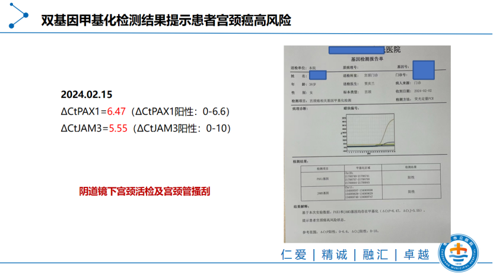
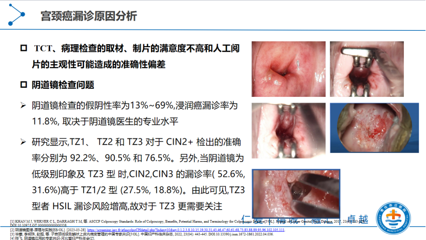
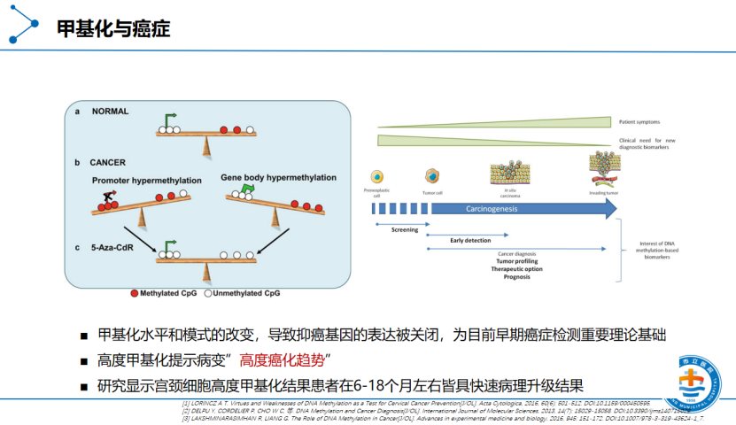

On August 25, 2025, a cervical cancer methylation academic exchange conference was held online, co-chaired by Director Zhao Qingping from Sichuan Provincial Maternity and Child Health Hospital and Director Dong Yuyan from Shandong Provincial Maternity and Child Health Hospital. The meeting focused on discussing clinical case sharing of methylation detection in cervical cancer screening, triage, and treatment decisions, exploring its clinical application feasibility. This exchange activity will provide frontier exploration for future clinical research and the development of relevant guidelines and expert consensus.

Dr. Zhang Yumin from Zaozhuang Municipal Hospital shared a case of post-surgical persistent HPV positivity with complex pathology and imaging findings, highlighting the application of PAX1/JAM3 dual-gene DNA methylation detection in triage, post-operative monitoring, and clinical decision-making. Director Dong Yuyan from Shandong Provincial Maternity and Child Health Hospital, Director Wang Jian from Zaozhuang Municipal Hospital, Professor Liu Jing from Shandong Cancer Hospital, and other experts engaged in lively discussion of this case, reaching consensus on methylation detection "as a supplementary triage and post-operative monitoring tool when indicated," while also pointing out several key issues and considerations in clinical application.

##**1. Case Sharing**

[Basic Information]

Name: Liu X, Female, 38 years old.

First visit: 2024-02-02.

Chief complaint: Over 3 years post cervical conization, persistent high-risk HPV positivity for over 1 year.

[Medical History]

2019: External hospital TCT showed HSIL, HPV16 positive; 2019-12-27 colposcopy biopsy showed HSIL.

2020-03-17: Cold knife conization performed, post-operative pathology was CIN III with focal microinvasion (width <7mm, depth <2mm), partial margins CIN II, remaining margins showed no specific lesions. Post-surgical further surgery was recommended (suggesting IA stage lesion), but the patient chose conservative management due to strong fertility desires.

No other chronic disease history, allergy history, or family genetic disease history.

[Current Medical History]

- 2020–2023 multiple follow-ups: TCT mostly showed "inflammation/cellular hyperplasia," DNA ploidy testing repeatedly negative, but high-risk HPV (predominantly HPV16) intermittently or persistently positive. SCC index showed low fluctuation (e.g., 1.13 in 2021, 1.81 in 2022). Colposcopy repeatedly showed no definitive signs of invasive tumor (records were unclear or showed low-grade impressions).
- 2024-02: High-risk HPV still persistently positive. PAX1/JAM3 dual-gene methylation testing was performed at this visit, both positive (ΔCtPAX1=6.47 (positive determination range 0–6.6), ΔCtJAM3=5.55 (positive determination range 0–10)). Subsequent biopsy pathology showed: cervical canal high-grade intraepithelial neoplasia (CIN II–III), immunohistochemistry: Ki-67 (+, approximately 90%), p16(++).

[Treatment Course] 2020 first conization post-operative pathology suggested microinvasion (IA stage) and radical surgery (hysterectomy) was recommended, but the patient explicitly requested fertility preservation, so conservative management and follow-up were undertaken.

In 2024, after consecutive imaging/molecular and pathological evidence evaluation (including this dual-gene methylation suggesting high risk and review biopsy showing CIN II–III), to balance uterine preservation with safety, the team performed a second cervical cold knife conization. Post-operative pathology showed HSIL with gland involvement, internal cervical os margin and deep margin showed CIN III, external os margin negative. Post-operatively, PAX1/JAM3 methylation detection was used as one of the post-operative monitoring tools, incorporated into the follow-up plan to assess residual or progression risk and guide subsequent triage/treatment decisions.

##**2. Application and Importance of DNA Methylation Detection in This Case**

Filling blind spots of routine testing: In this case, traditional TCT, DNA ploidy testing, and simple HPV testing had issues with sampling, subjective interpretation, and false-negative/false-positive problems, leading to insufficient assessment of lesion progression risk. PAX1/JAM3 dual-gene methylation detection provided more direct molecular evidence when hrHPV was positive and cytology was inconclusive or follow-up was contradictory, indicating potential high-grade lesions or pathological upgrade risk, thereby helping clinical decisions on whether early biopsy or surgery was needed.

Improving triage and reducing overtreatment: As a triage tool for HPV-positive populations, methylation detection has high specificity, reducing unnecessary repeat colposcopy or excessive surgery, especially in cases where TCT is atypical or HPV is non-16/18 type but persistently positive. Methylation results have important reference value for "who needs prompt diagnosis and treatment."

Post-operative monitoring and lifecycle management: For patients wishing to preserve fertility and undergoing conservative surgery, methylation detection can serve as one of the molecular indicators for post-operative follow-up, providing early indication of residual lesions or recurrence risk, thereby achieving more precise dynamic decision-making between conservative and radical approaches. Clinical studies have also reported the supplementary value of methylation indicators in post-operative monitoring or short-term risk prediction.

##**3. Clinical Significance and Applicable Scenarios of Methylation**

Triage decisions for HPV-positive populations: For patients with persistent hrHPV positivity but inconclusive or negative cytology results, methylation detection can help determine whether prompt colposcopy/biopsy is needed.

Auxiliary assessment of pathological upgrade risk: In patients with prior CIN or conization history planning uterine preservation management, methylation results can serve as an important reference for deciding between conservative observation and secondary conization/radical surgery.

Post-operative follow-up and monitoring: Incorporating methylation detection into follow-up indicators helps early detection of residual disease or recurrence, especially suitable for patient populations unwilling to undergo immediate radical surgery and wishing to preserve fertility. Optimization of screening systems: In settings with limited resources or personnel, methylation detection can be combined with HPV screening to optimize referral processes, reduce unnecessary colposcopies, and improve high-grade lesion detection rates.

##**4. Case Discussion**

Chief Physician Professor Wang Jian from the Gynecology Center of Zaozhuang Municipal Hospital and Associate Chief Physician Professor Liu Jing from the Radiotherapy Department of Shandong Cancer Hospital expressed their views on the application of DNA methylation in cervical cancer screening:

**Wang Jian (Zaozhuang Municipal Hospital) — Emphasizes Detection Limitations, Process Synergy, and Individualization**

Director Wang pointed out that any test has shortcomings (sampling, sample preservation, technical and subjective interpretation can cause false negatives/false positives), and recommended:

1. Introducing methylation detection early in initial screening or follow-up as a triage tool to reduce missed diagnosis risk, especially for patients with persistent HPV16/18 positivity;
2. Clarifying the time windows and sampling intervals for each test, discussing whether methylation sampling "within one week" after HPV/TCT results are available would affect result accuracy;
3. Emphasizing information sharing and collaboration between colposcopy, outpatient sampling, and pathology departments to form a "diagnostic synergy," and proposing incorporating methylation into post-operative follow-up for dynamic assessment.

**Liu Jing (Shandong Cancer Hospital) — Focus from Radiation Therapy and Recurrence Monitoring Perspectives**

- Professor Liu stated that radiation therapy departments have limited understanding of early screening and methylation, but are very interested in the potential role of methylation in recurrence screening and for patients with suspected recurrence, especially when traditional methods have difficulty early identifying recurrence after chemoradiation or surgical treatment. Selective methylation testing may provide help.
- Focused on the potential role of methylation in recurrence monitoring, for patients with suspected residual disease or persistent HPV positivity/cytology abnormalities after chemoradiation, noting that traditional methods have difficulty early identifying recurrence in these scenarios.
- Recommended selective use of methylation detection in patients with suspected recurrence or persistent abnormalities, and looked forward to more evidence-based data supporting its application in recurrence screening and monitoring.

**Dong Yuyan (Shandong Provincial Maternity and Child Health Hospital) — Focus on Clinical Scenarios and Management Questions**

**Finally, Director Dong Yuyan from Shandong Provincial Maternity and Child Health Hospital summarized:**

- Director Dong affirmed the value of methylation detection in clinical scenarios such as "persistent HPV positivity after surgery," noting its ability to improve identification sensitivity for "occult lesions," especially important for triage of patients wishing to preserve fertility. She raised questions and points of concern about this case:
- The patient had prior microinvasion with positive conization margins, and after the second cold knife conization, the internal margins and deep basal margins were still positive. How should the subsequent management plan be formulated?
- Under the premise of balancing uterine preservation with safety, how should methylation detection guide the decision between "continued conservative vs. further radical" treatment?
- Director Dong emphasized that methylation helps with triage and assists in decision-making for uterine preservation patients, but requires clear indications combined with patient fertility desires and economic affordability, recommending continued follow-up and dynamic assessment.

##**5. Case Summary**

This case sharing and expert discussion demonstrated the practical value and challenges of methylation detection in clinical practice: it provides powerful molecular evidence for patients with "persistent HPV positivity but inconclusive routine examinations," helping optimize triage and follow-up strategies. Meanwhile, clinical application requires caution, individualization, and reliance on good sampling standards and multidisciplinary collaboration. Experts unanimously recommended prioritizing methylation detection "when there are clear indications," and continuing dynamic tracking of cases to validate its long-term utility in post-operative monitoring and uterine preservation management.

**About CISPOLY**

Beijing Origin CISPOLY Biotechnology Co., Ltd. is a technology enterprise driven by innovative science and focused on health. CISPOLY is a pioneer in the field of early diagnosis of gynecologic tumors. With proprietary technology and patent-protected biomarkers at its core, the company has developed early diagnostic products for cervical cancer, endometrial cancer, ovarian cancer, and other gynecologic tumors, filling a void in this field.

As women pay increasing attention to their own health, the women's health market holds great promise. Beyond its gynecologic tumor early screening and diagnosis product line, CISPOLY will continue to build additional women's health-related product pipelines, striving to become a technology-innovation-driven leader in the women's health market.