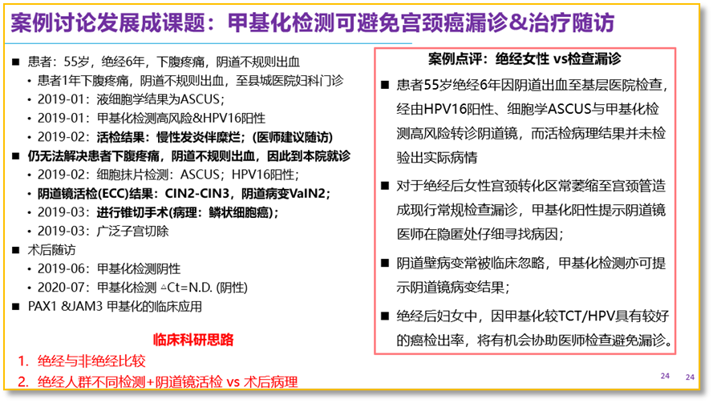
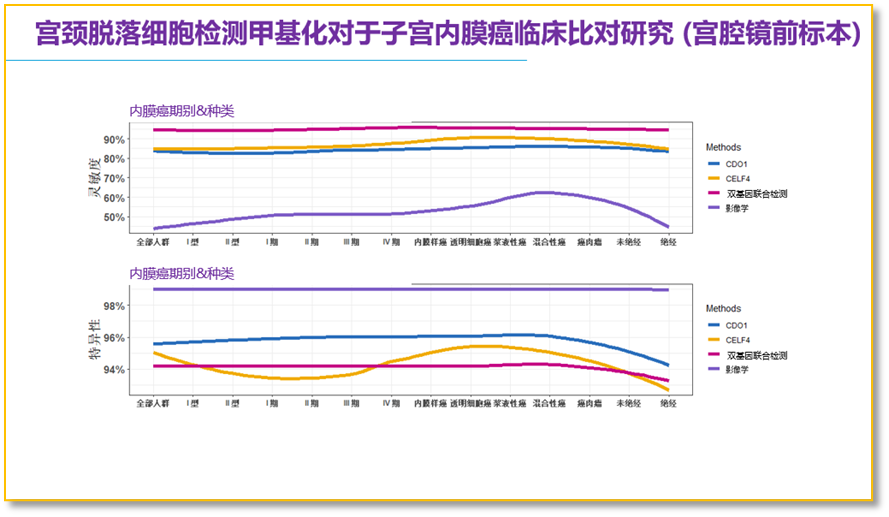

The 2025 Academic Annual Conference of the Obstetrics and Gynecology Committee of the Hunan Medical Association was grandly held in Changsha from September 5-7. Hosted by the Second Xiangya Hospital of Central South University, nearly a thousand top obstetrics and gynecology experts from across the country gathered in Changsha for this academic feast! The conference focused on frontier technologies, research achievements, and diagnostic and treatment concepts in obstetrics and gynecology, with in-depth academic exchange centered on discipline innovation and development. It not only provided a platform for participants to showcase research achievements and clinical experience, injecting new vitality into obstetrics and gynecology medicine, but also laid a solid foundation for improving diagnostic and treatment technologies and promoting the high-quality development of obstetrics and gynecology medical practice.

This conference featured 1 main venue and 11 sub-venues, covering 82 special lectures. This academic event provided participants with a high-level academic exchange platform, promoting the learning and sharing of new technologies in obstetrics and gynecology disease diagnosis and treatment, and enhancing clinical diagnostic, treatment, and research capabilities.

In the main forum, Professor Wang Yudong from the International Peace Maternity and Child Health Hospital of the China Welfare Institute delivered a wonderful lecture titled "Controversies in the Diagnosis and Treatment of Cervical Cancer" for attendees, elaborating on women's health from multiple dimensions and discussing cervical cancer-specific treatment plans combined with case analysis, covering DNA methylation, ARRP-seq-related fusion genes in cervical cancer, and other diagnostic aspects.

The Gynecologic Oncology Precision Treatment Forum brought together multiple renowned domestic experts for in-depth exchange and excellent sharing on the genetic basis of gynecologic tumors, rare types, innovative treatment approaches, and clinical strategies. Hereditary gynecologic tumors are all associated with mutations in specific genes, including the five common hereditary gynecologic tumors: Lynch syndrome-associated endometrial cancer, hereditary breast and ovarian cancer syndrome (HBOC), hereditary leiomyomatosis and renal cell carcinoma syndrome, Cowden syndrome-associated uterine tumors, and Peutz-Jeghers syndrome-associated cervical gastric-type adenocarcinoma. The exploration of molecular testing and immunotherapy applications in endometrial cancer is an important current clinical approach, requiring particular attention to the impact of genes on treatment outcomes.

Gynecologic tumor incidence presents key trends in regional differences, age changes, and prevention and control challenges. Therefore, early screening and early diagnosis are beneficial for improving survival rates and optimizing medical costs. In particular, China's rapid development in cancer methylation has been recognized worldwide, and how clinical research design establishes hospital standardization processes and mines hospital-specific clinical features is important.

Currently, PAX1 and JAM3 methylation detection for cervical cancer has accumulated extensive literature evidence and clinical precision testing for screening and stratified management, including:

**1. PAX1/JAM3 Dual-Gene Methylation Can Avoid Missed Diagnoses Caused by Type 3 Transformation Zones in Postmenopausal Women During Routine Testing, and Serves as Follow-up Monitoring**

**2. Young Women with Focal High-Grade Cervical Lesions Can Use Minimally Invasive Treatment (Such as Laser, etc.) to Avoid Immediate Conization, with PAX1/JAM3 Monitoring Before and After Treatment**

Additionally, it was shared that cervical brush-collected cells for endometrial cancer methylation detection show stable expression across different stages and cancer types of endometrial cancer. Compared to the variability of imaging, CDO1/CELF4 dual-gene methylation non-invasive detection is more suitable for non-invasive screening and combined imaging detection of endometrial cancer, avoiding damage from invasive endometrial examinations.

**3. CDO1/CELF4 Methylation Non-Invasive Detection Combined with Imaging for Endometrial Cancer Detection, Avoiding Damage from Invasive Endometrial Examinations**

Clinically-led systematic and standardized detection and treatment plans can form various clinical research design frameworks and strategies, while mining hospital-specific clinical research is of greater clinical significance for clinicians.

**About CISPOLY**

Beijing Origin CISPOLY Biotechnology Co., Ltd. is a technology enterprise driven by innovative science and focused on health. CISPOLY is a pioneer in the field of early diagnosis of gynecologic tumors. With proprietary technology and patent-protected biomarkers at its core, the company has developed early diagnostic products for cervical cancer, endometrial cancer, ovarian cancer, and other gynecologic tumors, filling a void in this field.

As women pay increasing attention to their own health, the women's health market holds great promise. Beyond its gynecologic tumor early screening and diagnosis product line, CISPOLY will continue to build additional women's health-related product pipelines, striving to become a technology-innovation-driven leader in the women's health market.