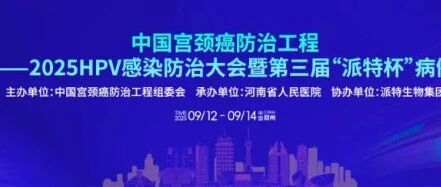
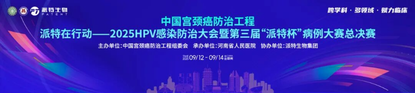
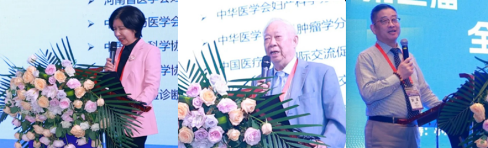
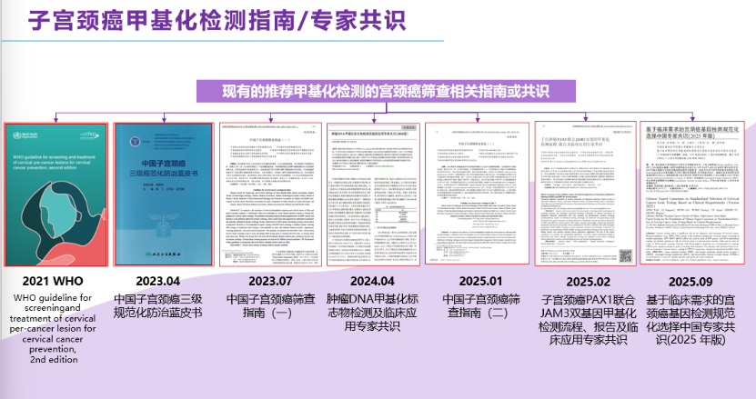
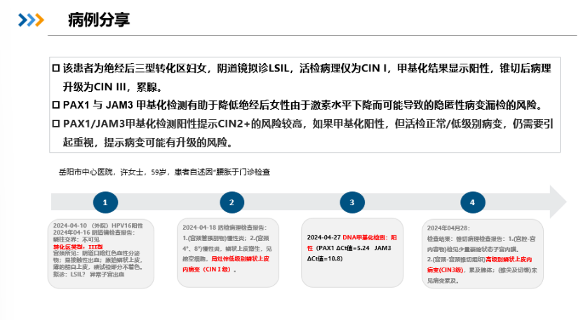
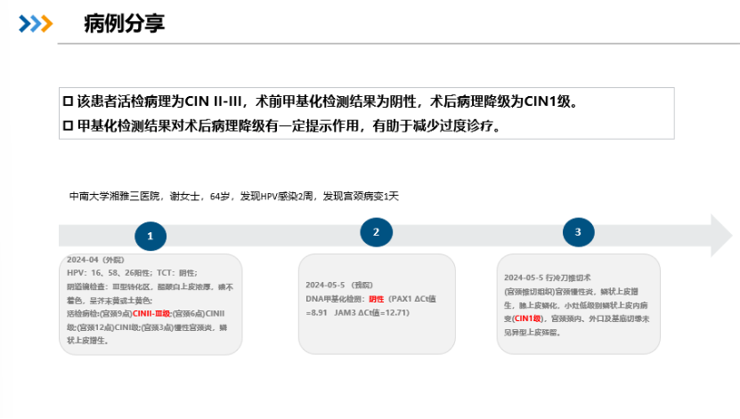

# 参会学习手记：中国宫颈癌防治工程—2025HPV感染防治大会－宫颈癌甲基化无创检测为女性健康筑牢「分子防线」

_2025年09月25日 13:36_

2025 年 9 月 13 日，由中国宫颈癌防治工程组委会主办，河南省人民医院承办，派特生物集团协办的**中国宫颈癌防治工程 —2025HPV 感染防治大会**在郑州顺利召开。来自全国各地的专家、学者参加了此次盛会。本次大会以“HPV 感染及相关疾病的有效防治”为主题，突出“跨学科 · 多领域 · 赋力临床”的特点，分为研究进展、. 指南 /共识、皮内病变专场、男女同治四大方向专题讲座和病例比赛, 共同探讨 HPV 感染防治的最新进展。

**中国宫颈癌防治工程组委会曹泽毅教授**致辞，这些年我们在宫颈癌防治领域取得了很多很大的成就，**对于 2030 年，实现《加速消除宫颈癌全球战略》提出的“90 — 70 — 90”阶段性目标的承诺**，务依然艰巨，坚信在大家的共同努力下，一定能够 2050 年实现全国消除宫颈癌使命。

**王悦教授**
指出，宫颈癌防治凝聚了几代妇产科人心血，从疫苗普及到检测和医疗与检测技术革新、专家共识和指南精细化，为女性筑起对抗宫颈癌与身体健康重要屏障。

在宫颈癌防治领域，大会将特别强调生育力保护的重要性。宫颈癌作为 HPV 相关疾病的高风险病症，传统治疗可能影响女性生殖健康。会议中，专家将分享如何在手术、放疗等干预中整合生育力保护策略，例如通过微创技术和个体化方案，减少对卵巢和子宫的损伤，确保患者治疗后的生活质量。同时，精准医学理念将贯穿全程，包括基于基因分型和分子标志物的个性化筛查与治疗，以提升防治效率。

值得关注的是，甲基化检测在宫颈癌早期诊断中的关键作用将成为焦点。作为精准医学的重要组成部分,DNA 甲基化标志物（如 PAX1、JAM3 等）能有效识别 HPV 感染的癌前病变，提高筛查准确率，减少假阳性, 并已出台多个指南与共识，帮助医务工作者实现早诊早治，降低宫颈癌发病风险。

病例分享也说明了 PAX1/JAM3 双基因甲基化检测可以对于绝经后三型转化区女性发现其 CIN3 高风险, 并作为后续随访的重要生物标志物 ｡

PAX1/JAM3 双基因甲基化检测技术，通过捕捉宫颈细胞 DNA 甲基化异常信号，可实现宫颈癌前病变（CIN2+）及宫颈癌的早期精准筛查。临床数据显示，该检测对 CIN2+ 的高灵敏度和特异性, 且能同时覆盖鳞癌与腺癌检出，显著优于传统细胞学检查。在治疗随访中，其对锥切术后复发风险的预测准确性（AUC>0.92）更成为临床管理利器,助力实现「早筛 \- 精治 \-动态监测」死循环防控体系。此项技术已纳入多项《宫颈癌专家共识》，为女性健康筑牢「分子防线」。

**关于聚禾生物**

北京起源聚禾生物科技有限公司是以创新科技为驱动、以关注健康为宗旨的科技企业。聚禾生物是妇科肿瘤早诊领域的开拓者，以独家技术和专利保护的标志物为核心，开发了宫颈癌、子宫内膜癌、卵巢癌等妇科肿瘤早诊产品，填补了该领域的空白。

随着女性对自身健康的关注越来越密切，女性健康市场将大有可为，除妇科肿瘤早筛早诊产品线外，未来聚禾生物还将建立更多女性健康相关的产品管线，打造女性健康市场的技术创新型领先企业。
