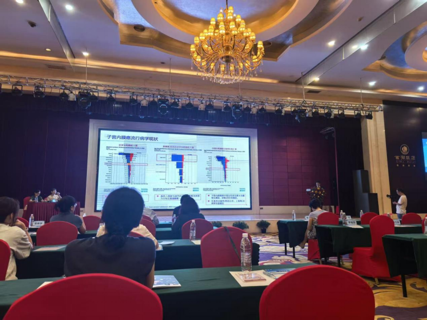
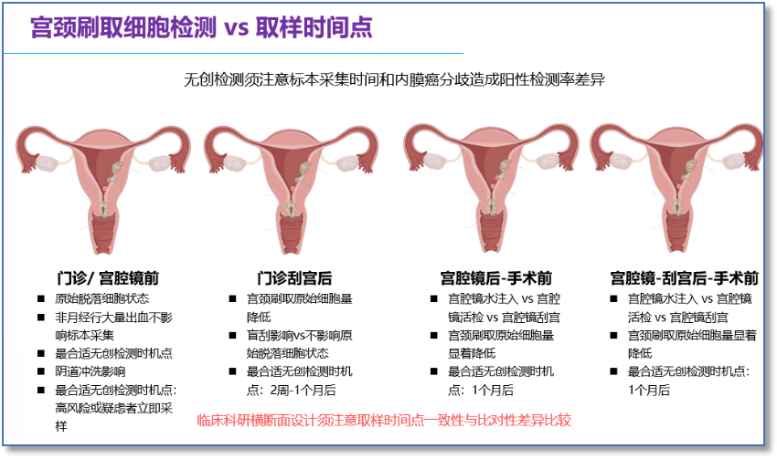

The "2025 Academic Annual Conference" hosted by the Obstetrics and Gynecology Committee of the Hengyang Medical Association was held on September 12-13 at the Hengyang Xihu Hotel. With "Focusing on Frontier Technology, Jointly Promoting Discipline Development" as its core, this conference gathered authoritative experts in obstetrics and gynecology from within and outside the province. Through academic presentations, special discussions, and technology exchanges, it provided comprehensive coverage, targeting industry frontiers and clinical pain points, building a high-level exchange platform for regional obstetrics and gynecology medical colleagues, and helping to improve the diagnostic and treatment levels and service capabilities of obstetrics and gynecology in Hengyang and surrounding areas.

Researcher Liu Yuli from Tsinghua Changgung Hospital shared a new model of precision medicine early screening and management for endometrial cancer, presenting the clinical trials and nationwide multicenter data of tens of thousands of cases using non-invasive endometrial cancer methylation detection technology, sharing the importance of precision screening for endometrial cancer.

This technology detects gene methylation levels through cervical brush collection of exfoliated cells, achieving high sensitivity and high specificity, and can precisely identify early lesions. Compared to traditional ultrasound, it improves precision, requires no hysteroscopy or tissue biopsy, avoids invasive procedure risks, and reduces the risk of endometrial damage from invasive curettage and hysteroscopy due to thickened endometrial benign diseases. It is particularly suitable for reproductive-age and postmenopausal women.

Multicenter studies show that CDO1/CELF4 combined with ultrasound detection can further improve accuracy, with significant predictive value for asymptomatic high-risk populations, buying golden time for early diagnosis and treatment.

In endometrial cancer-related diagnosis and treatment, the following key challenges are currently faced:

1\.**Physiological structural limitations in postmenopausal women**: The narrow cervical canal characteristic of postmenopausal women may interfere with examination procedures or diagnostic accuracy.

2\.**Limitations of transvaginal ultrasound technology**: Transvaginal ultrasound examination has false-positive issues, easily leading to diagnostic result deviations.

3\.**Invasive procedure risks**: Traditional invasive procedures such as diagnostic curettage and hysteroscopy carry risks of endometrial damage and may also lead to missed diagnoses due to procedural limitations.

To address the above clinical pain points, detection of CDO1/CELF4 methylation levels in cervical exfoliated cells demonstrates unique value in endometrial cancer diagnosis, specifically reflected in:

1\.**Sampling feasibility (pathological mechanism support)**: Intercellular adhesion in endometrial cancer cells is significantly weaker than in normal cells, making them more likely to shed and accumulate in the cervical canal, providing pathological feasibility evidence for "cervical sampling."

2\.**Sample enrichment potential**: Abnormal cells exhibit "multiple accumulation" characteristics at the cervical canal. By optimizing brushing procedures (such as increasing brushing frequency and range), the proportion of abnormal cells in samples can be further improved, indirectly enhancing detection sensitivity.

3\.**Technical adaptability**: PCR technology has the advantage of **high sensitivity**, suitable for trace, highly heterogeneous sample types such as cervical exfoliated cells, meeting precision detection needs.

4\.**Clinical application feasibility**: Practice has verified that conducting endometrial cancer **methylation detection** using cervical exfoliated cells is feasible both technically and in terms of clinical value, providing an innovative direction for early screening and diagnosis of the disease.

The above two dimensions of "clinical pain points" and "precision solution efficacy" provide the core value logic of cervical exfoliated cell detection in endometrial cancer diagnosis and treatment.

Cervical brush-collected cells at the "outpatient/hysteroscopy pre-procedure" time point represent **the "optimal baseline timing" for non-invasive testing**. At this stage, no invasive procedures have been performed, and cervical brush-collected cells maintain the natural physiological state of endometrial exfoliated cells, unaffected by mechanical/inflammatory interference from curettage, hysteroscopy, or other invasive procedures, truly reflecting endometrial cell characteristics. Additionally, specimens can still be collected during non-menstrual heavy bleeding periods, unconstrained by the common clinical confounder of "bleeding," broadening the scenario compatibility of testing (such as immediate screening for patients with abnormal bleeding).

For "high-risk populations (such as family history or obesity)" or "clinically highly suspicious cases," clinical data support immediate sampling and testing, shortening diagnostic waiting time and facilitating early risk stratification or intervention decisions.

Non-invasive uterine brush collection of exfoliated cells for endometrial cancer detection has the advantage that sample collection is not affected by different types of endometrial cancer or disease stage, nor by hormonal changes, offering detection stability. It is currently the optimal biomarker for endometrial cancer detection.

**About CISPOLY**

Beijing Origin CISPOLY Biotechnology Co., Ltd. is a technology enterprise driven by innovative science and focused on health. CISPOLY is a pioneer in the field of early diagnosis of gynecologic tumors. With proprietary technology and patent-protected biomarkers at its core, the company has developed early diagnostic products for cervical cancer, endometrial cancer, ovarian cancer, and other gynecologic tumors, filling a void in this field.

As women pay increasing attention to their own health, the women's health market holds great promise. Beyond its gynecologic tumor early screening and diagnosis product line, CISPOLY will continue to build additional women's health-related product pipelines, striving to become a technology-innovation-driven leader in the women's health market.