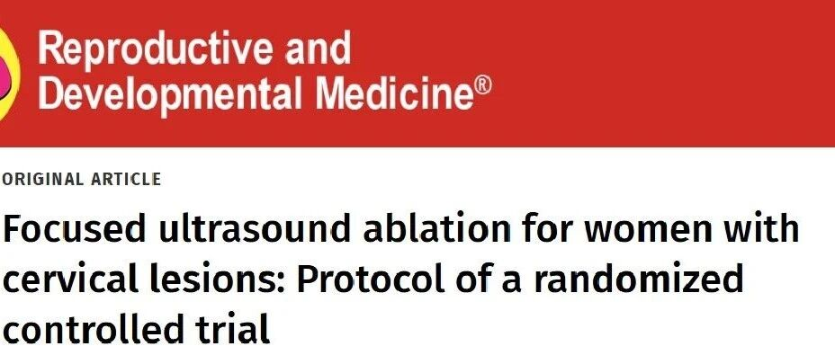

Recently, a prospective randomized controlled study protocol aimed at evaluating the impact of minimally invasive focused ultrasound ablation (FUS) for treating high-grade cervical lesions (CIN2/3) on fertility in reproductive-age women was officially published in the international journal *Reproductive and Developmental Medicine*. Developed jointly by the Third Affiliated Hospital of Zhengzhou University, Chongqing Medical University, and other institutions, the study innovatively uses PAX1/JAM3 gene methylation detection as a core biomarker for evaluating the efficacy of focused ultrasound ablation in treating high-grade cervical lesions in reproductive-age women and predicting patients' future reproductive outcomes, providing a more precise, less traumatic new clinical management strategy for women with fertility needs.

**1. Core Study Design: Focus on Fertility Preservation**

This study is a randomized controlled trial planned with a 2-year follow-up period.

·**Study subjects**: Recruiting female patients aged 18 to 49 with fertility plans diagnosed with CIN2 or CIN3 (transformation zone TZ1/TZ2).

·**Intervention comparison**: Direct comparison of **focused ultrasound ablation (FUS)** versus traditional **loop electrosurgical excision procedure (LEEP) or cold knife conization (CKC)**, with focus on evaluating differences in lesion clearance efficacy, surgery-related complications, and impact on subsequent fertility (such as pregnancy rates, obstetric outcomes).

·**Follow-up schedule**: Visit points at baseline and at 3, 6, 12, 18, and 24 months post-surgery, comprehensively collecting PAX1/JAM3 methylation levels, HPV status, cytology (TCT) results, vaginal microbiome, and colposcopy/pathology data.

**2. Clinical Role and Value of PAX1/JAM3 Methylation Detection**

This study protocol designates PAX1 and JAM3 gene DNA methylation detection as key molecular indicators, aiming to deeply explore their potential value in clinical decision-making.

-**Predicting lesion outcomes**: By analyzing changes in methylation levels before and after treatment, evaluating their ability to predict lesion progression or regression.

-**Assisting clinical decision-making**: Existing evidence suggests that for some CIN2/3 reproductive-age patients, if PAX1/JAM3 methylation levels are negative, it may indicate lower progression risk and possible natural regression. This provides important molecular biology evidence for clinicians to adopt conservative management strategies such as "watchful waiting" or "delayed treatment," potentially avoiding some unnecessary traumatic surgeries, reducing fertility risks, and better preserving reproductive function.

-**Optimizing diagnostic pathways**: Domestic studies have shown that application of PAX1/JAM3 methylation detection helps reduce unnecessary colposcopy referrals, alleviating patients' medical burden and psychological anxiety. In this study, if patients' methylation testing remains persistently negative and other examination indicators are favorable, it may indicate higher safety for post-operative pregnancy attempts.

**3. References:**

Yang Li, Wang Zhao-Xin, Zhu Yuan-Hang, et al. Focused ultrasound ablation for women with cervical lesions: Protocol of a randomized controlled trial. Reproductive and Developmental Medicine, DOI: 10.1097/RD9.0000000000000132, April 22, 2025.

**About CISPOLY**

Beijing Origin CISPOLY Biotechnology Co., Ltd. is a technology enterprise driven by innovative science and focused on health. CISPOLY is a pioneer in the field of early diagnosis of gynecologic tumors. With proprietary technology and patent-protected biomarkers at its core, the company has developed early diagnostic products for cervical cancer, endometrial cancer, ovarian cancer, and other gynecologic tumors, filling a void in this field.

As women pay increasing attention to their own health, the women's health market holds great promise. Beyond its gynecologic tumor early screening and diagnosis product line, CISPOLY will continue to build additional women's health-related product pipelines, striving to become a technology-innovation-driven leader in the women's health market.