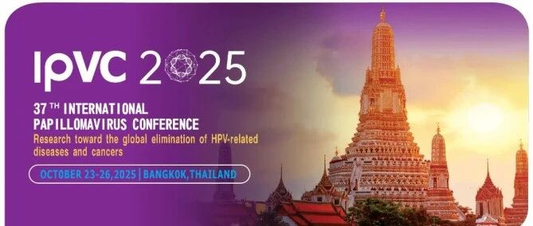
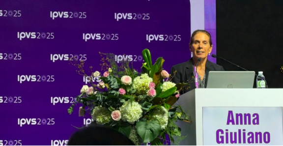
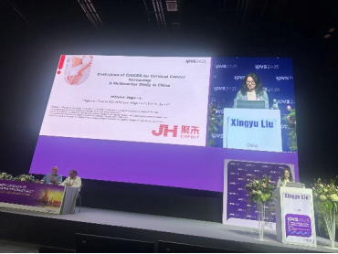
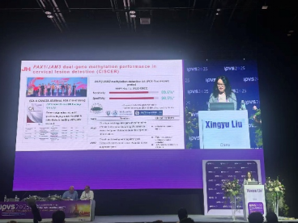
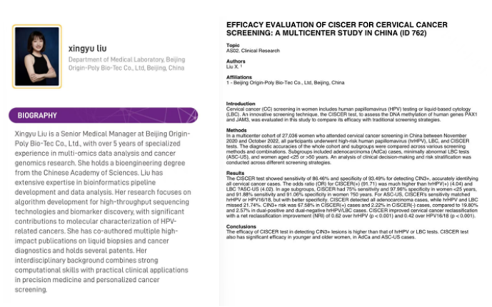
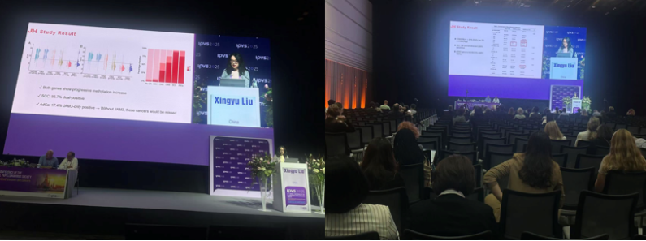
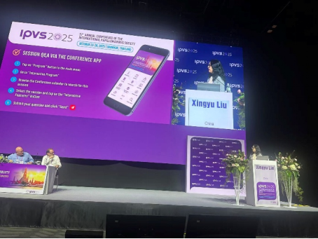
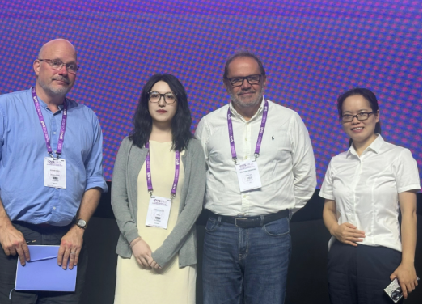

From October 23 to 26, 2025, the 37th International Papillomavirus Society Conference (IPVS 2025) was grandly held in Bangkok, Thailand. With the theme "Research toward Global Elimination of HPV-Related Diseases and Cancers," this conference gathered over one thousand top experts, scholars, and physicians from 104 countries and regions worldwide.

**On this globally prominent international stage, innovative technology from China shone brilliantly!**

Congress Co-Chair Anna R. Giuliano delivers opening remarks

Congress leadership and VIPs

**Chinese Innovation Takes the International Main Stage**

Researcher Liu Xingyu from Beijing CISPOLY delivered an oral presentation in the main conference hall, showcasing to global experts the latest clinical research results of China's independently developed 'PAX1/JAM3' dual-gene methylation detection technology in cervical cancer screening.

This is CISPOLY's first research presentation at the International Papillomavirus Society Conference (IPVS), marking **high recognition of China's innovative cervical cancer screening technology by the international academic community**.

**CISPOLY Clinical Research First Presented at IPVS Congress**

**Speaker and Presentation Overview**

**Breakthrough Results from Innovative Technology**

**What is Methylation Detection?**

The 'PAX1/JAM3' dual-gene methylation detection technology is an innovative method for **identifying cervical precancerous lesions at the DNA level**. Compared to traditional screening methods, this technology detects epigenetic changes to more accurately identify high-risk populations requiring treatment.

**Outstanding Clinical Data**

The multicenter study presented covered **over 27,000** subjects, with exciting results:

- **Detection accuracy of 86.5%**: Precisely identifies high-grade precancerous lesions

- **Specificity of 93.5%**: Effectively excludes low-risk populations not requiring treatment

- **Dramatic reduction in unnecessary examinations**: Reduced unnecessary colposcopy from 74% to 17%

- **100% cancer detection rate**: Detected all 139 cervical cancer cases, including 23 adenocarcinomas easily missed by traditional methods

>**Plain language explanation**: This means the technology can not only accurately identify patients with real problems but also prevent healthy individuals from undergoing unnecessary further examinations, improving detection rates while reducing physical and psychological burden on those tested.

**PAX1/JAM3 Cervical Cancer Methylation Clinical Data Presentation**

**From Following to Leading: Chinese Standards Go Global**

CISPOLY's 'PAX1/JAM3' dual-gene methylation detection technology has not only been approved for market launch by China's NMPA but has also been cited and introduced by the top international journal *CA: A Cancer Journal for Clinicians*, **providing important Chinese evidence for the formulation of global cervical cancer screening guidelines**.

Domestically, the technology has been incorporated into multiple authoritative guidelines and expert consensus:

- *Chinese Blue Book on Three-Level Standardized Prevention and Treatment of Cervical Cancer*

- *2024 Expert Consensus on Tumor DNA Methylation Biomarker Detection*

- *2025 Chinese Cervical Cancer Screening Guidelines (Part II)*

- *2025 Expert Consensus on the Workflow, Reporting, and Clinical Application of Combined PAX1 and JAM3 Dual-Gene Methylation Detection for Cervical Cancer*

The extensive publication of these guideline documents marks that **China's clinical practice in the field of cervical cancer methylation detection has become standardized and is beginning to lead global development directions**.

**Moderators and speakers in lively discussion about the future of cervical cancer methylation applications**

**Looking Forward: Chinese Solutions Benefit Global Women's Health**

With the widespread application of the 'PAX1/JAM3' dual-gene methylation detection technology in China and the continuous accumulation of clinical data, **China's innovative practice is contributing wisdom and solutions to global cervical cancer prevention and treatment**.

This brilliant appearance at the international academic conference not only showcases the new face of Chinese research power but also highlights the increasingly important role of Chinese enterprises in global health initiatives. CISPOLY will continue to deepen innovation, enabling more Chinese-manufactured medical technologies to benefit global women's health!

**Conference Chair and CISPOLY Cervical Methylation Research Team Photo**

**Left: Christopher John Gill, Liu Xingyu (CISPOLY), Rolando Herrero, Yu Furong (First Affiliated Hospital of University of South China)**

---

**About the IPVC Congress**: The International Papillomavirus Society Conference is one of the most authoritative and influential academic events in the field of HPV and related diseases research worldwide.

**About CISPOLY**

Beijing Origin CISPOLY Biotechnology Co., Ltd. is a technology enterprise driven by innovative science and focused on health. CISPOLY is a pioneer in the field of early diagnosis of gynecologic tumors. With proprietary technology and patent-protected biomarkers at its core, the company has developed early diagnostic products for cervical cancer, endometrial cancer, ovarian cancer, and other gynecologic tumors, filling a void in this field.

As women pay increasing attention to their own health, the women's health market holds great promise. Beyond its gynecologic tumor early screening and diagnosis product line, CISPOLY will continue to build additional women's health-related product pipelines, striving to become a technology-innovation-driven leader in the women's health market.
