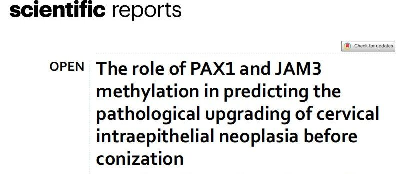
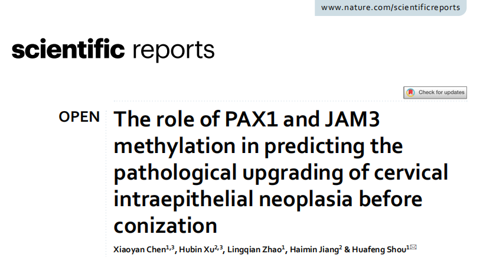
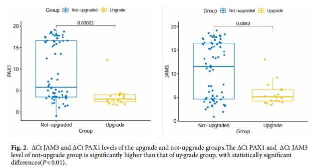
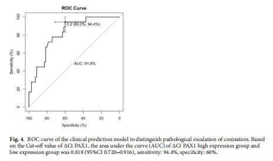
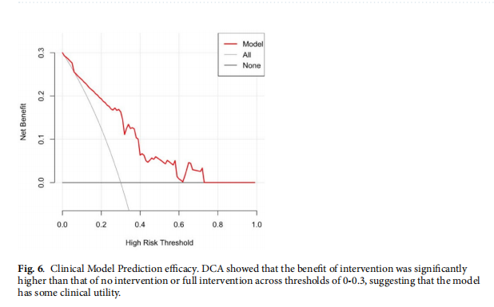

# 无创PAX1和JAM3甲基化检测可预测宫颈手术病理“升级”——为个体化手术决策提供有力分层管理工具

_2025年10月30日 16:50_

一项由浙江省人民医院与杭州师范大学合作完成的回顾性研究发现：宫颈脱落细胞中 PAX1 和 JAM3 基因高甲基化在锥切术后病理升级组显著高于未升级组｡

建立无创子宫颈癌检测预测模型：宫颈脱落细胞检测 PAX1/JAM3 甲基化在区分“病理升级”方面显示出良好辨识能力（AUC=0.818），提示甲基化检测可作为锥切术前分诊与治疗决策｡ 尤其对希望保留生育功能的年轻患者和宫颈萎缩的老年患者具精准检测与分层管理的重大意义。

**一、研究背景**

子宫颈上皮内瘤变（CIN）在临床上存在“回归—持续—进展”三种结局。锥切术用于确诊与治疗，但术前经宫颈活检（colposcopy-directed biopsy, CDB）与锥切术后病理结果常有不一致（包括“病理升级”），这会导致延误治疗或过度治疗。

DNA 甲基化是肿瘤发生进展的关键分子事件，PAX1 与 JAM3 为候选甲基化标志基因，已有研究提示其在 HSIL 与宫颈癌分层中具有潜在价值。

**二、研究目的**

探讨PAX1和JAM3基因甲基化对子宫颈锥切术后病理升级的影响。

**三、研究方法**

- 单中心回顾性队列研究，纳入接受阴道镜检查的患者 549 例进行分析，寻找影响宫颈锥切术病理升级的独立危险因素，建立预测模型。

- 统计分析方法：单因素筛选、多因素 logistic 回归、ROC 曲线与 AUC、Bootstrap 校准与决策曲线分析（DCA）用于评估模型绩效与临床净获益。

**四、研究结果**

PAX1 或 JAM3 甲基化结果“阳性”提示〝锥切较活检组织病理〞升级组显著高于未升级组，具统计学意义 (P<0.05)。

∆Ct PAX1 与宫颈管搔刮（endocervical canal, ECC）病变为独立相关因子。

宫颈锥切术后病理升级预测模型：AUC = 0.818 (95% CI 0.720–0.916）且特异度高达 94.4%，因此甲基化检测有望成为预测宫颈上皮内瘤变 (CIN) 锥切前病理升级的有希望的分诊标志物。

当使用 Youden 指数确定的 ∆Ct PAX1 截断值 4.34 时，则高度提示病理升级，模型在最大 Youden 条件下显示特异度 94.4%。

Bootstrap 校准误差平均 0.031, DCA 在 0–0.3 阈值范围显示净获益优于“全治或不治”策略。

**五、文章小结**

人 PAX1 和 JAM3 基因甲基化检测试剂盒 PAX1/JAM3 甲基化 (国家药监局批准 III 类医疗器械)可以作为术前无创分诊管理的有前景标志物。当无创检测超高甲基化时 (0<∆Ct<4.3)，提示锥切后发生病理升级的风险明显升高，尤其宫颈三型转化区的女性应更加提高临床警惕；反之，中度或低度甲基化 (∆Ct ≥ 4.3) 的患者短期内病理进展风险相对较低，若患者有生育意愿，可考虑更保守的管理、延缓手术或是微创治疗。该指标与宫颈管病变信息联合使用能进一步提高“实际病变”预测价值。

**六、临床应用价值与意义**

**对生育期女性的影响**

对拟保留生育能力的年轻女性，精确判定是否确需锥切具有重要意义 —— 使用无创甲基化检测有望避免不必要的锥切，从而降低未来妊娠并发症风险。

**对阴道镜检查不满意 ( 宫颈三型转化区 )**

对曾经宫颈治疗、绝经后或是三型转化区女性 — 使用无创甲基化检测可提高隐匿高级别病变检测率，从而降低漏诊风险。

**术前风险分层管理**

在阴道镜活检结果为 CIN 时，加入甲基化检测可帮助识别“隐藏的”更高级病变（underdiagnosed），从而减少漏诊造成的延误治疗，也能降低对低风险患者的过度侵入性治疗。

**在资源受限地区的潜在优势**

当常规 colposcopy/ 病理评估资源有限或质量参差不齐时，分子甲基化检测可作为客观、可重复的术前辅助手段。

**文献来源**

Chen X, Xu H, Zhao L, Jiang H, Shou H. The role of PAX1 and JAM3 methylation in predicting the pathological upgrading of cervical intraepithelial neoplasia before conization. Sci Rep. 2025;15(1):17684. doi:10.1038/s41598-025-01422-3

**关于聚禾生物**

北京起源聚禾生物科技有限公司是以创新科技为驱动、以关注健康为宗旨的科技企业。聚禾生物是妇科肿瘤早诊领域的开拓者，以独家技术和专利保护的标志物为核心，开发了宫颈癌、子宫内膜癌、卵巢癌等妇科肿瘤早诊产品，填补了该领域的空白。

随着女性对自身健康的关注越来越密切，女性健康市场将大有可为，除妇科肿瘤早筛早诊产品线外，未来聚禾生物还将建立更多女性健康相关的产品管线，打造女性健康市场的技术创新型领先企业。
