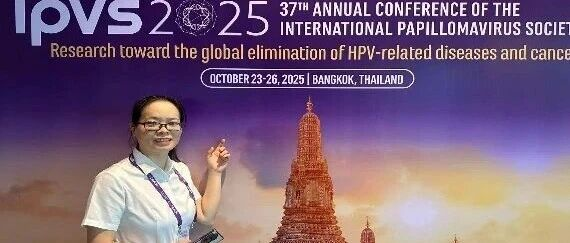
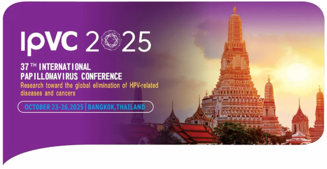
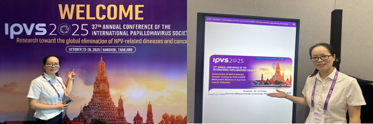
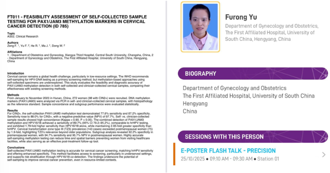
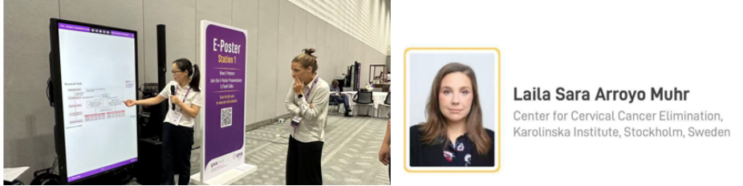

# 中国自采样宫颈癌甲基化研究获国际权威认可瑞典专家期待深入合作—在2025IPVC世界宫颈癌舞台向全球展示宫颈自采样甲基化成果

_2025年11月04日 16:12_

2025年10月23日至26日，第37届国际乳头瘤病毒学术大会（IPVC
2025）在泰国曼谷隆重举行。南华大学附属第一医院余芙蓉医生作为中国代表之一，在大会E-poster Flash Talk会场发表了南华大学附属第一医院和湘雅三医院曾飞团队合作的《FTO11-FEASIBILITY ASSESSMENT OF SELF-COLLECTED SAMPLETESTING FOR PAX1/JAM3 METHYLATION MARKERS IN CERVICALCANCER DETECTION (ID 785)﹔自取样检测 PAX1/JAM3 甲基化标志物用于宫颈癌筛查的可行性评估》演讲。

这项研究成果首次系统证实了自采样 PAX1/JAM3 甲基化检测与医生采样结果具有高度一致性，为提升宫颈癌筛查可及性提供了创新解决方案。余芙蓉医生的报告吸引了多国专家的关注，成为大会亮点之一。

**一、** 国际舞台上的中国声音

该研究纳入 272 例接受阴道镜检查的女性，通过严谨的实验设计验证了自采样技术的可靠性。

**研究数据**

- 自采样本和医生采样样本进行 PAX1 和 JAM3 双基因甲基化检测结果呈显著正相关，相关系数分别达到0.858 和
0.828。这一发现为自采样技术在宫颈癌筛查中的推广应用提供了坚实证据。

- 自采样 PAX1/JAM3 甲基化检测对 CIN2+ 病变的检测灵敏度达到 77.6%,特异度为 87.2%
，表现出了优异的临床检测效能。

- 特别值得关注的是,PAX1/JAM3 甲基化联合 HPV16/18 检测在 CIN3+ 病变中的敏感度高达 96.0%
，显著优于传统检测方法。这一发现对于提高高级别病变的检出率具有重要意义。

- 该检测技术在绝经前后女性中均表现良好。绝经后女性中检测敏感度与阴性预测值分别达到 94.7% 和 95.7%
，为解决绝经女性宫颈癌筛查难题提供了新思路。

**解决宫颈癌筛查痛点**

- 余芙蓉医生在演讲中指出，自采样技术能够有效克服传统筛查中的诸多障碍。特别是对于医疗资源不足地区、行动不便或因个人原因不愿就诊的女性群体，自采样提供了更加便捷的筛查选择。

- 研究数据显示,PAX1/JAM3 甲基化检测的特异度显著高于 hrHPV
检测，这意味着可以大幅减少假阳性结果，避免不必要的阴道镜转诊和心理负担。

这一技术还有助于解决宫颈三型转化区（TZ3）女性的筛查难题。研究中 TZ3 女性数量是绝经后女性的 1.9 倍，表明这一问题在育龄女性中同样存在，而甲基化检测为此提供了有效的解决方案。

**二、** 国际专家的高度评价

IPVC 大会期间，余芙蓉医生的研究报告引起了国际同行的广泛讨论。

瑞典 Karolinska 学院宫颈癌消除中心兼国际 HPV 参考中心负责人 Muhr 博士在听完余芙蓉医生的壁报演讲后表示：“这项研究在自采样技术和甲基化检测结合方面取得了重要突破，尤其在绝经后女性的高敏感性和育龄女性的高特异性结果对全球宫消除宫颈癌目标贡献中国智慧和中国方案。

这项技术的推广将特别惠及偏远地区和经济欠发达地区的女性群体，有力推动宫颈癌筛查的普及化进程，为实现健康公平提供有力技术支持。

**三、** 背景介绍

**卡罗林斯卡学院（Karolinska Institute）坐落于瑞典首都斯德哥尔摩，是瑞典著名的医学院，是世界上最大最好的单一医学院之一，也是世界医学排名前十的医学院，承担了全国 43% 的医药类学术研究，并拥有一个附属的卡罗林斯卡大学医院（Karolinska University Hospital）。同时，学院有一个诺贝尔委员会而闻名于世，每年负责评审和颁发诺贝尔生理学或医学奖。**

Laila Sara Arroyo Muhr 博士作为瑞典卡罗林斯卡医学院宫颈癌消除中心的专家,Muhr 博士是国际公认的 HPV 和宫颈癌防治领域权威。她目前担任国际人类乳头瘤病毒参考中心的科学负责人，负责协调全球 HPV 实验室网络（Global HPV LabNet）。

**关于聚禾生物**

北京起源聚禾生物科技有限公司是以创新科技为驱动、以关注健康为宗旨的科技企业。聚禾生物是妇科肿瘤早诊领域的开拓者，以独家技术和专利保护的标志物为核心，开发了宫颈癌、子宫内膜癌、卵巢癌等妇科肿瘤早诊产品，填补了该领域的空白。

随着女性对自身健康的关注越来越密切，女性健康市场将大有可为，除妇科肿瘤早筛早诊产品线外，未来聚禾生物还将建立更多女性健康相关的产品管线，打造女性健康市场的技术创新型领先企业。
