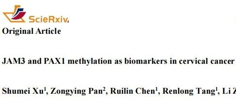
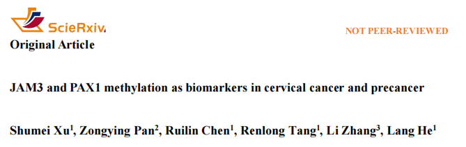
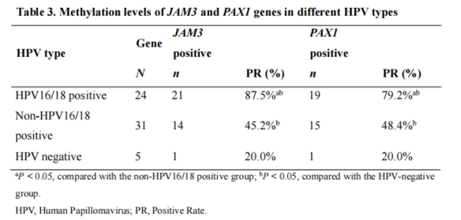
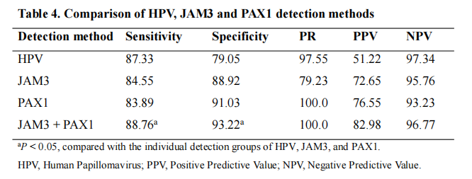

# 宫颈癌筛查迎来精准化突破：JAM3与PAX1基因甲基化检测破解目前临床诊断限制

_2025年11月08日 15:54_

成都第五人民医院领衔的一项创新研究，为宫颈癌筛查领域带来重大进展。研究发现，通过检测 JAM3 与 PAX1 基因的甲基化水平，可有效解决传统活检方法存在的临床诊断偏差问题。这项发表于《Scierxiv》杂志的成果，标志着宫颈癌早诊早治进入新阶段。

**一、** 临床诊断困境：活检技术的局限性

当前宫颈癌诊断体系存在明显短板。研究数据显示，约 20-30% 的患者面临 " 临床与病理不符 " 的困境 —— 患者临床表现提示高级别病变，但活检结果却显示为低级别病变或正常病理。

**问题根源分析**：

- **解剖结构限制**：约 35% 的病变位于宫颈管深处，传统活检器械难以触及 ｡

- **取样偏差**：即使可见病灶，取样位置偏差也会影响病理判断准确性 ｡

- **诊断盲区**：表面组织正常不能排除深层与隐匿癌前病变存在的可能性 ｡

**二、** 技术创新：双基因检测显优势

该检测技术目前**已获得 NMPA 通过医疗器械三类证**，该研究通过前瞻性分析发现：

- **病变严重度预测**：JAM3 和 PAX1 基因的甲基化水平随病变严重程度同步升高 ｡

- **HPV 关联性**：在 HPV16/18 感染者中，基因甲基化阳性率高达 87.5% ｡

- **诊断准确性**：双基因联合检测灵敏度达 88.76%,特异度 93.22% ｡

>"这意味着 JAM3/PAX1 双基因甲基化检测能以无创方式，更早、更准地识别高风险患者，相当于一种与手术病理结果相符的无创分子病理诊断方法。"

研究团队开创性地提出无创刷取宫颈脱落细胞进行 JAM3 与 PAX1 基因甲基化检测的新方案。这一方法突破传统活检的局限，从分子层面为诊断提供更可靠的依据，阳性结果可辅助阴道镜医师在宫颈隐匿多加注意可能病变。

**三、** 研究总结与核心价值

基于 JAM3 与 PAX1 基因甲基化检测的临床应用研究，提出以下筛查优化方案，实现不同人群的精准分层管理：

1.**HPV 阳性人群的精准分流**

在 HPV 阳性人群中整合甲基化检测，可建立高效的三级筛查分流体系。临床数据显示，该策略能够减少 30% 以上的不必要阴道镜活检，显著降低医疗资源消耗与患者经济负担。甲基化检测作为二次分流工具，有效识别真正的高风险人群，避免过度诊疗。

2.**特殊人群的个体化管理方案**

**(1). 绝经后女性群体** 的临床挑战：由于宫颈萎缩导致的 " 不满意阴道镜 " 比例高达 40-60%（无法清晰观察鳞柱交界区域）。针对这一难题，甲基化检测提供创新解决方案：

- 甲基化阳性患者：启动紧密随访机制，每 3-6 个月进行联合检测，必要时辅以宫颈管搔刮等进一步检查

- 甲基化阴性患者：可适当延长筛查间隔，降低医疗干预频率

**(2). 育龄女性管理** 体现精准医疗理念：

- CIN2 病变伴甲基化阴性：在充分医患沟通基础上，可选择随访观察或微创干预方案

- 该策略有效平衡疾病风险与生育功能保留的需求

**(3). 基层医疗推广的可行性**

甲基化检测的无创、样本采集简便、检测标准化、可及性强 ( 提升偏远地区宫颈癌筛查覆盖率 ) 特性为其在基层医院推广奠定基础

**四、** 专家观点

这项研究将 JAM3/PAX1 基因甲基化检测从 HPV 分层管理工具升级为高级别病变预测管理模式，是实现宫颈癌精准医疗的重要一步。

这一创新检测方法未来有望纳入宫颈癌筛查体系，为临床医生提供更精准的诊断工具，最终惠及广大女性健康。

**文献来源**：

Xu S, Pan Z, Chen R, et al. JAM3 and PAX1 ethylation as biomarkers in cervical cancer and precancer. Scierxiv 2025.

**关于聚禾生物**

北京起源聚禾生物科技有限公司是以创新科技为驱动、以关注健康为宗旨的科技企业。聚禾生物是妇科肿瘤早诊领域的开拓者，以独家技术和专利保护的标志物为核心，开发了宫颈癌、子宫内膜癌、卵巢癌等妇科肿瘤早诊产品，填补了该领域的空白。

随着女性对自身健康的关注越来越密切，女性健康市场将大有可为，除妇科肿瘤早筛早诊产品线外，未来聚禾生物还将建立更多女性健康相关的产品管线，打造女性健康市场的技术创新型领先企业。
