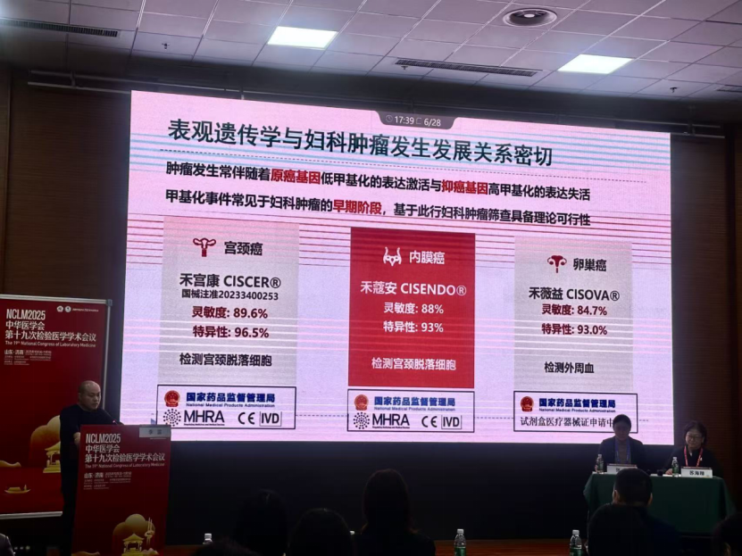
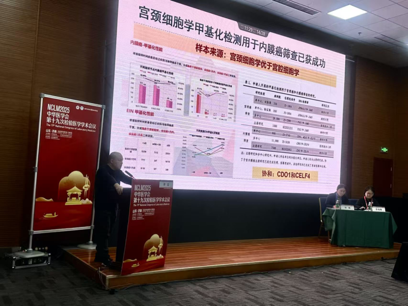

On October 31, 2025, the 19th Chinese Medical Association National Conference on Laboratory Medicine, organized by the Chinese Medical Association and its Laboratory Medicine Branch and undertaken by the Shandong Medical Association, was grandly held at the Shandong International Convention and Exhibition Center in Jinan, Shandong Province!

In recent years, epigenetics technology represented by DNA methylation has achieved a series of breakthroughs. As of November 2025, China's National Medical Products Administration has led the world by approving 41 DNA methylation kit Class III medical device certificates, driving tumor screening into a new era of "predictable and preventable." Therefore, the conference specially established two academic sessions on "Application of Methylation in Early Tumor Screening and Diagnosis," gathering top domestic experts to jointly discuss the innovation and translation of epigenetics technology in the field of tumor prevention and treatment.

The conference specially invited Professor Li Lei from the Department of Obstetrics and Gynecology at Peking Union Medical College Hospital to deliver a special presentation, systematically elaborating on the innovative applications of epigenetics in clinical practice for gynecologic tumors.

Notably, a review article published in the world's top oncology journal *CA: A Cancer Journal for Clinicians* (IF: 286.13), titled "Cancer Epigenetics in Clinical Practice," described the series of breakthroughs achieved by the Peking Union Medical College Hospital team in gynecologic tumor methylation detection. Their cervical cancer PAX1/JAM3 dual-gene methylation detection technology and endometrial cancer CDO1/CELF4 dual-gene methylation detection technology were validated through nationwide large-scale clinical studies covering tens of thousands of cases, and have passed NMPA Class III medical device approval, confirming that early diagnosis of gynecologic tumors can be achieved through non-invasive testing.

Ovarian cancer is considered the most lethal reproductive tract cancer in women. The Peking Union Medical College Hospital team has also made important progress in liquid biopsy technology based on circulating tumor DNA methylation, providing a new non-invasive pathway for early diagnosis of ovarian cancer. The team's CISOVA detection product achieves sensitivity of 84.7% and specificity of 93.0%, and is currently advancing NMPA medical device registration.

In addition to presenting the team's existing academic and clinical research achievements, Professor Li Lei emphasized in discussing future plans: "**Stay calm, be patient, and carefully polish the evidence chain. Take 3-5 years to achieve first-class clinical evidence.**"

As more research achievements are translated and applied, China has gradually shifted from traditional treatment models to a new stage of preventive medicine in the field of early diagnosis and treatment of gynecologic tumors. Peking Union Medical College Hospital's innovative technology is expected to provide a Chinese solution for global gynecologic tumor prevention and treatment, providing strong support for advancing the Healthy China initiative.

**About CISPOLY**

Beijing Origin CISPOLY Biotechnology Co., Ltd. is a technology enterprise driven by innovative science and focused on health. CISPOLY is a pioneer in the field of early diagnosis of gynecologic tumors. With proprietary technology and patent-protected biomarkers at its core, the company has developed early diagnostic products for cervical cancer, endometrial cancer, ovarian cancer, and other gynecologic tumors, filling a void in this field.

As women pay increasing attention to their own health, the women's health market holds great promise. Beyond its gynecologic tumor early screening and diagnosis product line, CISPOLY will continue to build additional women's health-related product pipelines, striving to become a technology-innovation-driven leader in the women's health market.