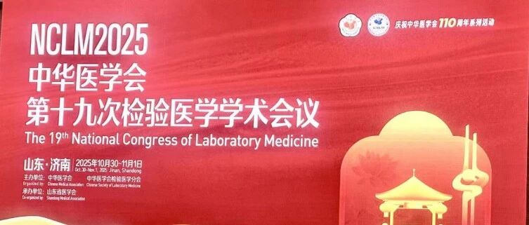
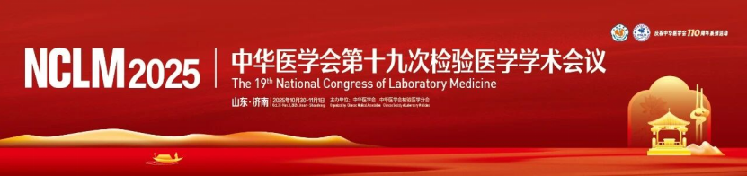
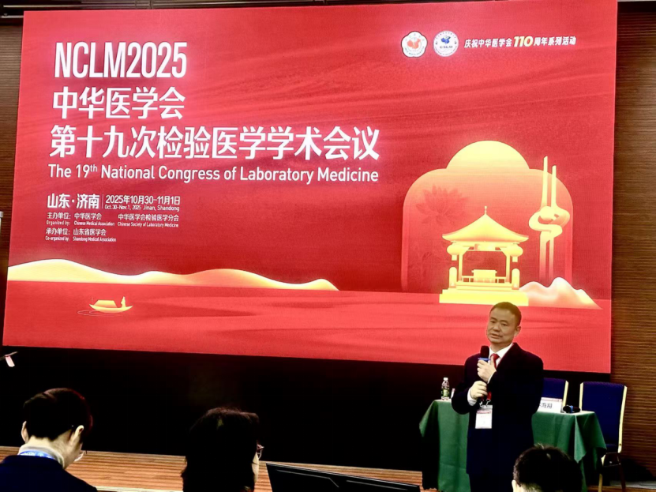
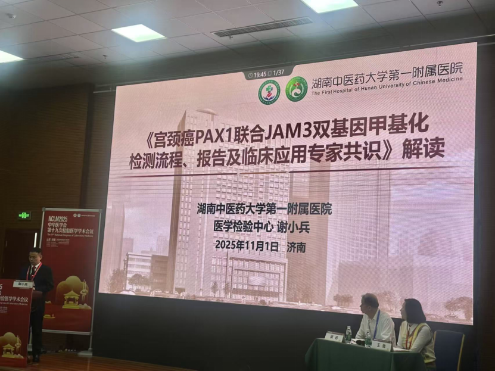
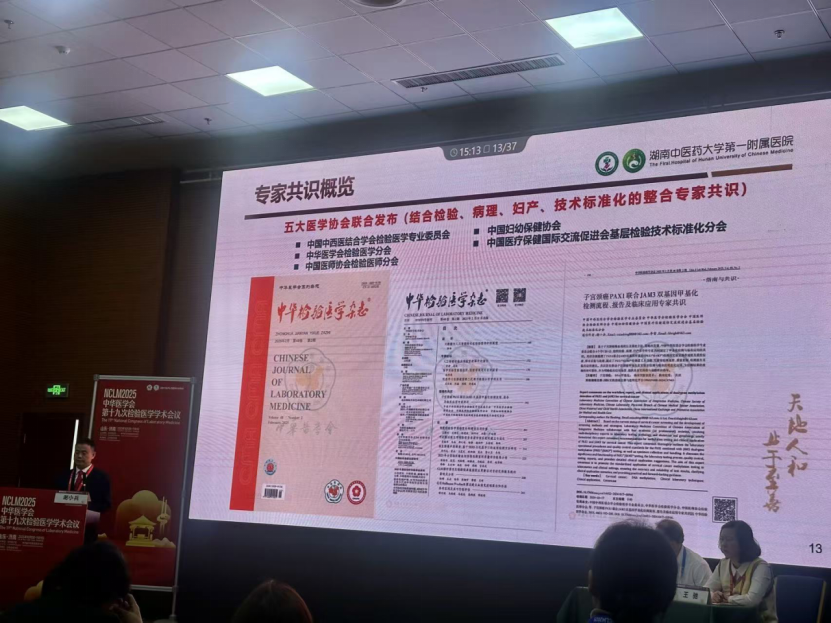
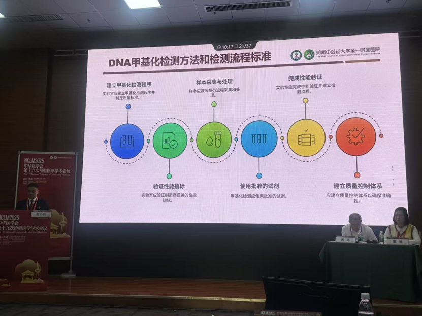
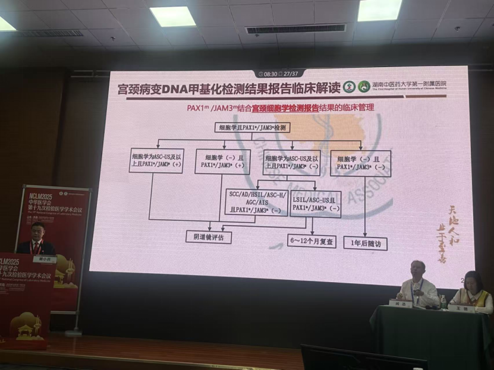
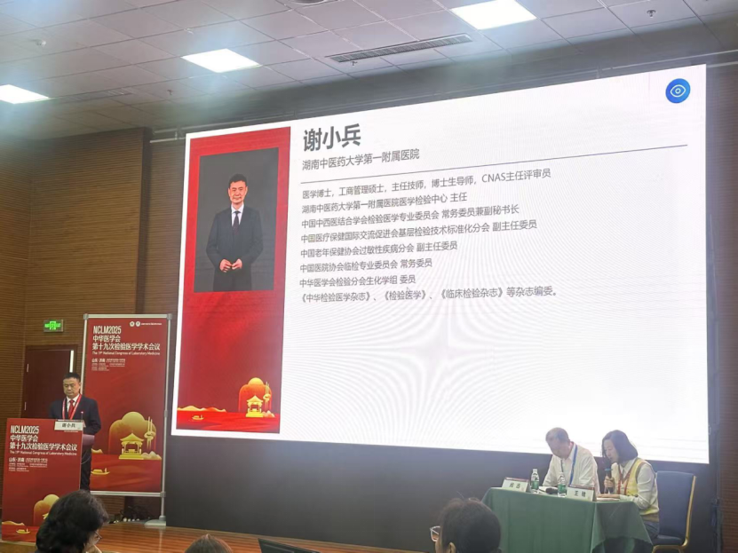

# 甲基化技术推动肿瘤早筛革新：谢小兵教授权威解读子宫颈癌双基因甲基化专家共识

_2025年11月15日 17:48_

中华医学会第十九次全国检验医学学术会议在山东济南召开，来自全国各地的国内顶尖专家共同聚焦甲基化技术从基础研究到临床应用的完整链条，围绕妇科肿瘤、乳腺癌、消化道肿瘤等常见高发癌种的甲基化应用展开系统阐述，深度探讨其如何赋能肿瘤防治的前移。

论坛特别邀请到湖南中医药大学第一附属医院医学检验中心主任谢小兵教授权威解读了《子宫颈癌 PAX1 联合 JAM3 双基因甲基化检测流程、报告及临床应用专家共识》。这一共识的制定突破了传统的临床指南制定往往由单一专科主导，首次实现了联合检验科、病理科与妇瘤科三大领域的五大国家级学术组织的深度协作共同制定，全面覆盖技术标准化、病理诊断和临床应用的多学科协作的新模式。

谢教授指出,PAX1 和 JAM3 基因的甲基化检测为子宫颈癌的早期诊断不仅能提示 HPV 持续感染状态，还能有效识别子宫颈高级别病变, 为宫颈癌检测提供了新的技术路径并可减少57.21% 的阴道镜转诊。

**一、标准化检测流程，确保结果准确性**

共识详细规范了从样本采集到报告解读的全流程标准，且须建立严格的质控体系，检测必须在获得主管部门批准的基因扩增实验室内进行，并使用已获批的检测试剂，从源头上保证检测质量。

**二、清晰临床路径，指导规范化应用**

**共识创新性地将 PAX1/JAM3 甲基化检测与现行宫颈癌筛查体系相融合，为临床医生提供了明确且易于执行的应用指导。基于医生已熟练掌握的 HPV 检测（不分型与分型）及细胞学报告体系，共识设计了标准化的管理路径，确保新的检测技术能够无缝对接现有临床流程。**

这一设计使医生可继续沿用熟悉的指南规范路径，同时结合 PAX1/JAM3 检测报告进行综合判断，既保持了诊疗规范的连续性，又提升了诊断的精准性。共识中明确的临床路径不仅降低了新技术的使用门槛，也通过标准化报告格式增强了结果的可操作性，为不同临床场景提供了具体、清晰的决策支持。

通过将甲基化检测纳入既有筛查体系，共识在提升宫颈病变检出准确性的同时，也确保了临床医生能够快速适应并规范应用这一新技术，为推进精准筛查的普及奠定了坚实基础。

**三、制定流程创新，确保共识科学性和代表性**

制定团队特别注重临床证据的等级评价，并引入了临床路径流程图，直观展示甲基化检测在宫颈癌筛查中的具体应用场景。这一科学严谨的制定流程，使共识成为临床工作者可信赖的实践指南，为PAX1/JAM3双基因甲基化检测的规范化应用提供了明确指导。

谢小兵教授表示，这一跨学科专家共识的制定模式为今后其他肿瘤标志物的临床应用指南制定提供了可借鉴的范例。随着甲基化检测技术的不断发展和临床应用经验的积累，共识内容也将持续更新和完善。

本次高水平学术交流不仅展示了甲基化技术在肿瘤早筛领域的丰硕成果，也为推动其临床应用的规范化与标准化提供了重要平台。随着甲基化检测技术的不断成熟和标准化体系的建立，与会专家一致认为肿瘤早期筛查的准确性将得到显著提升，最终惠及更多患者。

**关于聚禾生物**

北京起源聚禾生物科技有限公司是以创新科技为驱动、以关注健康为宗旨的科技企业。聚禾生物是妇科肿瘤早诊领域的开拓者，以独家技术和专利保护的标志物为核心，开发了宫颈癌、子宫内膜癌、卵巢癌等妇科肿瘤早诊产品，填补了该领域的空白。

随着女性对自身健康的关注越来越密切，女性健康市场将大有可为，除妇科肿瘤早筛早诊产品线外，未来聚禾生物还将建立更多女性健康相关的产品管线，打造女性健康市场的技术创新型领先企业。
