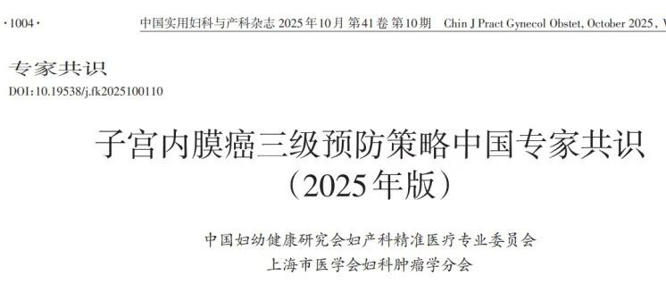
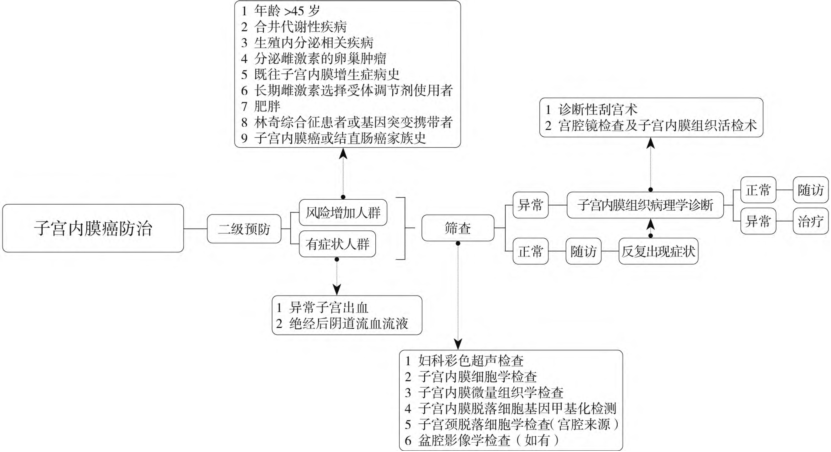

Recently, the world's first *Chinese Expert Consensus on Three-Level Prevention Strategies for Endometrial Cancer (2025 Edition)* was officially released. Developed jointly by the Precision Medicine Committee of Obstetrics and Gynecology of the China Maternal and Child Health Research Association and the Gynecologic Oncology Branch of the Shanghai Medical Association, this consensus systematically constructs a three-level prevention and control system for endometrial cancer applicable to the Chinese population for the first time. Among them, the "Human CDO1 and CELF4 Gene Methylation Detection Kit" developed by Beijing Origin CISPOLY Biotechnology Co., Ltd. has been included in the consensus, recommended as an "**early screening**" tool for endometrial cancer, marking an important step forward for China in non-invasive endometrial cancer screening.

The Human **CDO1** and **CELF4** Gene Methylation Detection Kit had previously received NMPA approval for market launch, for qualitative in vitro detection of the methylation levels of CDO1 and CELF4 genes in DNA from **human cervical exfoliated cells**. A prominent advantage of this consensus is the flexible and diverse sampling methods — in addition to traditional endometrial brushes and cervical brushes, vaginal tampon or urine samples can also be used for testing, greatly enhancing screening accessibility and patient acceptance. Clinical studies show that this test achieves sensitivity of 87.0%–94.51% and specificity of 86.0%–95.5% for diagnosing endometrial cancer, outperforming existing conventional screening methods.

**1. Consensus Establishes Three-Level Prevention Framework, Defines Six Screening Pathways**

This consensus systematically proposes, for the first time, a three-level prevention strategy for endometrial cancer covering the entire process of "prevention – screening – treatment and rehabilitation." In the critical secondary prevention (i.e., early screening and diagnosis) section, the consensus prospectively defines six screening methods, providing a new paradigm for the world, specifically including:

1. Gynecological color ultrasound examination

2. Endometrial cytology examination

3. Endometrial micro-histological examination

4. Endometrial exfoliated cell gene methylation detection

5. Cervical exfoliated cell cytology examination (endometrial origin)

6. Pelvic imaging examination (as applicable)

The consensus recommends that screening should focus on high-risk populations, including women over 45, patients with obesity or metabolic syndrome, those presenting with postmenopausal bleeding or abnormal discharge, and women with Lynch syndrome or relevant family history.

**Screening pathways should combine medical history assessment, transvaginal ultrasound (TVS), and gene methylation testing for comprehensive judgment, thereby more precisely deciding whether further invasive examinations (such as tissue biopsy or hysteroscopy) are needed.**

**2. Promoting Screening Popularization, with Important Clinical and Public Health Value**

The release of this consensus and the application of methylation detection technology carry multiple positive implications:

- **Improving early diagnostic rates**: High sensitivity for early lesions helps achieve early detection and early treatment.

- **Optimizing diagnostic workflows**: When molecular and imaging results indicate low risk, unnecessary diagnostic curettage or hysteroscopy can be reduced, lowering medical burden and patient discomfort.

- **Expanding screening coverage**: Convenient sampling methods are particularly beneficial for promotion in primary healthcare facilities and resource-limited areas, improving overall screening accessibility.

- **Achieving individualized management**: Combining multiple test results enables establishment of more refined risk stratification and follow-up plans.

**3. Expert Opinion: Standardized Application Is Key — Compliance Must Be Noted**

This consensus opens a new chapter in endometrial cancer prevention and treatment in China. To ensure the standardized application of this new screening model, clinical institutions are specifically reminded to select NMPA-approved detection kits and strictly follow the [Intended Use] specified in their instructions for use. Currently approved kits typically have "cervical exfoliated cell samples" (capable of detecting endometrial-origin exfoliated cells shed to the cervix) or "endometrial exfoliated cell samples" (requiring intrauterine sampling) as applicable samples. If clinical practice requires use beyond the approved scope (such as using urine, tampon, or other samples), it is recommended that medical institutions establish corresponding standard operating procedures and systematically collect clinical data to address regulatory requirements and ensure medical compliance.

Following NMPA review, these two sampling methods can be used for endometrial cancer methylation detection.

**About CISPOLY**

Beijing Origin CISPOLY Biotechnology Co., Ltd. is a technology enterprise driven by innovative science and focused on health. CISPOLY is a pioneer in the field of early diagnosis of gynecologic tumors. With proprietary technology and patent-protected biomarkers at its core, the company has developed early diagnostic products for cervical cancer, endometrial cancer, ovarian cancer, and other gynecologic tumors, filling a void in this field.

As women pay increasing attention to their own health, the women's health market holds great promise. Beyond its gynecologic tumor early screening and diagnosis product line, CISPOLY will continue to build additional women's health-related product pipelines, striving to become a technology-innovation-driven leader in the women's health market.