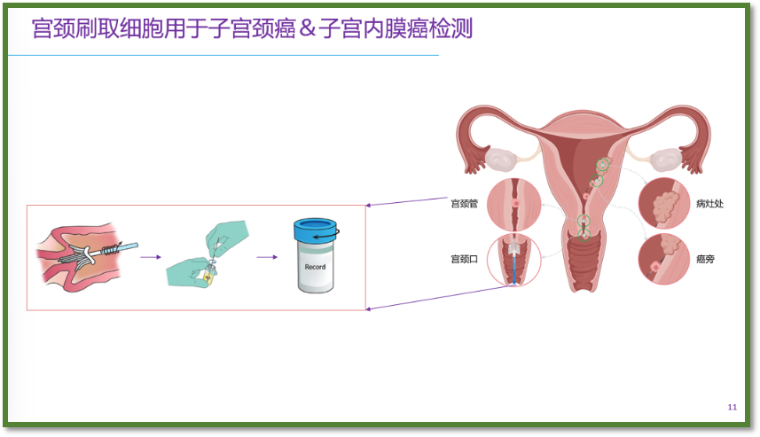
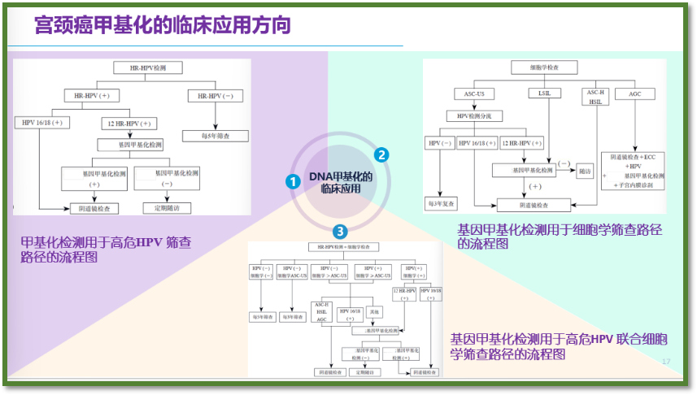
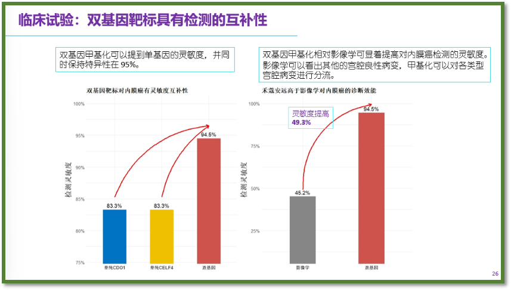
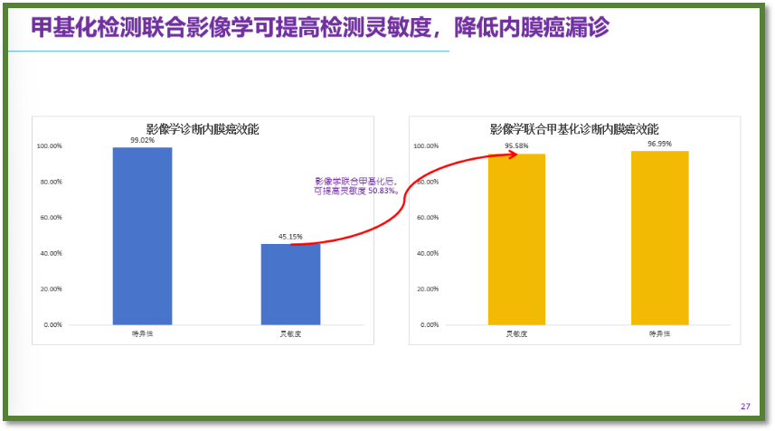
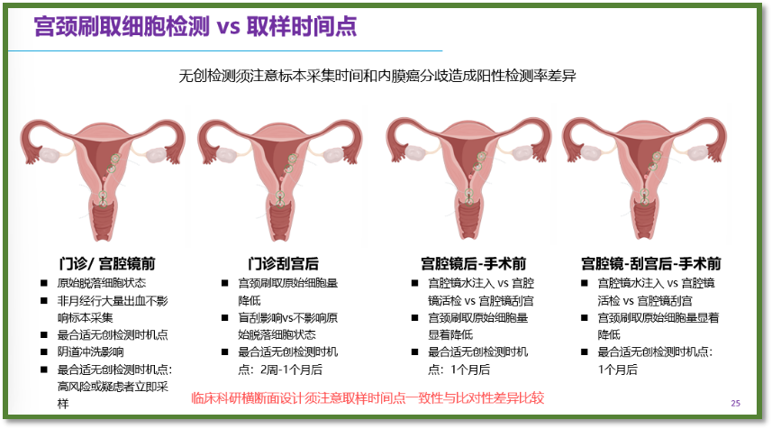

Recently, the "Second National-Level Colposcopy and Cervical Disease Standardized Prevention and Treatment Training Course," organized by the China Maternal and Child Health Association and hosted by Xuzhou Maternity and Child Health Hospital, was successfully held in Xuzhou, attracting gynecologic medical professionals from across the country.

This training closely followed the spirit of the "Action Plan for Accelerating the Elimination of Cervical Cancer (2023-2030)" and established a systematic curriculum. The training content focused on three core areas: cervical cancer screening and prevention strategies, standardized colposcopy techniques, and comprehensive treatment and management of cervical lesions. Through a combined theoretical and practical teaching approach, it comprehensively enhanced the professional capabilities of participants in cervical disease prevention and treatment.

In recent years, the incidence of female malignancies has continued to rise. Epidemiological data show that the incidence of cervical cancer, uterine corpus cancer, and breast cancer is trending upward. Notably, endometrial cancer has become the leading gynecologic malignancy in developed countries, and in developed Chinese cities such as Beijing, its incidence has surpassed cervical cancer since 2008, becoming the primary gynecologic tumor. This trend makes early non-invasive screening & diagnosis and prevention and treatment work a global public health priority.

China has made significant progress in gynecologic tumor DNA methylation detection technology. To date, the National Medical Products Administration has approved 41 tumor target gene methylation detection kits, with gynecologic tumor detection technology performing outstandingly. In cervical cancer prevention, the PAX1/JAM3 dual-gene methylation detection kit effectively addresses three major clinical challenges: distinguishing transient infection from progression risk, safe treatment and follow-up while preserving fertility, and accurate identification of CIN2/3 or invasive cancer. This technology not only plays an important role in high-risk HPV screening pathways but also demonstrates superior performance in cytology screening and co-testing pathways.

In the field of early diagnosis of endometrial cancer, methylation detection technology based on cervical exfoliated cells has achieved a major breakthrough. Using CDO1 and CELF4 gene methylation detection, sensitivity reaches 88% and specificity 93%, providing a non-invasive solution for early diagnosis of endometrial cancer.

Notably, the timing of sampling directly affects testing accuracy. Clinical practice shows that the optimal sampling time is before outpatient or hysteroscopic examination, while after procedures such as hysteroscopy, a wait of 2 weeks to 1 month is needed to ensure sample quality, avoiding the impact of procedures on the quantity of endometrial exfoliated cells and ensuring testing accuracy.

Through the "mentor-train-transfer" training model, this training course effectively promoted the extension of high-quality medical resources to grassroots levels. With the successful conclusion of the training, China's cervical cancer prevention network will welcome a new group of highly skilled professionals, injecting new momentum into achieving the goal of eliminating gynecologic tumors at an early date, and contributing to the implementation of the "Healthy China 2030" strategy.

**About CISPOLY**

Beijing Origin CISPOLY Biotechnology Co., Ltd. is a technology enterprise driven by innovative science and focused on health. CISPOLY is a pioneer in the field of early diagnosis of gynecologic tumors. With proprietary technology and patent-protected biomarkers at its core, the company has developed early diagnostic products for cervical cancer, endometrial cancer, ovarian cancer, and other gynecologic tumors, filling a void in this field.

As women pay increasing attention to their own health, the women's health market holds great promise. Beyond its gynecologic tumor early screening and diagnosis product line, CISPOLY will continue to build additional women's health-related product pipelines, striving to become a technology-innovation-driven leader in the women's health market.