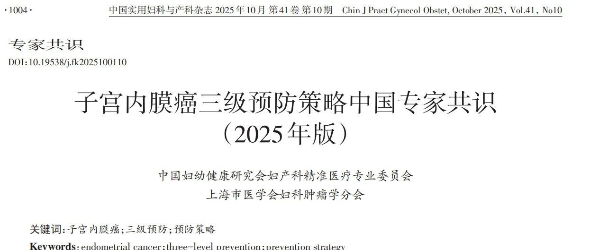
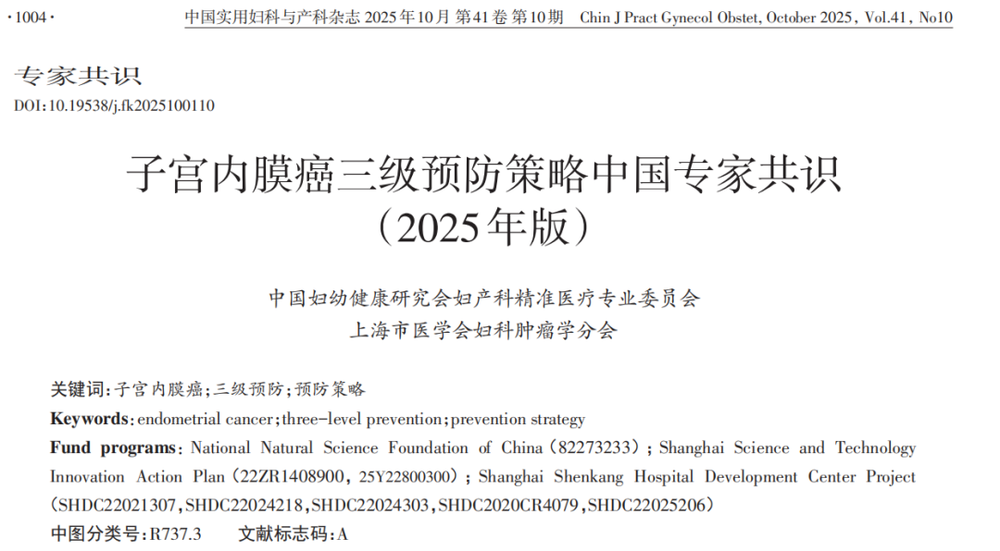
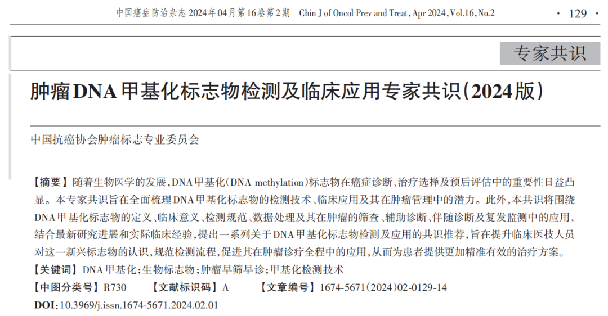

**1. Publication Record to Date**

Beijing Origin CISPOLY Biotechnology Co., Ltd. (CISPOLY) has accumulated systematic research evidence in the field of gynecologic tumor methylation biomarkers. Its CDO1/CELF4 dual-gene methylation detection significantly outperforms traditional screening strategies in performance. Related research includes multicenter prospective and retrospective clinical trials, using non-invasive cervical cell brush collection of endometrial exfoliated cells for methylation analysis. The feasibility of this sampling method has been fully validated.

This test is applicable to populations at increased risk (such as obesity or metabolic syndrome patients) and clinical subgroups with typical or atypical clinical presentations. Research evidence consistently demonstrates that CDO1/CELF4 dual-gene methylation detection has become a key tool for early screening and disease monitoring of endometrial cancer, with important clinical application value.

Studies show that the detection method based on CDO1/CELF4 methylation biomarkers performs excellently in endometrial cancer screening and monitoring. The related 9 research publications have been cited and affirmed by important gynecologic oncology expert consensus, and it has been established for the first time as an effective screening tool.

**2. Published Endometrial Cancer Research**

1\. Cai B, Li L, Liu B, Liu P, Wang L, Wang Y, et al. Application value of CISENDO dual-gene methylation detection in endometrial cancer screening. Journal of Lanzhou University (Medical Sciences). 2024;50:28–36. https://doi.org/10.13885/j.issn.1000-2812.2024.07.004 . — Collaborating institution: Gansu Provincial Maternity and Child Health Hospital

2\. Zhao X, Xu D, Ma J, Fu Y, Li B, Jin X, et al. Application value of DNA methylation detection in the diagnosis of endometrial cancer in reproductive-age women with abnormal uterine bleeding. Chinese Journal of Laboratory Medicine. 2023;46:367–74. https://doi.org/10.3760/cma.j.cn114452-20221110-00670 . — Collaborating institution: Third Xiangya Hospital of Central South University

3\. Kong L, Xiao X, Wan R, Chao X, Chen X, Wang J, et al. Application value of DNA methylation detection in endometrial cancer screening in postmenopausal women. Chinese Medical Journal. 2023;103:907–12. https://doi.org/10.3760/cma.j.cn112137-20220929-02058 . — Collaborating institution: Peking Union Medical College Hospital, Chinese Academy of Medical Sciences

4\. Zhao X, Yang Y, Fu Y, Lv W, Xu D. DNA methylation detection is a significant biomarker for screening endometrial cancer in premenopausal women with abnormal uterine bleeding. International journal of gynecological cancer : official journal of the International Gynecological Cancer Society. 2024;34:1165–71. https://doi.org/10.1136/ijgc-2024-005723 . — Collaborating institution: Third Xiangya Hospital of Central South University

5\. Lee H-SJ, Wu S, Yeung S-Y, Cheung C-W, Fung W-YL, Kwok P-KS, et al. Prospective evaluation of cervical scrapings CDO1 and CELF4 methylation (epiHERA®) assay in detection of endometrial cancer. Cancers. 2025;17. https://doi.org/10.3390/cancers17183010. — Collaborating institution: The Chinese University of Hong Kong, National University of Singapore

6\. Qi B, Sun Y, Lv Y, Hu P, Ma Y, Gao W, et al. Hypermethylated CDO1 and CELF4 in cytological specimens as triage strategy biomarkers in endometrial malignant lesions. Frontiers in oncology. 2023;13:1289366. https://doi.org/10.3389/fonc.2023.1289366 . — Collaborating institution: Cangzhou Central Hospital

7\. Cai B, Du J, Wang Y, Liu Z, Wang Y, Li L, et al. The endometrial cancer detection using non-invasive hypermethylation of CDO1 and CELF4 genes in women with postmenopausal bleeding in northwest China. CytoJournal. 2024;21:15. _https://doi.org/10.25259/Cytojournal_78_2023 . — Collaborating institution: Gansu Provincial Maternity and Child Health Hospital

8\. Hou Q, Yuan Y, Li Y, Gong Z, Zhang Q, Feng D, et al. Significance of high expression of CDO1 and HOXA9 gene promoter methylation in serum for ovarian cancer diagnosis. Chinese Journal of Laboratory Medicine. 2024;47:401–6. https://doi.org/10.3760/cma.j.cn114452-20231115-00287 . — Collaborating institution: Chengdu Women's and Children's Central Hospital

9\. Yang L, Wang Z-X, Zhu Y-H, Bai Y, Liou Y, Li Q, et al. Focused ultrasound ablation for women with cervical lesions: Protocol of a randomized controlled trial. Reproductive and Developmental Medicine. 2025. https://doi.org/10.1097/RD9.0000000000000132 . — Collaborating institution: Chongqing Medical University

**3. Expert Consensus Publications**

CDO1/CELF4 methylation detection is an NMPA-approved Class III medical device. Using cervical brush collection of endometrial exfoliated cells for methylation gene detection provides more precise risk stratification for endometrial cancer, helping to reduce unnecessary colposcopies and invasive treatments, preserve patient fertility, and reduce medical burden.

1\. Chinese Expert Consensus on Three-Level Prevention Strategies for Endometrial Cancer (2025 Edition). Chinese Journal of Practical Obstetrics and Gynecology. 2025; 41(10): 1004-1011. — Developed by: Precision Medicine Committee of Obstetrics and Gynecology, China Maternal and Child Health Research Association, and Gynecologic Oncology Branch, Shanghai Medical Association.

2\. Expert Consensus on Detection and Clinical Application of Tumor DNA Methylation Biomarkers (2024 Edition). Chinese Journal of Oncology Prevention and Treatment. 2024; 16(2): 129-142. — Developed by: Tumor Biomarker Professional Committee, China Anti-Cancer Association

**4. Consensus Highlights: Clinical Application Scenarios for Methylation**

**Clinical needs**: The core of secondary prevention of endometrial cancer lies in achieving **early detection and precise intervention** for **populations at increased risk**. However, traditional screening and diagnostic methods have limitations, creating an urgent clinical need for novel, efficient tools:

1\.**Addressing inadequacies of traditional screening methods**: Transvaginal ultrasound (TVS) is a commonly used screening tool, but its interpretation depends on endometrial thickness and involves subjectivity and uncertainty. Endometrial cytology examination lacks unified diagnostic standards and is difficult to interpret, serving only an auxiliary role.

2\.**Resolving the invasive limitations of the diagnostic gold standard**: Endometrial biopsy is the gold standard for diagnosis, but whether through diagnostic curettage or hysteroscopy, both are invasive procedures that may cause pain, infection, and other complications, and are not suitable for large-scale population initial screening.

3\.**Meeting the urgent need for high-precision, non-invasive screening tools**: Clinical practice requires a screening method that can precisely identify early lesions, with minimal trauma and high patient compliance, particularly for application in community populations and high-risk groups (such as obese patients, metabolic syndrome patients, and genetically susceptible individuals).

The secondary prevention goals and strategies emphasized in the consensus establish the clinical need foundation for methylation testing application.

**Contributions of Methylation**:

Expert consensus explicitly identifies **endometrial exfoliated cell gene methylation detection** as a research hotspot in recent years. The strength of evidence is mainly reflected in the following aspects:

1\.**Technological innovation and performance breakthrough**: Sensitivity of 94.5% and specificity of 94.2% for diagnosing endometrial cancer. This performance is superior to current traditional screening strategies.

2\.**Non-invasive/minimally invasive sampling**: NMPA-approved **cervical cell brush sampling, with future implementation of vaginal tampon, urine, and other sampling methods**, greatly reduces the invasiveness of screening and patient fear, making repeat screening and large-scale population screening feasible.

3\.**Integration into screening pathways, enhancing early diagnostic capability**: Methylation testing combined with TVS as a non-invasive screening pathway provides a high-precision triage tool, helping physicians make more accurate decisions about whether invasive histological biopsy is needed.

4\.**Product translation and standard establishment**: The consensus notes that Beijing Origin CISPOLY Biotechnology Co., Ltd.'s product has been officially approved for market launch, marking the technology's transition from research to clinical practice, providing a foundation for standardized application.

**Practical Impact**:

1\.**Impact on clinical practice**: Provides physicians with an objective, efficient molecular diagnostic tool, helping to build a stepwise screening-diagnosis workflow of "initial screening (TVS/medical history) + precision screening (methylation testing) → definitive diagnosis (tissue biopsy)," improving early lesion detection rates and avoiding unnecessary invasive examinations. Together they constitute the full-process precision management of endometrial cancer.

2\.**Impact on patients and public health**: Non-invasive sampling is more easily accepted by patients, potentially increasing participation rates among target populations, especially in areas with relatively limited medical resources, improving screening accessibility and compliance.

3\.**Improving patient prognosis**: Through earlier detection, patients can receive treatment at the initial stage of disease, thereby significantly improving treatment outcomes, survival rates, and quality of life.

4\.**Reducing medical burden**: Early diagnosis and treatment costs are far lower than advanced cancer treatment. In the long run, effective screening helps save overall social medical costs.

In summary, the expert consensus fully affirms the key role of endometrial exfoliated cell gene methylation detection in addressing current clinical needs. Its outstanding technological contributions are making and will continue to make positive practical impacts on endometrial cancer prevention and treatment.

**5. Conclusion**

CISPOLY looks forward to collaborating with more medical institutions and public health departments on pilot programs to evaluate the effectiveness and cost-efficiency of methylation testing in real-world screening workflows, and to continuously optimize stratified management strategies, providing women's reproductive health with more precise, safe, and accessible screening solutions.

**About CISPOLY**

Beijing Origin CISPOLY Biotechnology Co., Ltd. is a technology enterprise driven by innovative science and focused on health. CISPOLY is a pioneer in the field of early diagnosis of gynecologic tumors. With proprietary technology and patent-protected biomarkers at its core, the company has developed early diagnostic products for cervical cancer, endometrial cancer, ovarian cancer, and other gynecologic tumors, filling a void in this field.

As women pay increasing attention to their own health, the women's health market holds great promise. Beyond its gynecologic tumor early screening and diagnosis product line, CISPOLY will continue to build additional women's health-related product pipelines, striving to become a technology-innovation-driven leader in the women's health market.