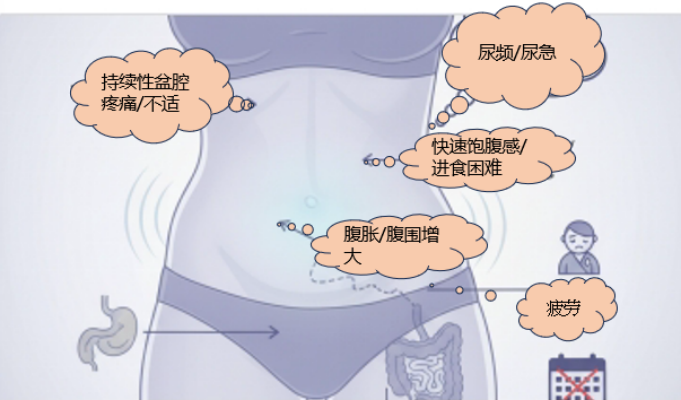

The CISOVA® (CDO1/HOXA9) gene methylation detection kit, with its outstanding reliability and technological innovation demonstrated in early screening and auxiliary diagnosis of ovarian cancer, has officially received a Class III medical device registration certificate from China's National Medical Products Administration (NMPA) (Registration No.: 20253402443), ushering in a new era of non-invasive early diagnosis of ovarian cancer.

As the world's first approved non-invasive methylation detection kit for ovarian cancer, the launch of CISOVA® marks a new powerful detection tool for clinicians to overcome the challenges of early ovarian cancer diagnosis, opening a new chapter in "precision non-invasive early diagnosis" of ovarian cancer.

Ovarian cancer is a deadly malignancy that seriously threatens the health of Chinese women, with clinical diagnosis and treatment facing severe long-term challenges. According to 2022 statistics from the National Cancer Center, China has approximately 55,000 new ovarian cancer cases annually, with deaths reaching 38,000 [1]. An even more alarming phenomenon is that ovarian cancer mortality ranks seventh among female malignancies (especially prevalent in the 40-59 age group), significantly higher than its incidence ranking (tenth) [2], directly revealing the grim reality of poor prognosis and low survival rates.

**Figure 1. Often-overlooked early symptoms of ovarian cancer**

Over 70% of patients are already at advanced stages (III/IV) at diagnosis, which is the core reason for the persistently low five-year survival rate [2]. Early symptoms of ovarian cancer (such as bloating, abdominal pain, indigestion, etc.) are extremely insidious and lack specificity, resulting in an average delay of months to years from onset of non-specific discomfort to final diagnosis, thereby missing the optimal treatment window. Currently, conventional clinical testing methods have particularly prominent limitations in addressing early diagnostic needs:

- Serum tumor markers (such as CA125): Limited sensitivity in early-stage cancer (approximately 50%), susceptible to interference from benign diseases such as pelvic inflammatory disease and endometriosis, with high false-positive rates, and may miss certain subtypes such as mucinous carcinoma.

- Imaging examinations (such as ultrasound): Diagnostic accuracy largely depends on operator experience, with difficulties in differentiating tiny lesions and atypical images, and non-negligible missed diagnosis risk.

- Histopathology (gold standard): Relies on invasive surgery to obtain tissue samples, cannot be applied to large-scale screening and routine monitoring, and diagnosis is inherently delayed.

- Confirmatory biopsy involves invasive procedures, carries surgical risks and potential complications, and is not suitable for screening or regular monitoring of high-risk populations.

Through innovative technology, the CISOVA® gene methylation test resolves the challenges of early ovarian cancer diagnosis. Expert consensus has elucidated its non-invasive advantages based on liquid biopsy, outstanding early detection performance (particularly high sensitivity for Stage I cancer), and broad clinical applicability, making it a potentially important tool in the gynecologic tumor early screening and auxiliary diagnosis system [3]. Its approval and simple usage make it a leading tool for early diagnosis of gynecologic tumors. High-risk women or those with relevant symptoms are advised to consult their physician for CISOVA® non-invasive testing.

**References**

[1] Han B, et al. Cancer incidence and mortality in China, 2022. J Natl Cancer Cent. 2024 Feb 2;4(1):47-53.

[2] Qi J, et al. National and subnational trends in cancer burden in China, 2005-20: an analysis of national mortality surveillance data. Lancet Public Health. 2023 Dec;8(12):e943-e955.

[3] Tumor Biomarker Professional Committee, China Anti-Cancer Association. Expert Consensus on Detection and Clinical Application of Tumor DNA Methylation Biomarkers (2024 Edition)[J]. Chinese Journal of Oncology Prevention and Treatment, 2024, 16(2): 129-142.

**About CISPOLY**

Beijing Origin CISPOLY Biotechnology Co., Ltd. is a technology enterprise driven by innovative science and focused on health. CISPOLY is a pioneer in the field of early diagnosis of gynecologic tumors. With proprietary technology and patent-protected biomarkers at its core, the company has developed early diagnostic products for cervical cancer, endometrial cancer, ovarian cancer, and other gynecologic tumors, filling a void in this field.

As women pay increasing attention to their own health, the women's health market holds great promise. Beyond its gynecologic tumor early screening and diagnosis product line, CISPOLY will continue to build additional women's health-related product pipelines, striving to become a technology-innovation-driven leader in the women's health market.