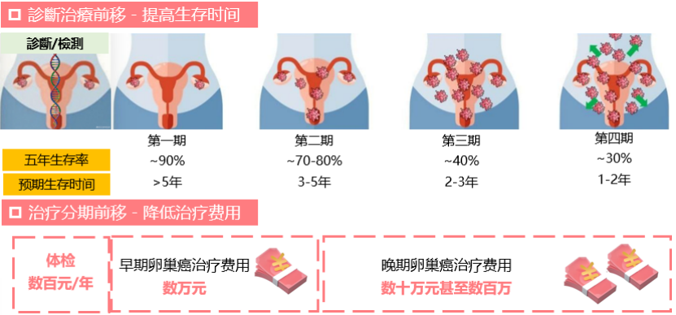
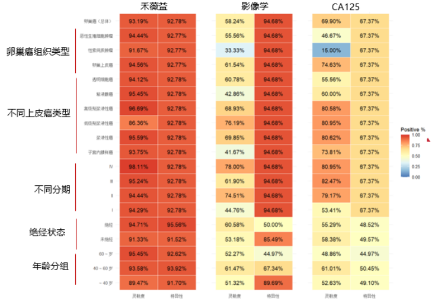

> In the Series 1 article [ CISOVA® Clinical Interpretation (Series 1): Breaking Through the Dilemma of Early Ovarian Cancer Diagnosis](https://mp.weixin.qq.com/s/K48pmAXx34ooLfflrwAW_w)

we introduced the background and clinical value of CISOVA® (CDO1/HOXA9) gene methylation detection kit, the world's first approved non-invasive methylation detection product for ovarian cancer. This article will focus on the product's core technical principles and its outstanding performance data validated through large-scale clinical studies.

The Years of Life Lost (YLL) rate for ovarian cancer remains at a relatively high level, reflecting the disease's insidious onset, difficulty of early diagnosis, and the significant premature mortality and healthy life-years lost it causes. In terms of age distribution, the ovarian cancer mortality rate for women aged 40-59 ranks seventh among cancer deaths for women in this age group [1]. In summary, ovarian cancer has become one of the deadliest malignancies among female reproductive system tumors, with a severe prevention and control situation that urgently needs strengthening. Efficient early screening and diagnosis for high-risk populations, symptomatic populations, and peak-age populations is the key to advancing diagnosis and treatment to earlier stages, improving survival rates, and reducing treatment costs.

**Figure 1. CISOVA® enables early diagnosis and treatment of ovarian cancer**

**1. Technical Principle: Precision Detection Based on Liquid Biopsy**

CISOVA® is a liquid biopsy technology based on circulating cell-free DNA (cfDNA) in peripheral blood. Tumor cells release their DNA into the bloodstream during apoptosis, necrosis, and other processes. This cfDNA carries tumor-specific epigenetic changes — DNA methylation. By specifically detecting the methylation levels of the CDO1 and HOXA9 genes in cfDNA, CISOVA® uses high-sensitivity qPCR technology for amplification and quantification, achieving early, non-invasive diagnosis of ovarian cancer.

**2. Key Clinical Data: High Sensitivity, High Specificity, Particularly Strong in Early Detection**

The product's core value stems from solid clinical evidence. A multicenter clinical study led by **Peking Union Medical College Hospital**, in collaboration with **Fudan University Cancer Hospital, the Third Xiangya Hospital, and the Women's Hospital of Zhejiang University School of Medicine**, enrolled a total of 1,421 samples and comprehensively evaluated the detection performance of CISOVA®. The results were remarkable:

·**Outstanding overall performance**: Overall diagnostic sensitivity for ovarian cancer reached **93.2%**, with overall specificity of **92.8%**, demonstrating extremely high accuracy.

·**Advancing to Stage I ovarian cancer**: For Stage I ovarian cancer — the most difficult to detect clinically — sensitivity remained as high as **94.3%**, with specificity of 92.8%. This data significantly surpasses traditional methods (e.g., CA125 sensitivity in early-stage cancer is only approximately 50%), meaning this test has the potential to substantially shift the diagnostic window earlier, truly achieving early detection.

·**Broad cancer type coverage**: Not only effective for the most common serous carcinoma, it also maintains sensitivity and specificity above 91% for clear cell carcinoma, mucinous carcinoma, and other non-serous cancer subtypes, avoiding the missed diagnosis risk of traditional markers that may not be expressed in certain subtypes.

·**Stable performance**: Test results are not affected by menopausal status or menstrual cycle, ensuring detection stability across different physiological states.

**Figure 2. CISOVA® ovarian cancer classification and different baselines show superior detection performance**

Studies show that compared to traditional imaging and serum marker (CA125) detection methods, CISOVA® can avoid approximately 30-40% of missed diagnoses, providing a superior-performing new option for early screening and differential diagnosis of ovarian cancer.

Through innovative technology, the CISOVA® gene methylation test resolves the challenges of early ovarian cancer diagnosis. Expert consensus has elucidated its non-invasive advantages based on liquid biopsy, outstanding early detection performance (particularly high sensitivity for Stage I cancer), and broad clinical applicability, making it a potentially important tool in the gynecologic tumor early screening and auxiliary diagnosis system [2]. Its approval and simple usage make it a leading tool for early diagnosis of gynecologic tumors. High-risk women or those with relevant symptoms are advised to consult their physician for CISOVA® non-invasive testing.

**References**

[1] Qi J, et al. National and subnational trends in cancer burden in China, 2005-20: an analysis of national mortality surveillance data. Lancet Public Health. 2023 Dec;8(12):e943-e955.

Dec;8(12):e943-e955.

[2] Tumor Biomarker Professional Committee, China Anti-Cancer Association. Expert Consensus on Detection and Clinical Application of Tumor DNA Methylation Biomarkers (2024 Edition)[J]. Chinese Journal of Oncology Prevention and Treatment, 2024, 16(2): 129-142.

**About CISPOLY**

Beijing Origin CISPOLY Biotechnology Co., Ltd. is a technology enterprise driven by innovative science and focused on health. CISPOLY is a pioneer in the field of early diagnosis of gynecologic tumors. With proprietary technology and patent-protected biomarkers at its core, the company has developed early diagnostic products for cervical cancer, endometrial cancer, ovarian cancer, and other gynecologic tumors, filling a void in this field.

As women pay increasing attention to their own health, the women's health market holds great promise. Beyond its gynecologic tumor early screening and diagnosis product line, CISPOLY will continue to build additional women's health-related product pipelines, striving to become a technology-innovation-driven leader in the women's health market.