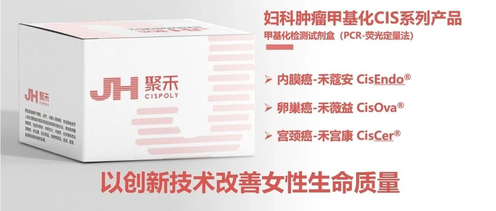

On December 16, 2025, the Beijing Municipal Bureau of Economy and Information Technology officially released the 2025 list of "Specialized, Refined, Differential, and Innovative" (SRDI) Small and Medium Enterprises. Beijing Origin CISPOLY Biotechnology Co., Ltd. was awarded this authoritative designation by virtue of its deep expertise and outstanding performance in the field of women's health biomedical technology.

This recognition is not only an official affirmation of CISPOLY's long-standing commitment to innovation-driven development and focus on core business in the women's health field, but also marks the company's advancement into the ranks of Beijing's high-quality small and medium enterprises in terms of biomedical technology capabilities, product strength, and market potential.

Looking ahead, CISPOLY will use this recognition as a new starting point to further focus on core technology breakthroughs and translation, deepen its strategic presence in the segmented fields of women's diseases and health, and continuously enhance its product competitiveness and brand influence. The company will continue to increase R&D investment, attract top talent, strive for higher-quality development, and contribute more "CISPOLY strength" to promoting the biomedical industry development and industrial upgrading of Beijing and the nation.

**About CISPOLY**

Beijing Origin CISPOLY Biotechnology Co., Ltd. is a technology enterprise driven by innovative science and focused on health. CISPOLY is a pioneer in the field of early diagnosis of gynecologic tumors. With proprietary technology and patent-protected biomarkers at its core, the company has developed early diagnostic products for cervical cancer, endometrial cancer, ovarian cancer, and other gynecologic tumors, filling a void in this field.

As women pay increasing attention to their own health, the women's health market holds great promise. Beyond its gynecologic tumor early screening and diagnosis product line, CISPOLY will continue to build additional women's health-related product pipelines, striving to become a technology-innovation-driven leader in the women's health market.