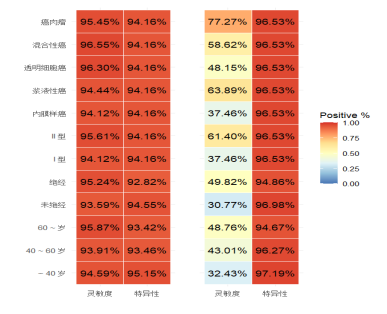
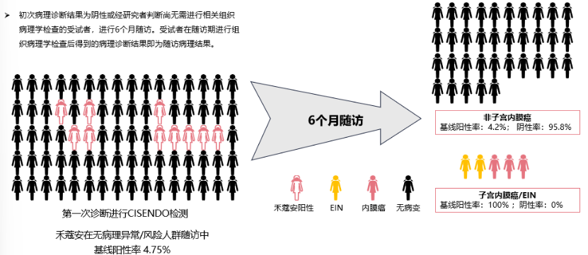

Faced with the clinical challenges of endometrial cancer early screening, a breakthrough technology has emerged. The CISENDO® (CDO1/CELF4) gene methylation detection kit received NMPA Class III medical device registration (Registration No.: 20243402610) in December 2024. As the world's first non-invasive endometrial cancer early diagnostic test based on cervical exfoliated cell samples, its launch benefits many women and marks the entry of endometrial cancer early screening technology into a new stage of non-invasive, convenient, and precise detection.

**1. Solid Evidence from Multicenter Clinical Studies**

The performance of CISENDO® has been validated by a large-scale clinical study led by Peking Union Medical College Hospital, in collaboration with Shanghai Obstetrics & Gynecology Hospital, the Third Xiangya Hospital of Central South University, the Women's Hospital of Zhejiang University School of Medicine, and other top domestic gynecologic oncology centers, enrolling 4,818 cases. Its core value is reflected in:

- · Non-invasive revolution, convenient sampling: Only requires synchronous collection of cervical exfoliated cells during routine gynecological examination (same method as HPV testing), without intrauterine procedures, greatly improving screening acceptance and accessibility.

- · Precise and reliable, outstanding performance: Clinical data show detection sensitivity for endometrial cancer as high as 94.51% and specificity of 94.16%, enabling precise identification of carcinogenesis risk.

- · Comprehensive coverage, prospective early warning: Using dual-gene complementary detection of CDO1 and CELF4, it can effectively capture "molecular traces" of multiple early carcinogenesis events including Type I, Type II, and rare subtypes. Even more notably, the detection rate of endometrial cancer or precancerous lesions (EIN) within 6 months in baseline-positive populations reached 100%, demonstrating powerful prospective warning value.

- · Filling blind spots of traditional methods: This test can significantly reduce the potential missed diagnosis risk of imaging-only examinations and provides non-invasive auxiliary benign-malignant differentiation of suspected lesions identified on ultrasound.

Figure 2: CISENDO® precisely detects different types of early endometrial cancer

Figure 3: CISENDO® demonstrates precise early warning capability

**2. Recognized by Authoritative Guidelines, Guiding Clinical Direction**

Based on its outstanding clinical value, endometrial cancer methylation detection technology has received recommendations from authoritative domestic consensus guidelines:

- · The *Chinese Expert Consensus on Three-Level Prevention Strategies for Endometrial Cancer (2025 Edition)* explicitly recommends its use in combined screening.

- · The *Expert Consensus on Detection and Clinical Application of Tumor DNA Methylation Biomarkers (2024 Edition)* clarifies its clinical application scenarios.

Clinical data for CISENDO® show detection sensitivity for endometrial cancer as high as 94.51% and specificity of 94.16%. Recommended by expert consensus, it can precisely identify carcinogenesis risk. It is applicable for broad health management and risk screening, with particular recommendation for the following populations to consult for evaluation:

1\. Those with abnormal symptoms: Especially women with abnormal uterine bleeding (such as postmenopausal bleeding, menstrual irregularities, menorrhagia, or prolonged menstruation).

2\. Those with metabolic diseases: Such as obesity, diabetes, hypertension, etc. — high-risk populations for endometrial cancer.

3\. Those with specific medical or family history: Including polycystic ovary syndrome (PCOS) patients, women with a family history of endometrial cancer or colorectal cancer, and those on long-term unopposed estrogen therapy.

4\. Those needing auxiliary diagnosis: Cases where transvaginal ultrasound or other imaging shows abnormally thickened endometrium or space-occupying lesions, or where tumor markers such as CA125 are abnormal, requiring auxiliary benign-malignant differentiation.

5\. Health-conscious and proactive managers: Healthy or high-risk women who wish to undergo early risk screening using high-sensitivity, non-invasive technology.

**3. Summary**

Through innovative non-invasive gene testing technology, CISENDO® effectively addresses core pain points of traditional screening methods — insufficient sensitivity and low compliance with invasive procedures — providing a powerful new tool for early detection of endometrial cancer.

Women who meet the above high-risk characteristics or are concerned about their reproductive health are advised to proactively discuss with their physician the applicability of CISENDO® testing. Early detection is key to overcoming cancer, and proactive screening is an important step in safeguarding health.

**References**

[1] Precision Medicine Committee of Obstetrics and Gynecology, China Maternal and Child Health Research Association; Gynecologic Oncology Branch, Shanghai Medical Association. Chinese Expert Consensus on Three-Level Prevention Strategies for Endometrial Cancer (2025 Edition). Chinese Journal of Practical Obstetrics and Gynecology, 2025, 41(10): 1004-1011.

[2] Tumor Biomarker Professional Committee, China Anti-Cancer Association. Expert Consensus on Detection and Clinical Application of Tumor DNA Methylation Biomarkers (2024 Edition). Chinese Journal of Oncology Prevention and Treatment, 2024, 16(2): 129-142.

**About CISPOLY**

Beijing Origin CISPOLY Biotechnology Co., Ltd. is a technology enterprise driven by innovative science and focused on health. CISPOLY is a pioneer in the field of early diagnosis of gynecologic tumors. With proprietary technology and patent-protected biomarkers at its core, the company has developed early diagnostic products for cervical cancer, endometrial cancer, ovarian cancer, and other gynecologic tumors, filling a void in this field.

As women pay increasing attention to their own health, the women's health market holds great promise. Beyond its gynecologic tumor early screening and diagnosis product line, CISPOLY will continue to build additional women's health-related product pipelines, striving to become a technology-innovation-driven leader in the women's health market.