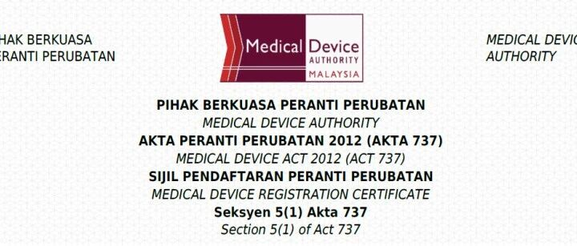
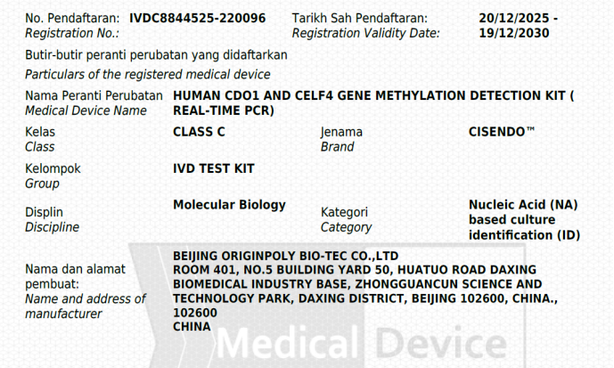

CISPOLY's independently developed endometrial cancer methylation detection product "CISENDO® (CDO1/CELF4)" has officially received its registration certificate from Malaysia's medical device regulatory authority. This approval marks a key step in CISPOLY's internationalization strategy in the field of gynecologic oncology precision diagnostics, and brings innovative, efficient endometrial cancer early screening solutions to the Southeast Asian market.

**1. Deepening the Southeast Asian Market: Precision Diagnostic Technology Gains International Recognition**

Malaysia, as an important hub for the Southeast Asian medical market, granting successful registration to CISENDO® demonstrates that its technical reliability, clinical value, and quality management system all meet international standards. Endometrial cancer is one of the common malignancies of the female reproductive system, and early screening is critical for improving prognosis. The entry of CISENDO® into the Malaysian market is an important practice of the company's mission to "protect women's health through technology." The company will gradually expand to more Southeast Asian countries, contributing "Chinese R&D and manufacturing" intelligence to global women's health.

**2. Continuing to Expand Overseas Presence, Strengthening International Cooperation**

CISPOLY has always been committed to advancing early screening and diagnosis of gynecologic tumors through innovative molecular diagnostic technology. Following CISENDO®, the company's cervical cancer methylation detection product "CISCER® (PAX1/JAM3)" and ovarian cancer methylation detection product "CISOVA® (CDO1/HOXA9)" are also expected to receive overseas approvals in succession, jointly building a comprehensive early screening product matrix covering major gynecologic cancers and providing women with more comprehensive, non-invasive early risk assessment tools.

This CISENDO® approval is an important practice of the company's mission to "protect women's health through technology," and lays a solid foundation for further expansion into Southeast Asian and "Belt and Road" markets. Looking ahead, CISPOLY will continue to deepen cooperation with overseas medical institutions and channel partners, leveraging technological innovation and global resource integration to bring Chinese precision diagnostic solutions to more regions, helping to elevate global gynecologic cancer prevention and control.

**About CISPOLY**

Beijing Origin CISPOLY Biotechnology Co., Ltd. is a technology enterprise driven by innovative science and focused on health. CISPOLY is a pioneer in the field of early diagnosis of gynecologic tumors. With proprietary technology and patent-protected biomarkers at its core, the company has developed early diagnostic products for cervical cancer, endometrial cancer, ovarian cancer, and other gynecologic tumors, filling a void in this field.

As women pay increasing attention to their own health, the women's health market holds great promise. Beyond its gynecologic tumor early screening and diagnosis product line, CISPOLY will continue to build additional women's health-related product pipelines, striving to become a technology-innovation-driven leader in the women's health market.