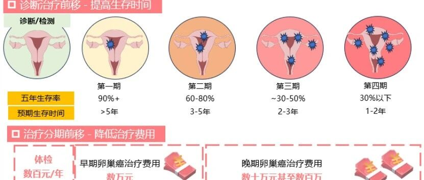
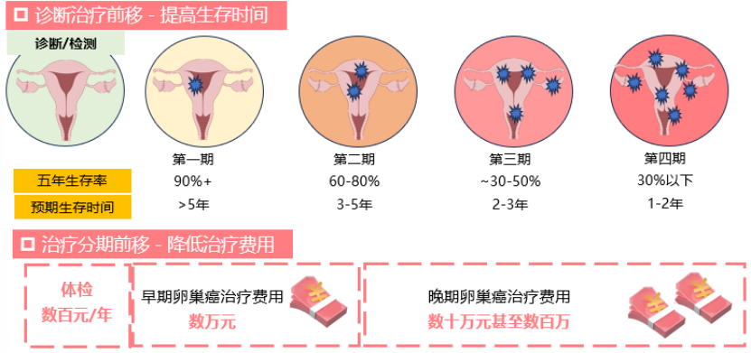

# 禾蔻安®临床解读（三）| 您需要检测吗？

_2025年12月29日 17:15_

禾蔻安 ®(CDO1/CELF4) 基因甲基化检测试剂盒于 2024 年 12 月获国家药监局（NMPA）批准三类医疗器械注册证（国械注准 20243402610）。作为全球首个基于宫颈脱落细胞样本的无创子宫内膜癌早诊检测，它的上市造福许多女性并标志着子宫内膜癌早期筛查技术迈入了**无创、便捷、精准** 的新阶段。

禾蔻安 ® 通过与 HPV 检测相同的无创采样方式，实现了灵敏度 94.51%、特异性 94.16% 的高精准检测，不仅能全面预警早期癌变，还可有效弥补传统影像检查的盲区，为子宫内膜癌筛查提供创新利器。

了解子宫内膜癌的风险与新筛查技术后，许多女性会问：我属于高风险人群吗？这个检测具体怎么做？以下信息为您提供清晰指引。

**一、哪些人群尤其适合进行禾蔻安®检测？**

本检测适用于广泛的健康管理与风险筛查者，特别推荐以下人群咨询评估：

(1). 存在异常症状者：尤其是有异常子宫出血（如绝经后出血、月经紊乱、经量过多或经期延长）的女性。

(2). 患有代谢性疾病者：如肥胖、糖尿病、高血压等患者，是内膜癌的高风险人群。

(3). 有特定病史或家族史者：包括多囊卵巢综合征（PCOS）患者、有子宫内膜癌或结直肠癌等家族史的女性，以及长期单独使用雌激素进行治疗者。

(4). 辅助诊断需求者：经阴道超声等影像学检查提示子宫内膜异常增厚或占位，或肿瘤标志物如 CA125 异常，需进行良恶性辅助鉴别者。

(5) 健康关注与主动管理者：希望采用高灵敏度、无创技术进行早期风险筛查的健康或高危女性。

**二、禾蔻安®发现早期子宫内膜癌，早治疗负担越轻**

子宫内膜癌五年生存率从 90% 以上逐步降至 30% 以下，预期生存时间相应缩短，而治疗费用则从每年的常规体检费用（数百元），上升到早期治疗的数万元，直至晚期可能高达数十万甚至数百万元。

因此，对于符合筛查指征的女性，主动进行禾蔻安 ® 这类高精度、无创的早期检测，是推动自身健康管理“关口前移”的关键一步。这不仅能显著提升治愈希望，更能有效避免未来可能面临的沉重健康与经济负担，是实现“早诊早治、提升生存、降低费用”这一健康目标最经济高效的方式。

**图 1 禾蔻安让发现子宫内膜癌前移，早发现早治疗**

**三、检测流程与结果解读**

- · 采样方式：非常简单。在医疗机构由专业人员进行，采样过程与常规的宫颈 HPV/TCT 检查完全相同，无创、无痛，几分钟即可完成。

- · 可和影像学 ( 例如阴道超声 ) 或肿瘤标志物联合检查｡

·**结果解读：**

- o 检测阳性：提示存在子宫内膜癌变风险较高，建议尽快前往妇科或妇科肿瘤专科门诊，由医生结合临床情况进行进一步的宫腔镜等检查，以明确诊断。

- o 检测阴性：提示当前子宫内膜存在癌变的风险较低，建议保持健康生活方式，并遵循医生建议进行定期随访。

**四、**结论和展望

禾蔻安 ® 基因甲基化检测以其无创、高灵敏度、高特异性的优势，为子宫内膜癌的早期筛查与风险分层提供了变革性的解决方案。它特别适合解决当前临床中因传统方法局限导致的诊断延迟或过度有创检查问题。

建议符合上述高风险特征或关注自身生殖健康的女性，主动与您的医生沟通，了解禾蔻安® 检测的适用性。早期发现是战胜癌症的关键，主动筛查是守护健康的重要一步。

**关于聚禾生物**

北京起源聚禾生物科技有限公司是以创新科技为驱动、以关注健康为宗旨的科技企业。聚禾生物是妇科肿瘤早诊领域的开拓者，以独家技术和专利保护的标志物为核心，开发了宫颈癌、子宫内膜癌、卵巢癌等妇科肿瘤早诊产品，填补了该领域的空白。

随着女性对自身健康的关注越来越密切，女性健康市场将大有可为，除妇科肿瘤早筛早诊产品线外，未来聚禾生物还将建立更多女性健康相关的产品管线，打造女性健康市场的技术创新型领先企业。
