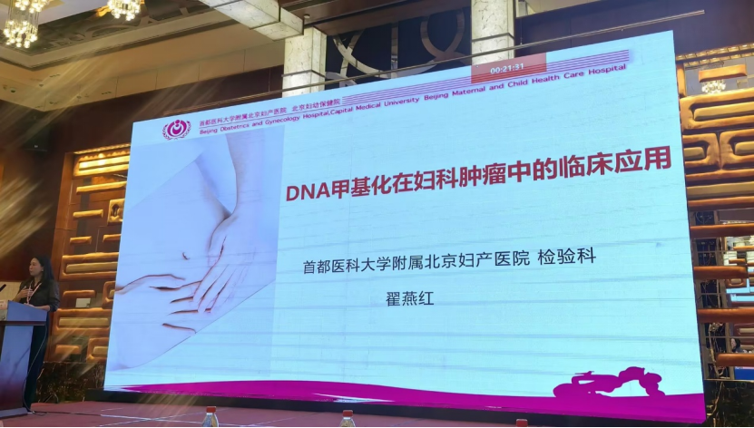
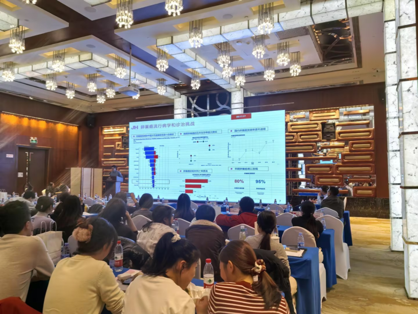

In December 2025, the "2025 Beijing Maternal and Child Health Inspection New Technology Training Course and the 7th Beijing Maternal and Child Health Inspection Laboratory Medicine Forum," jointly organized by Beijing Obstetrics and Gynecology Hospital, Capital Medical University, and the China Association for Improving Birth Outcomes and Child Development, was successfully held in Beijing. The forum brought together numerous experts in maternal and child health laboratory medicine and clinical medicine for in-depth exchange on frontier technologies, jointly promoting discipline development. Among them, the clinical translation and application of DNA methylation testing technology in early diagnosis of gynecologic tumors became a focal point of the conference.

Dr. Zhai Yanhong from Beijing Obstetrics and Gynecology Hospital, Capital Medical University, systematically elaborated on the key role and latest progress of this technology in gynecologic tumor diagnosis and treatment in her special presentation titled "Application of DNA Methylation in Gynecologic Tumors." She noted that PAX1/JAM3 gene methylation testing can effectively assist in cervical cancer screening. This technology not only helps alleviate anxiety in HPV-positive reproductive-age women but also provides a precise molecular pathology solution for postmenopausal women who may face missed diagnosis risks with cytology and colposcopy. In terms of early identification of endometrial cancer, CDO1/CELF4 methylation testing combined with transvaginal ultrasound can effectively identify high endometrial cancer risk in cases meeting specific imaging criteria (≥5mm postmenopause, ≥11mm premenopause), assist in differentiating high endometrial cancer risk from benign lesions, and provide important molecular pathology evidence for clinical decisions on whether hysteroscopy is needed, thereby promoting more precise diagnostic decisions, reducing unnecessary invasive procedures and potential missed diagnoses, and achieving a clinical application breakthrough in non-invasive testing.

Dr. Liu Yuli from Beijing Tsinghua Changgung Hospital delivered a special presentation titled "Application of Ovarian Cancer Methylation in Gynecology," focusing on the clinical application value of China's first approved ovarian cancer methylation detection kit. Ovarian cancer has insidious early symptoms and is mostly diagnosed at advanced stages, earning it the clinical designation of "silent killer." Dr. Liu noted that CDO1/HOXA9 methylation testing can non-invasively capture early molecular signals released by tumors from blood. Combined with abdominal ultrasound, this test can achieve a detection rate of up to 92% for cases with atypical imaging features for ovarian cancer, significantly reducing missed diagnoses. For patients with typical ultrasound findings, it provides molecular pathology evidence of high ovarian cancer risk, enabling physicians to conduct more careful examinations and timely treatment for high-risk patients. Used in conjunction with the CA125 tumor marker, it can assist in differentiating ovarian cancer from other diseases when CA125 is positive, reducing unnecessary examinations and patient anxiety; for patients with negative CA125 but relevant symptoms, it can still precisely identify 93% of early-stage ovarian cancers, avoiding diagnostic delays caused by repeated testing. This technology opens a revolutionary new pathway for early warning and precision screening of ovarian cancer.

Through high-level academic dialogue, this forum fully demonstrated the solid progress of DNA methylation testing from research to clinical practice. As such breakthrough technologies continue to be implemented and optimized in clinical practice, they are expected to bring profound transformation to early detection, precision diagnosis, and personalized treatment of gynecologic tumors, injecting important technological momentum into improving women's health.

**About CISPOLY**

Beijing Origin CISPOLY Biotechnology Co., Ltd. is a technology enterprise driven by innovative science and focused on health. CISPOLY is a pioneer in the field of early diagnosis of gynecologic tumors. With proprietary technology and patent-protected biomarkers at its core, the company has developed early diagnostic products for cervical cancer, endometrial cancer, ovarian cancer, and other gynecologic tumors, filling a void in this field.

As women pay increasing attention to their own health, the women's health market holds great promise. Beyond its gynecologic tumor early screening and diagnosis product line, CISPOLY will continue to build additional women's health-related product pipelines, striving to become a technology-innovation-driven leader in the women's health market.