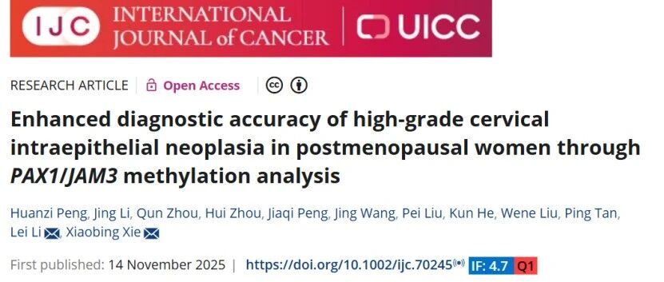
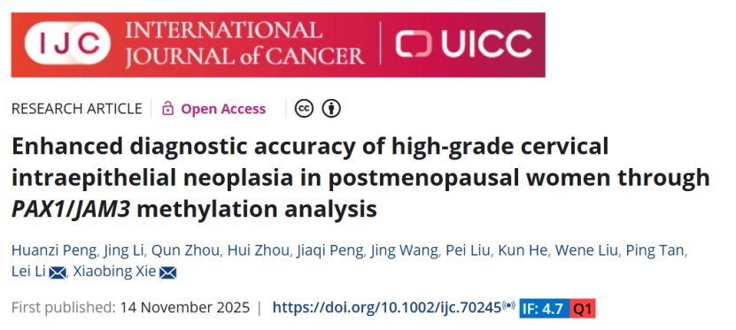
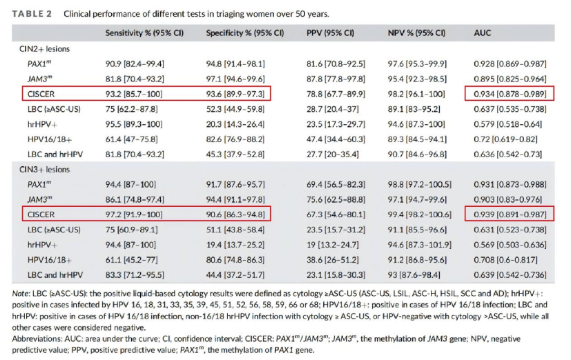
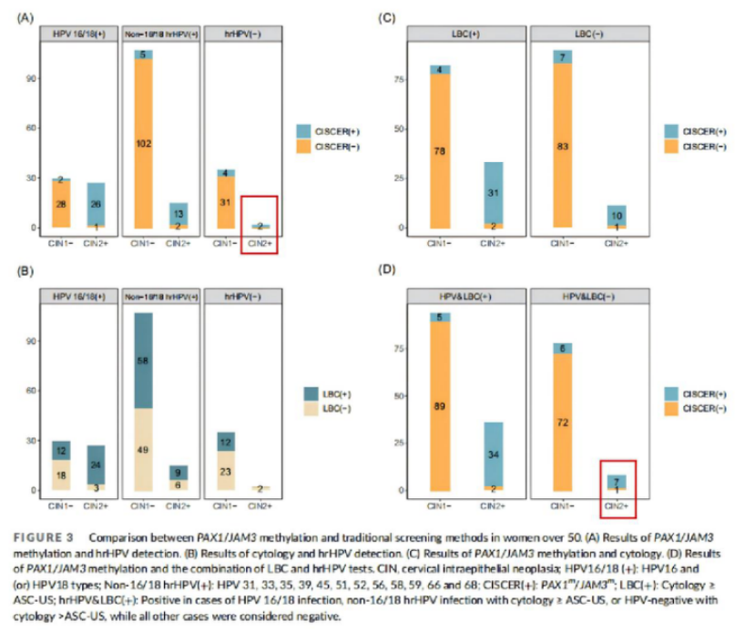

# 新文刊发| 禾宫康®甲基化检测为中老年女性宫颈癌筛查提供更精准方案

_2026年01月05日 17:11_

近日，一项发表于国际权威期刊《International Journal of Cancer》的大样本临床研究显示,PAX1/JAM3 基因甲基化检测（商品名：禾宫康 ® CISCER®）在绝经后（≥50 岁）女性的高级别宫颈病变（CIN2+ / CIN3+）灵敏度与特异度均超过 90%,显著优于传统筛查手段，并能够有效检出 hrHPV 阴性或细胞学正常漏诊人群 ( 腺癌及高级别病变 )，为中老年女性宫颈癌筛查提供了更精准无创分子检测工具。

— 最新研究显示甲基化检测有效识别 50 岁以上高级别病变常漏诊病例 —

**一、研究背景与方法**

绝经后女性因宫颈萎缩、鳞柱交界内移等生理变化，传统细胞学与阴道镜检查的敏感性下降，漏诊风险较高。研究团队纳入了 2023–2025 年间接受阴道镜评估的 428 名受试者，其中 216 名为 ≥50 岁的绝经后女性作为主要分析人群。研究使用经国家药监局批准上市的禾宫康 ® 试剂进行检测，并系统比较其与液基细胞学（LBC）及 hrHPV 检测的检测效能。

**二、关键研究结果**

在 ≥50 岁人群中对 CIN2+ 检测能力：禾宫康 ® 的灵敏度为 93.2%,对 CIN3+ 的灵敏度达 97.2%，特异性均维持在 93% 以上,AUC 高达 0.934。相比之下,LBC 灵敏度仅为 75.0%,特异性为 52.3%；hrHPV 检测虽灵敏度高（95.5%），但特异性仅为 20.3%,假阳性率居高不下。

**三、临床价值突出，弥补筛查盲区**

研究中有 2 例 hrHPV 阴性且细胞学正常的宫颈腺癌病例被传统方法漏诊，但均被禾宫康 ® 准确识别。此外，该检测还能有效检出非 16/18 型 hrHPV 感染但 LBC 漏诊的高级别病变，展现出在多元 HPV 感染背景下的广泛适用性。

**四、作为分流工具，优化诊疗路径**

将禾宫康 ® 用于细胞学或 HPV 初筛后的分流，可显著降低假阳性率（某些情况下降幅超 90%），减少不必要的阴道镜转诊和活检，在保障检出率的同时减轻医疗负担。

**五、结论**

禾宫康 ® CISCER®(PAX1/JAM3) 甲基化检测中老年女性宫颈癌筛查提供了更精准、可靠的分子手段，尤其适用于传统方法易漏诊的人群，有望成为未来筛查指南更新的重要依据。

**论文信息：**

Peng H, Li J, Zhou Q, et al. Enhanced diagnostic accuracy of high-grade cervical intraepithelial neoplasia in postmenopausal women through PAX1/JAM3 methylation analysis. Int J Cancer. doi:10.1002/ijc.70245

**关于聚禾生物**

北京起源聚禾生物科技有限公司是以创新科技为驱动、以关注健康为宗旨的科技企业。聚禾生物是妇科肿瘤早诊领域的开拓者，以独家技术和专利保护的标志物为核心，开发了宫颈癌、子宫内膜癌、卵巢癌等妇科肿瘤早诊产品，填补了该领域的空白。

随着女性对自身健康的关注越来越密切，女性健康市场将大有可为，除妇科肿瘤早筛早诊产品线外，未来聚禾生物还将建立更多女性健康相关的产品管线，打造女性健康市场的技术创新型领先企业。
