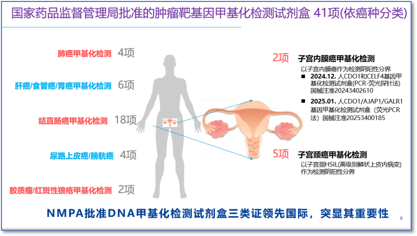
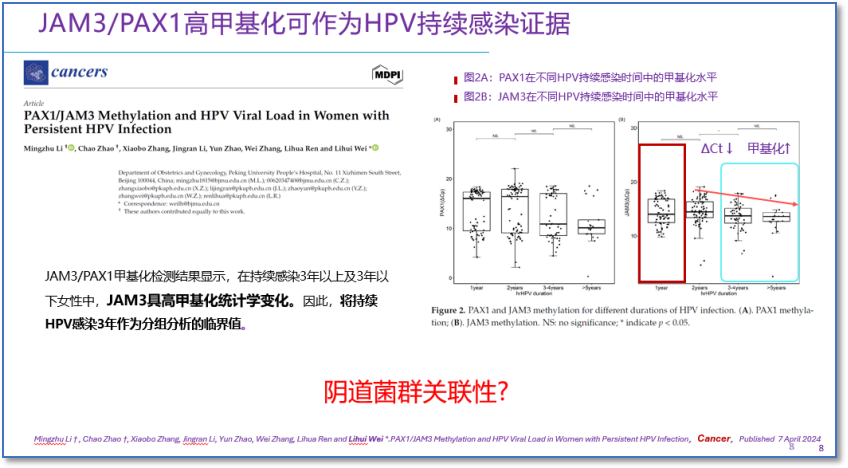
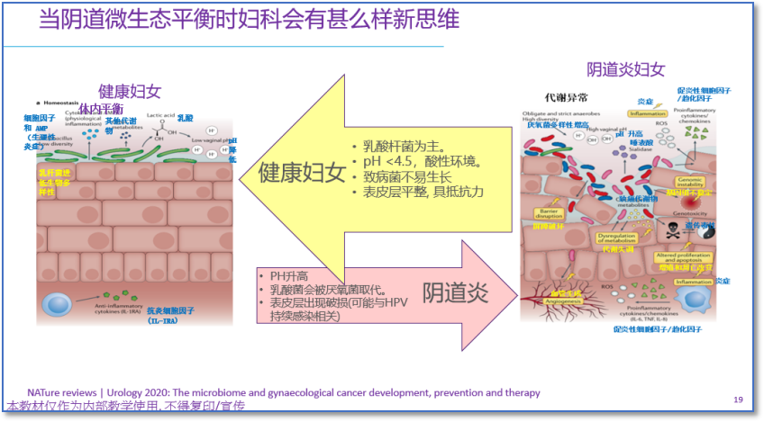

The 13th Pujiang Gynecologic Oncology Academic Conference was grandly opened in Shanghai. Co-hosted by Renji Hospital Affiliated to Shanghai Jiao Tong University School of Medicine and the Shanghai Key Laboratory of Gynecologic Oncology, the conference brought together over 140 domestic and international experts for in-depth exchange under the theme "Frontier Guidance, Exploring New Horizons in Basic Research of Gynecologic Oncology; Translational Empowerment, Jointly Charting the Blueprint for Precision Clinical Diagnosis and Treatment." The conference focused on the latest advances in gynecologic oncology, particularly in precision screening and prevention strategies for lower genital tract precancerous lesions, demonstrating a profound shift from traditional morphological assessment toward multi-omics integration and microenvironment intervention.

**1. Focus on Cervical Cancer Prevention: From Precision Screening to Individualized Clinical Decision-Making**

As one of the conference's core topics, the full-spectrum management of cervical cancer, particularly the precision diagnosis and treatment of precancerous lesions, was discussed from multiple dimensions and levels. In the keynote presentations, Academician Ma Ding, in his report titled "Improving the Diagnostic and Treatment Efficacy of Cervical Precancerous Lesions," systematically elaborated from a macro-strategic perspective on how to optimize screening, diagnosis, and treatment processes, emphasizing the need to transition from "one-size-fits-all" to "individualized" management based on more precise risk assessment tools.

**2. Frontier Exploration: The Synergistic Value of Methylation Testing and Vaginal Microbiome Assessment Emerges**

DNA methylation testing combined with vaginal microbiome assessment, as an emerging strategy leading lower genital tract precancerous lesion prevention toward a more precise stage, has become a consensus and direction of exploration in the academic community.

By detecting methylation levels of specific genes (such as PAX1, JAM3, etc.), it is possible to directly reflect the epigenetic changes in cells during the process of evolution from high-grade lesions to cancer. Compared to HPV testing, methylation has higher lesion specificity, more effectively indicating whether high-grade lesions requiring clinical intervention currently exist, thereby optimizing triage and reducing unnecessary colposcopy referrals.

At the same time, the vaginal microbiome, as the "health gatekeeper" of the lower genital tract, is closely related to local immune barrier function in its balanced state. Studies have confirmed that microbiome dysbiosis disrupts the local immune environment and significantly increases the risk of persistent HPV infection and lesion progression. Notably, cutting-edge research has found that, for example, the methylation level of the JAM3 gene gradually increases in patients with persistent HPV infection for over 2 years, reaching statistical significance after 3 years. This suggests that methylation signals can serve as molecular evidence of persistent infection and accumulating lesion risk. Even more noteworthy, research has also found that when JAM3 methylation begins to show an increasing trend, changes in vaginal pH and microbial abundance also show statistically significant correlations, suggesting a possible co-evolutionary relationship between epigenetic changes and local microenvironment imbalance.

**3. New Paradigm in Cervical Lesion Diagnosis and Treatment: The Synergistic Value of Methylation Testing and Vaginal Microbiome Assessment**

Based on the above mechanisms, combining methylation status with microbiome assessment opens new pathways for clinical practice and research:

1\. Achieving more precise risk stratification: Integrating host gene methylation (molecular level) with vaginal flora status (microenvironment level) to build multi-dimensional risk assessment models that precisely identify truly high-risk populations.

2\. Optimizing follow-up management strategies: For HPV-infected populations with negative methylation and healthy microbiome, consider appropriately extending follow-up intervals, reducing healthcare system burden and patient psychological anxiety.

3\. Developing novel adjunctive intervention approaches: For high-risk populations with microbiome dysbiosis, explore the application of Lactobacillus preparations, prebiotics, and other microbiome-modulating agents as adjunctive therapies to block persistent HPV infection and lesion progression, providing new natural regulatory approaches for "promoting lesion regression."

**4. Summary**

Precision prevention is moving from reliance on single virus detection toward a new era of integrated, multi-omics collaborative assessment combining viral, host epigenetic (methylation), and local microenvironmental information. By building a bridge connecting basic research with clinical practice, the conference gathered top intellect to jointly advance the prevention and treatment of lower genital tract lesions toward earlier, more accurate, and more individualized directions, jointly charting a new blueprint for precision diagnosis and treatment of gynecologic oncology.

**About CISPOLY**

Beijing Origin CISPOLY Biotechnology Co., Ltd. is a technology enterprise driven by innovative science and focused on health. CISPOLY is a pioneer in the field of early diagnosis of gynecologic tumors. With proprietary technology and patent-protected biomarkers at its core, the company has developed early diagnostic products for cervical cancer, endometrial cancer, ovarian cancer, and other gynecologic tumors, filling a void in this field.

As women pay increasing attention to their own health, the women's health market holds great promise. Beyond its gynecologic tumor early screening and diagnosis product line, CISPOLY will continue to build additional women's health-related product pipelines, striving to become a technology-innovation-driven leader in the women's health market.