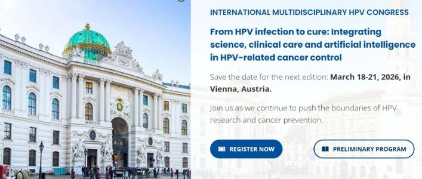
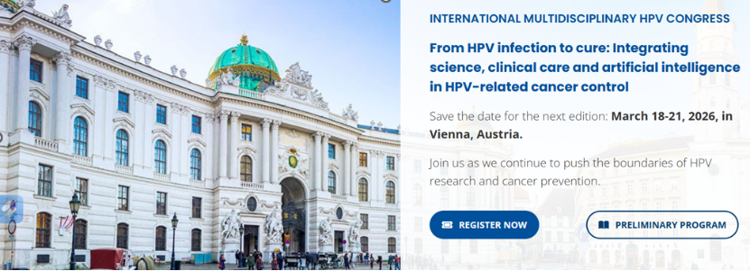
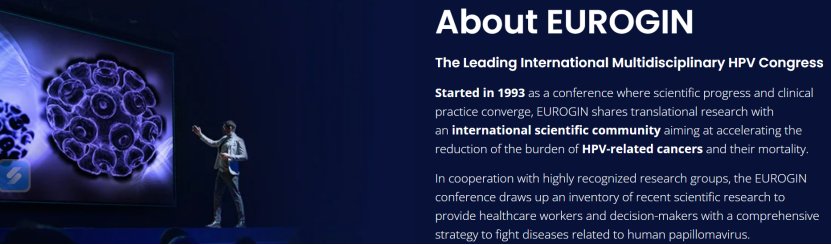
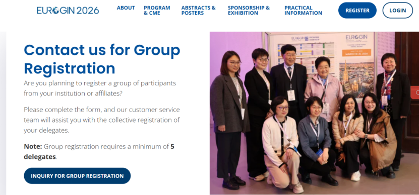

# 禾宫康® 甲基化检测获2026 EUROGIN大会五项口头演讲

_2026年01月09日 16:43_

2026年欧洲生殖器官感染和肿瘤研究组织（EUROGIN）国际大会将于3月18日至21日在奥地利维也纳举行。聚禾生物其宫颈癌甲基化检测产品“禾宮康®”（CISCER®）基于上市后由临床医生主导的真实世界研究成果,将在大会进行五项重磅口头报告，向全球展示该中国创新技术在真实诊疗场景中的突破性价值。

**一、临床驱动验证，定义精准应用场景**

聚禾生物核心产品禾宮康 ®（人 PAX1/JAM3 基因甲基化检测试剂盒）于 2023 年 3 月获 NMPA 三类医疗器械注册证。上市后，公司携手临床专家，在真实诊疗路径中，由医生根据具体临床需求（如 HPV 阳性分流、细胞学 ASC-US/LSIL 分流等）主动应用并积累数据。这种“医生主导、场景验证”的模式，不仅证实了禾宮康 ® 检测的高性能，更从临床视角明确了其在避免过度诊疗、实现个体化管理、保护女性生育力方面的独特优势，重塑了宫颈癌筛查实践。

**二、五项国际报告，全景诠释临床价值**

本次在 EUROGIN 大会上的五项报告，将系统展示上述研究成果，覆盖多个核心专场：

- **HPV 阳性分流管理专场：阐述其作为高效分流工具，如何优化管理路径。**

- **自我采样专场：展示其在自采样样本中的稳健性能，助力筛查可及性。**

- **筛查方法专场：探讨其作为新型标志物在整体筛查策略中的价值。**

- **甲基化专场：深入分享技术原理、临床数据与中国应用洞察。**

**三、立足中国创新，贡献全球方案**

聚禾生物凭借完全自主知识产权的甲基化检测技术，已构建覆盖宫颈癌、子宫内膜癌（禾蔻安 ®）及卵巢癌（禾薇益 ®）的妇科肿瘤早诊产品线。此次在 EUROGIN 这一国际顶级学术平台上的密集发声，标志着由中国临床与产业共同探索的甲基化应用方案已获国际学界高度认可，体现了中国医疗器械创新坚持“临床价值为导向”的成功实践。

聚禾生物表示，未来将继续深化临床合作，拓展甲基化等技术在女性健康领域的应用，致力于为全球提供更精准、便捷的诊断解决方案。

**关于聚禾生物**

北京起源聚禾生物科技有限公司是以创新科技为驱动、以关注健康为宗旨的科技企业。聚禾生物是妇科肿瘤早诊领域的开拓者，以独家技术和专利保护的标志物为核心，开发了宫颈癌、子宫内膜癌、卵巢癌等妇科肿瘤早诊产品，填补了该领域的空白。

随着女性对自身健康的关注越来越密切，女性健康市场将大有可为，除妇科肿瘤早筛早诊产品线外，未来聚禾生物还将建立更多女性健康相关的产品管线，打造女性健康市场的技术创新型领先企业。
