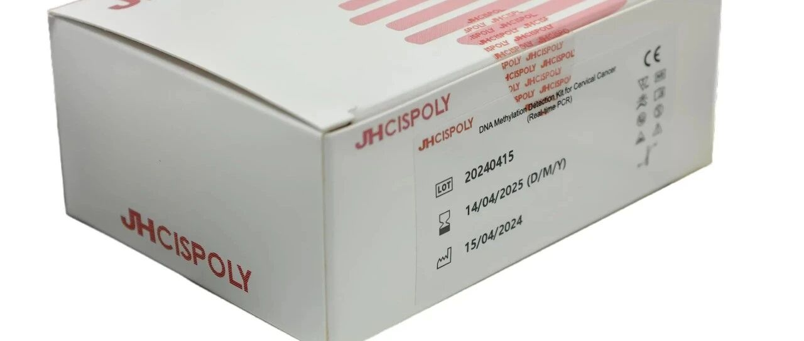
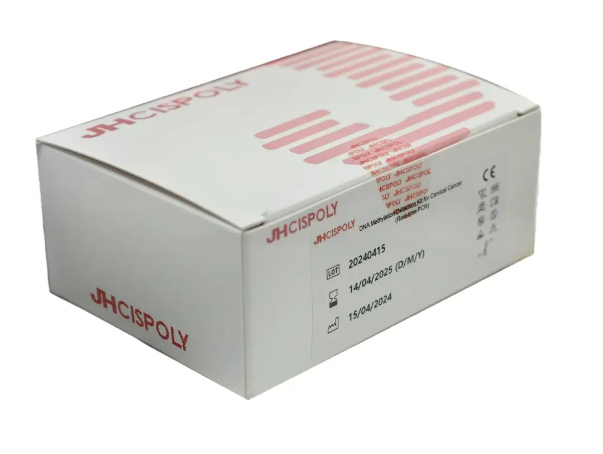

# 禾宫康®临床解读（一）| 从分子病理破解宫颈癌筛查与管理难题

_2026年01月13日 17:07_

**一、核心观点**

禾宫康 ®（PAX1/JAM3）基因甲基化检测，通过对宫颈脱落细胞中特定基因的甲基化水平进行客观定量，为临床决策提供了基于分子病理学的精准工具。它直指当前宫颈癌筛查中的核心困境——如何精准区分需要立即干预的高风险人群与只需常规随访的低风险人群，从而有效解决HPV初筛阳性后“过度转诊”与“潜在漏诊”并存的临床难题。

**二、产品定位与资质**

禾宫康 ®是一种用于宫颈癌早期无创检测的分子诊断产品，已于2023年3月获得中国国家药品监督管理局（NMPA）三类医疗器械认证（国械注准20233400253）。其可靠性与准确性已得到临床验证，为宫颈健康风险管理提供了精准、简便的新选择。

**三、临床价值详解**

**1\. 直击痛点：当前筛查的局限**

现有“HPV+TCT”联合筛查模式仍面临多重挑战：

- · HPV检测特异性不足：导致大量一过性感染女性面临不必要的阴道镜转诊及心理负担。

- · 细胞学（TCT）敏感性有限：结果判读存在主观性，对高级别鳞状上皮内病变（HSIL）的检出可能存在漏诊。

- · 特殊人群诊断困难：绝经后女性因转化区萎缩，以及存在隐匿性病变时，传统检查（包括宫颈管搔刮）的漏诊率较高。

**2\. 解决方案：分子病理的“标尺”**

PAX1/JAM3基因甲基化是宫颈细胞在癌变早期（HSIL阶段）即已出现的、稳定的分子生物学改变。检测该指标相当于直接探查细胞的“病变状态”，而非仅停留在“病毒感染状态”，从而为风险评估提供了更客观、更直接的分子依据。

**3\. 核心数据呈现（循证支撑）**

- ·**精准风险分层：**相较于单纯的 HPV阳性，甲基化水平能更特异地识别出那些正从“感染”向“进展性病变”发展的个体，帮助精准锁定需立即行阴道镜检查的高危人群。

- ·**高阴性预测值：**对于组织学确诊为高级别病变（CIN2+）的排除能力极强。检测阴性意味着当前罹患高级别病变的风险很低，能让医生和（尤其是HPV阳性）患者安心，实现有效分流与规律随访，避免对低风险人群的过度诊疗，这对有生育力保护需求的女性尤为重要。

- · 前瞻性预警价值：研究表明，甲基化阳性是提示未来病变进展风险增高的独立因素。对于细胞学结果为 ASC-US或LSIL的患者，阳性结果可提供前瞻性预警，辅助医生决策是否需更密切的随访或积极干预。

**四、清晰临床路径（应用场景）**

禾宫康 ®适用于以下场景，为精准管理提供分子证据：

- · 核心分流场景：用于 HPV初筛阳性后（特别是非16/18型）、或细胞学结果不明确（ASC-US/LSIL）时的有效风险分层与管理。

- · 特殊人群补充筛查：适用于绝经后女性、免疫功能抑制人群、反复阴道炎患者等，可作为补充检查手段以提高病变检出率。

- · 生育力保护决策：对有生育需求的年轻女性（尤其是 HPV 16/18型阳性者），可辅助判断病变风险，助力临床避免不必要的过度治疗，实践无创随访。

- · 治疗后随访监测：宫颈高级别病变切除术后，可联合 HPV检测及/或细胞学进行更灵敏、特异的随访，以早期提示复发风险。

**五、小结**

禾宫康 ®甲基化检测推动了宫颈癌筛查从“病毒筛查”向“高级别病变风险筛查”的范式转变。作为经NMPA认证的精准工具，它能帮助医生优化医疗资源配置，提升诊疗效率，在有效减少过度诊疗的同时，确保不遗漏真正的高风险病变，是实现宫颈癌精准防治的关键利器。

**关于聚禾生物**

北京起源聚禾生物科技有限公司是以创新科技为驱动、以关注健康为宗旨的科技企业。聚禾生物是妇科肿瘤早诊领域的开拓者，以独家技术和专利保护的标志物为核心，开发了宫颈癌、子宫内膜癌、卵巢癌等妇科肿瘤早诊产品，填补了该领域的空白。

随着女性对自身健康的关注越来越密切，女性健康市场将大有可为，除妇科肿瘤早筛早诊产品线外，未来聚禾生物还将建立更多女性健康相关的产品管线，打造女性健康市场的技术创新型领先企业。
