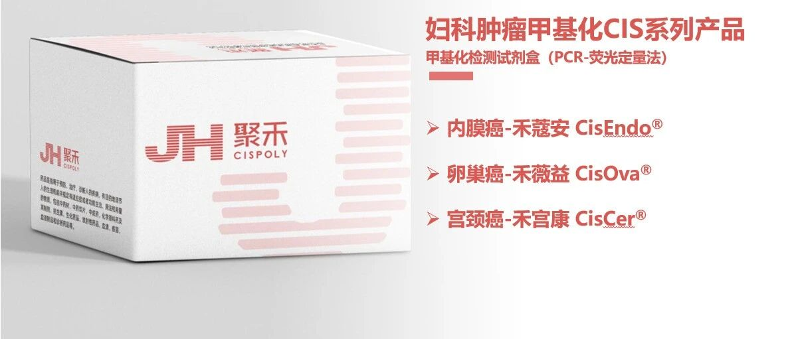

When HPV testing or TCT (cervical smear) results show abnormalities, many women feel confused and anxious: "Is something really wrong? What should I do next?"

The CISCER® (PAX1/JAM3) gene methylation test, validated through clinical trials at major Chinese hospitals and certified by China's National Medical Products Administration (NMPA), provides you with a clearer, more accurate answer as a new cervical cancer detection tool. Simply put, it serves as an intracellular "risk report" that helps you more precisely assess the current status of high-grade cervical lesions when facing uncertain screening results or when physical symptoms lack clear examination answers, enabling more reassuring health management.

**1. When Should You Consider Testing?**

**In the following common situations, the CISCER® methylation test can provide you with key decision-making information:**

- · When HPV test results are positive, especially non-16/18 type positivity, it can help clarify whether it is a "transient infection" or carries "progression risk," thereby determining whether immediate colposcopy is needed.

- · When cervical smear (TCT) results are inconclusive, such as reports showing ASC-US (atypical squamous cells of undetermined significance) or LSIL (low-grade squamous intraepithelial lesion), it can provide additional molecular evidence to assist in assessing lesion risk.

- · When you have concerns or symptoms but conventional examinations fail to provide a clear explanation, it can serve as a deeper molecular-level investigation.

- · For regular follow-up after treatment of high-grade cervical lesions, it can monitor recurrence risk earlier and more specifically than traditional methods.

- · For women who are health-conscious or have not undergone cervical cancer screening for over a year.

**2. Testing Experience: As Simple and Non-Invasive as Routine Screening**

· The sampling process is familiar to you: The test uses the same sampling method as the HPV or TCT examination you have already undergone. The physician simply uses a small brush to gently collect naturally shed cells from the cervix. The entire process is quick, non-invasive, and free of additional pain or discomfort.

· One sample, multiple layers of information: This test is very convenient and can typically be performed together with HPV, TCT, and CISCER® methylation testing from a single sample collection. This means that one simple examination can provide a more comprehensive assessment from three perspectives: "presence or absence of viral infection," "whether cell morphology is abnormal," and "whether gene changes toward lesions are occurring within cells."

**3. Result Interpretation: Clear Direction Forward**

After receiving your report, understanding what the results mean is critical. Methylation test results fall into two main categories, each pointing to distinctly different, clear follow-up paths:

1\. If the result is "methylation negative": This means current risk is very low, and you can be reassured with follow-up

- · Result meaning: This indicates that no definitive molecular markers associated with high-grade precancerous lesions (CIN2+) have been detected in your current cervical cells. Even if the HPV test is positive, this result strongly suggests that your current risk of having a progressive lesion is very low.

- · What you should do: This is typically a reassuring signal. It helps you and your physician determine that you belong to a low-risk group that can safely undergo regular check-ups. You simply need to follow your physician's advice and undergo routine screening at regular intervals (e.g., 1 year) in the future, thereby effectively avoiding unnecessary colposcopy or overtreatment driven by anxiety, and significantly reducing psychological and medical burden.

2\. If the result is "methylation positive": This means you have seized a key opportunity for early intervention

- · Result meaning: This indicates that stable molecular markers associated with precancerous lesions have appeared in your cervical cells. Please understand that this absolutely does not mean a cancer diagnosis; rather, it is an important warning signal indicating that adverse changes may be occurring within the cells, warranting clarification through colposcopy.

- · What you should do: Your physician will typically recommend colposcopy (with biopsy if necessary). This is the "gold standard" for diagnosing cervical lesions, allowing direct visualization of the cervix and sampling of tissue from the most suspicious areas for pathological analysis, thereby clarifying the actual degree of lesion corresponding to the molecular changes.

- · Positive perspective: Please recognize that this is precisely the most interventionable and effective link in the cervical cancer prevention chain. The vast majority of precancerous lesions can be completely cured through non-invasive interventions (such as photodynamic therapy, etc.) or simple outpatient procedures like laser or LEEP, successfully blocking their progression toward cancer while preserving the uterus and reproductive function. Detecting it early is precisely about resolving it with minimal cost and maximum precision.

**4. Summary**

The CISCER® methylation test is like a "molecular probe" with foresight, detecting the intrinsic gene activity status of cells before their morphology has visibly changed. When you feel lost due to HPV positivity, TCT abnormalities, or physical symptoms without clear conventional examination conclusions, it provides a clearer personal "risk map," making subsequent decisions — whether reassured follow-up or active intervention — more evidence-based and directionally clear. Fully discussing this test result with your physician is an important step in proactively and scientifically managing your own cervical health.

**About CISPOLY**

Beijing Origin CISPOLY Biotechnology Co., Ltd. is a technology enterprise driven by innovative science and focused on health. CISPOLY is a pioneer in the field of early diagnosis of gynecologic tumors. With proprietary technology and patent-protected biomarkers at its core, the company has developed early diagnostic products for cervical cancer, endometrial cancer, ovarian cancer, and other gynecologic tumors, filling a void in this field.

As women pay increasing attention to their own health, the women's health market holds great promise. Beyond its gynecologic tumor early screening and diagnosis product line, CISPOLY will continue to build additional women's health-related product pipelines, striving to become a technology-innovation-driven leader in the women's health market.